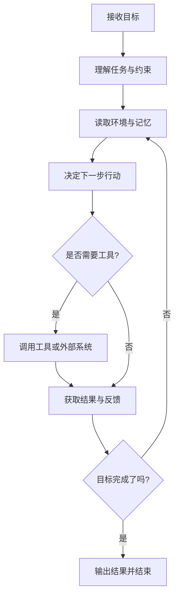
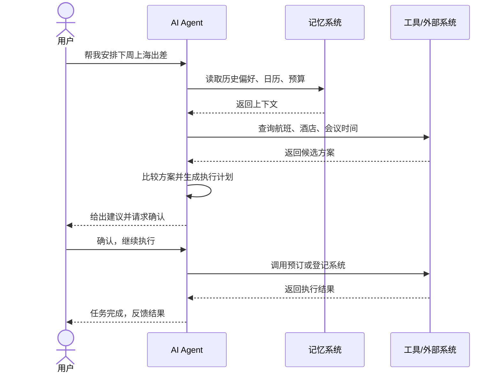
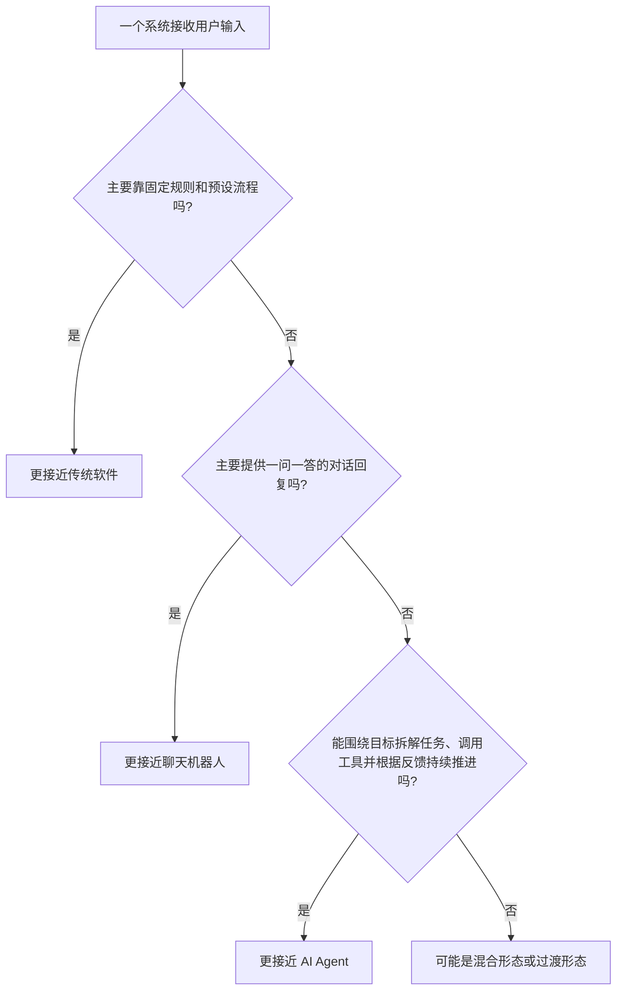
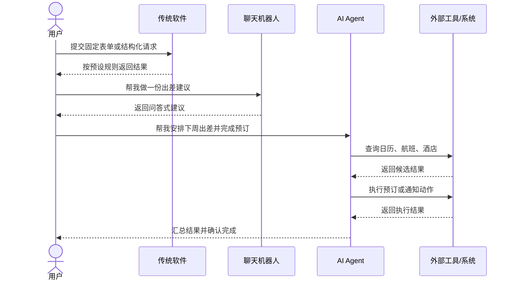

# 第一章 什么是 AI Agent

## 1. 先用一句人话解释

AI Agent（AI 智能体）不是“会聊天的大模型”这么简单。  
它更像一个能够接收目标、理解上下文、调用工具、执行动作，并根据结果继续推进任务的数字执行者。

一句话定义：

> AI Agent 是一个为了实现目标，能够感知环境、做出决策并采取行动的系统。

这个定义里有 4 个关键词：

- **感知环境**：知道当前发生了什么，比如用户输入、系统状态、外部数据、历史记录。
- **自主决策**：不是机械地返回一句话，而是判断“下一步该做什么”。
- **采取行动**：可以调用工具、访问系统、执行任务，而不只是输出文本。
- **实现目标**：它的核心不是“回答问题”，而是“把事情做成”。

## 2. 它和普通大模型有什么区别？

很多初学者会把 AI Agent 和大语言模型（LLM）混为一谈，但两者并不完全一样。

可以把它们理解成：

- **LLM** 更像“大脑”，擅长理解、推理和生成语言。
- **Agent** 更像“带着大脑去做事的人”，除了思考，还会观察、计划、执行和复盘。

一个简单对比：

| 对比项 | 普通 LLM | AI Agent |
| --- | --- | --- |
| 核心能力 | 生成内容、回答问题 | 围绕目标持续行动 |
| 工作方式 | 一问一答 | 观察 -> 决策 -> 行动 -> 反馈 |
| 是否能调用工具 | 不一定 | 通常可以 |
| 是否保留任务上下文 | 有限 | 通常结合多种记忆机制 |
| 是否能自动推进任务 | 较弱 | 较强 |

举个例子：

- 如果你问 LLM：`帮我做一份出差计划。`
  它通常会给你一个建议模板。
- 如果你把同样的目标交给 AI Agent：
  它可能会读取你的日历、查询航班和酒店、整理候选方案，甚至在你确认后直接完成预订。

所以，**Agent 的重点不是“会说”，而是“会做”。**

## 3. AI Agent 的本质：一个目标驱动的闭环系统

从工程角度看，可以把 AI Agent 理解为下面这个公式：

```text
AI Agent = 模型 + 目标 + 记忆 + 工具 + 行动循环
```

它不是一次性的输入输出，而是一个持续迭代的闭环。



这个流程说明了一件很重要的事：

**AI Agent 不是只回答一次，而是会根据执行结果不断调整下一步。**

这也是它和普通问答系统最大的区别。

## 4. AI Agent 是怎么工作的？

一个常见的工作过程大致如下：

1. 用户给出目标，比如“整理下周客户拜访行程”。
2. 智能体理解任务，并识别限制条件，比如预算、时间、地点。
3. 智能体读取当前上下文和历史记忆，比如用户偏好、过去记录、组织规则。
4. 智能体决定下一步要做什么，比如查日历、查机票、比较路线。
5. 如果需要，它会调用工具或外部系统。
6. 获取结果后，它会判断任务是否完成。
7. 如果还没完成，就继续下一轮。
8. 完成后，再把结果返回给用户或系统。

下面这张时序图更直观：



## 5. AI Agent 的核心组成

你给出的草稿已经抓住了关键点。整理后，AI Agent 通常可以拆成下面几个核心组件。

### 5.1 角色

角色决定智能体“应该以什么身份做事”。

一个定义良好的角色，通常包括：

- 它是谁
- 它的职责是什么
- 它能做什么、不能做什么
- 它的表达风格和沟通方式

比如：

- 一个“客服智能体”要耐心、准确、稳定
- 一个“代码助手智能体”要重视技术正确性和执行效率
- 一个“研究智能体”要强调信息来源、检索能力和归纳能力

角色的意义在于：**让智能体行为稳定，不容易跑偏。**

### 5.2 记忆

如果没有记忆，智能体每次都像“第一次见你”，很难连续完成复杂任务。

常见记忆类型包括：

- **短期记忆**：保存当前对话和当前任务的上下文
- **长期记忆**：保存历史数据、用户偏好、长期规则
- **情景记忆**：记录过去具体发生过什么，便于复用经验
- **共识记忆**：多个智能体共享的信息，比如团队规则、公共知识库

记忆的价值在于：

- 保持上下文连续
- 从历史中学习
- 根据新情况动态调整行为

你可以把记忆理解为智能体的“工作笔记本”和“经验库”。

### 5.3 工具

工具是 AI Agent 真正“动手做事”的关键。

没有工具，智能体往往只能停留在“提出建议”；  
有了工具，它才能真正与环境交互。

工具可以是：

- 查询类工具：搜索、数据库、知识库
- 处理类工具：计算、代码执行、数据分析、文档生成
- 控制类工具：调用 API、发消息、创建工单、操作系统

从交互界面上，也可以把工具分为：

- **物理界面**：控制机器人、传感器、硬件设备
- **图形界面**：点击页面、填写表单、操作软件
- **程序界面**：调用 API、执行函数、操作数据库

工具让智能体从“会想”走向“会做”。

### 5.4 模型

大语言模型（LLM）通常是 AI Agent 的基础能力来源。

它负责：

- 理解用户意图
- 拆解问题
- 推理和规划
- 生成语言和结构化输出

可以把 LLM 看成智能体的“大脑”，但只有大脑还不够。  
一个真正可用的 Agent，还需要记忆、工具和行动机制把思考变成执行。

## 6. AI Agent 有哪些类型？

“类型”这个问题可以从不同角度来看。最常见的有两种分类方式。

### 6.1 按与用户的互动方式分类

#### 1. 互动式合作伙伴

这类智能体直接和用户对话，也常被称为“表面智能体”。

特点：

- 由用户请求触发
- 直接面向人类交互
- 常用于问答、咨询、协助办理任务

典型场景：

- 智能客服
- 医疗咨询助手
- 教学辅导助手
- 编程助手

#### 2. 自主后台处理智能体

这类智能体通常在后台运行，也可以理解为“后台智能体”或“工作流智能体”。

特点：

- 常由事件驱动，而不是由用户实时发问触发
- 与人的直接互动较少
- 更强调自动执行、分析和流程推进

典型场景：

- 自动处理工单
- 数据监控与异常告警
- 定时生成日报或周报
- 审批流与业务流程自动化

### 6.2 按智能体数量分类

#### 1. 单智能体

单智能体是指一个 Agent 独立完成任务。

特点：

- 结构简单
- 易于设计和调试
- 适合目标明确、边界清晰的任务

例如：

- 一个个人助理帮你整理邮件
- 一个代码 Agent 帮你修改一个明确的 Bug

#### 2. 多智能体

多智能体系统由多个 Agent 协作或分工完成任务。

特点：

- 每个智能体可以负责不同角色
- 适合复杂任务分解
- 能模拟团队协作

例如：

- 一个负责规划
- 一个负责检索信息
- 一个负责执行操作
- 一个负责审核结果

多智能体系统的优势是灵活、可扩展，但设计和协调成本也更高。

> 注意：按“互动方式”分类和按“数量”分类不是互斥关系。  
> 比如，一个系统既可以是“后台智能体”，也可以是“多智能体系统”。

## 7. AI Agent 和传统软件、聊天机器人有什么边界和区别？

这是初学者最容易混淆的地方。

很多系统都会“接收输入，然后输出结果”，但它们背后的工作方式并不一样。  
区分它们时，重点不要看名字，而要看它有没有下面这些能力：

- 是否围绕目标持续推进任务
- 是否能根据环境变化自主决定下一步
- 是否能调用工具和外部系统
- 是否会根据执行结果进入下一轮调整

如果把三者放在一起看，大致可以这样理解：

| 对比项 | 传统软件 | 聊天机器人 | AI Agent |
| --- | --- | --- | --- |
| 核心逻辑 | 预先写好的规则和流程 | 对话交互 | 目标驱动的行动闭环 |
| 交互方式 | 点击、表单、接口调用 | 主要是问答和对话 | 对话、事件、任务都可以 |
| 是否自主决策 | 很弱，按规则执行 | 有限，通常停留在回复层 | 较强，会判断下一步动作 |
| 是否使用工具 | 可以，但通常由程序员固定编排 | 有时可用 | 通常是核心能力之一 |
| 是否会持续执行任务 | 一般不会 | 通常一轮一答 | 会围绕目标多轮推进 |
| 面对不确定任务 | 较弱 | 一般 | 较强 |

如果只看表格还不够直观，可以再看下面两张图。

第一张图是一个快速判断流程图：



第二张图是三类系统处理任务方式的对比时序图：



这两张图想表达的核心是：

- 传统软件强调**规则执行**
- 聊天机器人强调**对话回复**
- AI Agent 强调**目标驱动的任务推进**

### 7.1 AI Agent 和传统软件的区别

传统软件的核心是：**人先把规则写清楚，程序再严格执行。**

比如一个报销系统：

- 你提交报销单
- 系统检查金额、发票、审批链
- 满足规则就通过，不满足就驳回

它非常擅长：

- 稳定执行固定流程
- 高精度处理结构化任务
- 在明确规则下保持一致性

但它也有明显边界：

- 遇到模糊目标时不灵活
- 无法自己理解“用户真正想解决什么问题”
- 很难在不确定环境中自己调整策略

而 AI Agent 更像是：

- 先理解目标
- 再结合上下文做判断
- 必要时调用工具执行
- 根据结果继续修正路径

所以可以这样记：

> 传统软件更像“按流程办事的机器”，AI Agent 更像“会判断下一步怎么做的执行者”。

不过两者不是对立关系。  
现实里，大多数 Agent 系统其实仍然要依赖大量传统软件能力，比如数据库、工作流引擎、权限系统和业务系统 API。

### 7.2 AI Agent 和聊天机器人的区别

聊天机器人的核心是：**和人对话**。

它最常见的形态是：

- 用户提问
- 系统回答
- 对话结束或进入下一轮提问

一个聊天机器人可以很聪明，也可以用上大模型，但它不一定是 Agent。

关键区别在于：

- 如果它只是回答问题、闲聊、总结内容，那它更接近聊天机器人
- 如果它能围绕目标拆解任务、调用工具、执行动作、根据反馈继续推进，那它更接近 AI Agent

举个简单例子：

- “明天北京天气怎么样？”  
  这是聊天问答。
- “帮我根据明天北京天气决定是否改签航班，并通知相关人员。”  
  这已经更像 Agent 任务。

所以，**聊天机器人强调‘会聊’，Agent 强调‘会办事’。**

### 7.3 它们的边界不是绝对的

这里要特别注意：三者之间并不是一刀切的关系。

现实中的系统常常是混合形态：

- 一个传统软件里可能嵌入了聊天助手
- 一个聊天机器人可能接上搜索和工具后，逐渐演变成 Agent
- 一个 Agent 往往也会通过聊天界面和用户互动

也就是说：

- **不是所有用了 LLM 的系统都是 Agent**
- **不是所有聊天机器人都是 Agent**
- **不是所有 Agent 都必须长得像聊天窗口**

更准确的判断方式是看这个系统的“主能力”是什么：

- 如果主能力是固定规则执行，它更像传统软件
- 如果主能力是对话回复，它更像聊天机器人
- 如果主能力是围绕目标自主推进任务，它更像 AI Agent

### 7.4 一个快速判断方法

判断一个系统是不是 AI Agent，可以先问 4 个问题：

1. 它接收的是“问题”，还是“目标”？
2. 它输出的是“一次回复”，还是“持续行动”？
3. 它会不会自己决定下一步，并调用工具？
4. 它会不会根据执行结果调整计划？

如果这 4 个问题里，大多数答案都是“会”，那它大概率就已经进入 Agent 范畴了。

## 8. 初学者可以怎样理解 AI Agent？

如果你是第一次接触这个概念，可以用一个更生活化的比喻：

- **模型**像大脑
- **记忆**像笔记本和经验库
- **工具**像手和外部设备
- **角色**像岗位说明书
- **行动循环**像做事的方法论

把这些组合起来，AI Agent 就像一个“能理解任务、能查资料、能动手执行、还能根据结果调整策略的数字员工”。

当然，这里的“自主”并不意味着它完全不需要人类。  
很多 Agent 依然需要：

- 人类设定目标
- 人类提供约束
- 人类确认关键动作
- 人类对结果负责

所以更准确地说，**AI Agent 是一种增强执行力的系统，而不是完全脱离人的魔法机器。**

## 9. 本章小结

这一章你可以先记住 5 句话：

1. **AI Agent 的核心不是聊天，而是围绕目标持续行动。**
2. **LLM 是智能体的大脑，但不是智能体的全部。**
3. **记忆和工具决定了智能体能否从“会说”升级到“会做”。**
4. **智能体通常运行在“感知 -> 决策 -> 行动 -> 反馈”的闭环中。**
5. **不是所有聊天机器人都是 Agent，也不是所有用了大模型的系统都是 Agent。**

如果只用一句话概括：

> AI Agent = 能理解目标、能使用工具、能根据反馈持续推进任务的 AI 系统。
