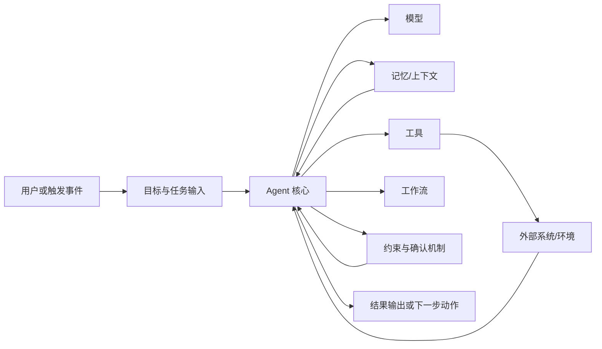
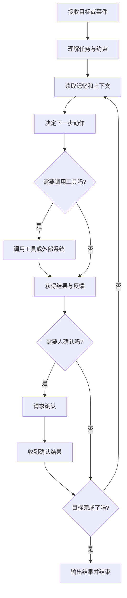
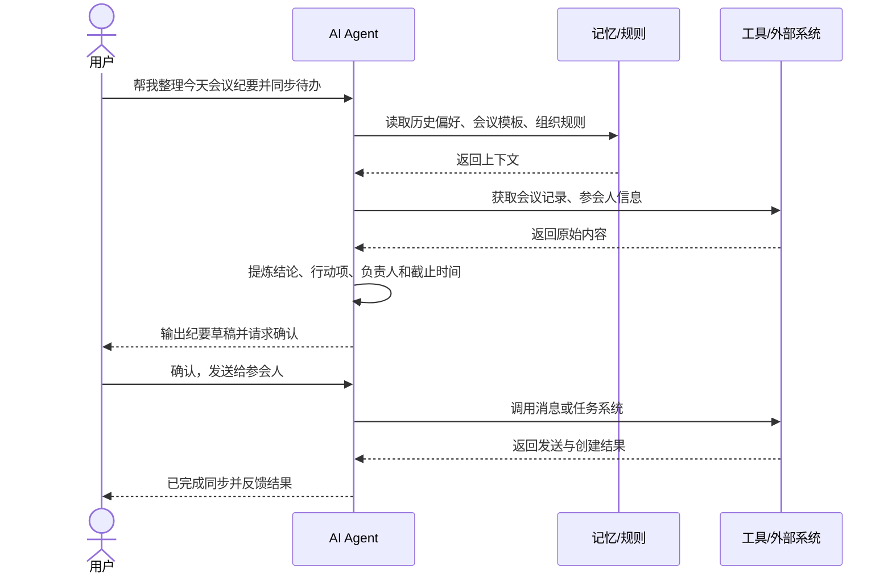
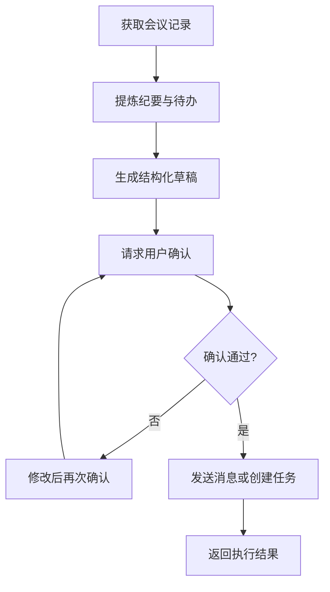

# 第三章 AI Agent 是如何构建的

## 1. 先说结论：构建 Agent，不是先写一段 Prompt

如果第一章回答的是“AI Agent 是什么”，第二章回答的是“AI Agent 能解决什么问题”，  
那么这一章要回答的就是一个更实际的问题：

**一个 AI Agent 到底是怎么被搭出来的？**

很多初学者一听到“做 Agent”，第一反应往往是：

- 写一段系统提示词
- 接一个大模型 API
- 给它几个工具
- 然后希望它自己把事情做完

这当然是起点，但还不够。

先说结论：

- **构建 Agent，不等于接一个大模型。**
- **构建 Agent，本质上是在组织一个“围绕目标持续运行的系统”。**
- **这个系统至少要把目标、上下文、工具、行动流程和约束组织起来。**
- **真正决定 Agent 能不能用的，不只是模型强不强，而是这些部分能不能形成闭环。**

可以把这件事理解得更直白一点：

> 如果大模型像大脑，那么构建 Agent 不是“给大脑接上麦克风”这么简单，  
而是要把它放进一个能理解任务、读取信息、调用工具、持续执行并接受反馈的工作系统里。
>

所以，一个可用的 Agent，不是靠一句 Prompt 突然“觉醒”的，  
而是靠一套清晰的结构被搭出来的。

## 2. 为什么“接一个大模型”不等于“构建一个 Agent”？

很多人第一次做 AI 应用时，会先这样尝试：

1. 用户输入一个需求
2. 把需求发给 LLM
3. 拿到结果后返回给用户

这个方式在很多场景下是有价值的。  
比如：

- 写文案
- 总结会议内容
- 翻译文本
- 回答一个知识问题

但如果任务变成下面这种：

- 帮我安排下周去杭州拜访客户的完整行程
- 帮我读一下这个代码库，定位 Bug 并给出修复方案
- 帮我整理今天的会议纪要，并把待办同步给相关人员

这时只靠“一次调用模型”通常就不够了。  
因为系统不只是要“回答”，还要：

- 理解目标和限制条件
- 读取外部信息
- 决定下一步动作
- 调用工具
- 根据结果继续调整
- 必要时和人确认

也就是说，**从 LLM 到 Agent，中间多出来的不是一点点提示词技巧，而是一整套任务运行机制。**

可以用下面这张表快速看出差异：

| 对比项 | 直接调用大模型 | 构建 AI Agent |
| --- | --- | --- |
| 核心目标 | 生成一次回答 | 围绕目标持续推进任务 |
| 输入内容 | 当前这次请求 | 当前请求 + 上下文 + 环境状态 |
| 输出结果 | 一段文本或结构化结果 | 一次动作、多个动作或完整任务结果 |
| 是否调用工具 | 不一定 | 通常是核心能力 |
| 是否能多步推进 | 有限 | 通常可以 |
| 是否会根据反馈调整 | 较弱 | 较强 |
| 是否需要约束与确认 | 可有可无 | 往往非常重要 |


一句话说：

> 接一个模型，你得到的是“会回答的能力”；  
构建一个 Agent，你得到的是“会推进任务的系统”。
>

## 3. 一个 Agent 的基本搭建公式

从学习角度看，可以先记住这样一个非常实用的公式：

```latex
AI Agent = 模型 + 目标/角色 + 记忆 + 工具 + 工作流 + 约束
```

这个公式不是严格的技术定义，  
而是帮助你理解“一个 Agent 至少由哪些部分组成”的思考框架。

这几个部分分别负责不同的事情：

- **模型**：负责理解、推理、生成，是 Agent 的“大脑”
- **目标/角色**：告诉它“你要完成什么”“你该以什么身份做事”
- **记忆**：让它知道过去发生过什么，而不是每次都从零开始
- **工具**：让它有能力和外部世界交互，而不是只能输出文字
- **工作流**：规定任务是怎样一步步推进的
- **约束**：控制它能做什么、不能做什么，什么时候必须停下来确认

如果你把这些放在一起看，一个 Agent 的整体结构大致像这样：



这张图里最重要的一点是：

**Agent 不是一个孤立的模型调用，而是一个被“目标、信息、动作和约束”共同塑造出来的系统。**

如果只看“模型”，你会误以为 Agent 的难点在推理；  
但如果看整个结构，你会发现真正的难点常常在：

- 信息能不能拿到
- 工具能不能调通
- 行动顺序怎么设计
- 哪些步骤必须让人确认
- 出错后怎么继续

这也是为什么很多 Agent 的问题，最后不是卡在模型本身，  
而是卡在系统结构。

## 4. 一个 Agent 是怎么跑起来的？

理解“组成部分”之后，下一步要理解的是：

**这些部分在任务运行时，是怎么协同工作的？**

一个常见的运行过程，大致可以拆成 8 步：

1. 接收目标或被事件触发  
例如用户说“帮我整理今天客户会议的纪要，并同步待办”。
2. 理解任务和约束  
判断目标是什么、需要什么信息、哪些动作有风险。
3. 读取上下文  
例如历史对话、组织规则、日历、会议记录、知识库。
4. 决定下一步动作  
是先总结内容，还是先查参会人，还是先调用系统接口。
5. 调用工具或外部系统  
比如搜索、读数据库、发消息、创建任务、执行代码。
6. 获取结果并判断是否足够  
如果结果不完整，可能要继续查；如果失败，可能要换路径。
7. 在必要时请求人类确认  
尤其是发通知、改数据、触发真实业务动作时。
8. 输出结果或进入下一轮  
如果目标没完成，就继续；如果完成了，再返回结果。

可以把这个过程看成一条完整的任务闭环：



如果你还是觉得抽象，可以再看一张时序图。  
下面以“会议纪要与待办跟进助手”为例：



从这两张图里你应该能看出一件事：

**Agent 的运行，不是“一次回答”，而是“在目标约束下不断决定下一步”。**

## 5. 构建 Agent 时最核心的 5 个模块

如果要把一个 Agent 真正搭出来，最值得优先理解的是下面 5 个模块。

先给一个总表：

| 模块 | 它解决什么问题 | 如果没有会怎样 |
| --- | --- | --- |
| 目标与角色 | 明确要做什么、以什么身份做 | 容易跑偏，回答看起来聪明但不对题 |
| 模型 | 提供理解、推理、生成能力 | 无法处理复杂语言与决策 |
| 记忆 | 保持上下文连续、复用历史信息 | 每轮都像第一次做任务 |
| 工具 | 让 Agent 能查、算、执行、控制系统 | 只能停留在建议层 |
| 工作流 | 让任务按顺序推进并形成闭环 | 会出现想到哪做哪、难以稳定复现 |


### 5.1 目标与角色

目标和角色决定的是：

- 这个 Agent 到底负责什么
- 它面对的任务边界在哪里
- 它应该以什么方式做事

比如同样是“整理信息”，不同角色的行为就会不一样：

- 销售助手会更关注客户背景、商机阶段和下一步跟进动作
- 研发助手会更关注日志、代码、报错和修复建议
- 客服助手会更关注用户情绪、问题分类和处理规则

所以，构建 Agent 的第一步，通常不是“先选模型”，  
而是先回答下面几个问题：

- 它服务谁？
- 它的目标是什么？
- 它能做哪些事？
- 它不能做哪些事？
- 什么情况下必须停下来让人确认？

如果这些问题没有定义清楚，后面的模型、工具和流程都会不稳定。

一句话说：

> 目标决定方向，角色决定行为风格和边界。
>

### 5.2 模型

模型通常是 Agent 的认知核心。

它负责的事情包括：

- 理解用户意图
- 识别上下文中的关键信息
- 拆解任务
- 判断下一步
- 生成自然语言或结构化结果

但这里要特别注意：

**模型很重要，但模型不是整个 Agent。**

你完全可以把模型理解成“大脑”，  
但一个只有大脑、没有手、没有记忆、没有规则的系统，是很难稳定做成事的。

在学习阶段，你不一定要先纠结“哪个模型最强”，  
更重要的是先理解：

- 模型负责“想”
- 工具负责“做”
- 记忆负责“记住”
- 工作流负责“把事情一轮轮推进下去”

很多初学者容易犯一个错误：

- 以为模型更强，Agent 就自然更强

实际上很多时候更真实的情况是：

- 模型已经够用
- 真正拖后腿的是上下文缺失、工具不通、流程混乱或约束缺位

所以，模型是基础，但不是全部。

### 5.3 记忆

没有记忆的 Agent，往往只能做很短平快的单轮任务。

一旦任务变成多轮、多步骤、跨时间的，记忆就会变得很重要。

你可以把记忆理解成 Agent 的“工作笔记本”和“经验库”。

常见的记忆内容包括：

- 当前任务上下文
- 用户偏好
- 历史对话
- 业务规则
- 过去执行过的结果
- 团队共享知识

记忆的价值主要体现在 3 件事上：

- **保持连续性**：知道前面已经发生过什么
- **提升相关性**：减少每轮都重复输入背景信息
- **支持更好的决策**：让下一步动作不是“凭空猜”

例如一个出差助手，如果记住了：

- 你通常喜欢高铁优先
- 酒店预算上限是多少
- 你不喜欢红眼航班
- 你上次已经确认过某些偏好

它下一次就会更像在“继续替你做事”，而不是“重新认识你一次”。

所以从系统角度看，记忆解决的不是“模型会不会回答”，  
而是“Agent 能不能连续地完成任务”。

### 5.4 工具

工具是 Agent 从“会说”走向“会做”的关键一步。

如果没有工具，Agent 再聪明，很多时候也只能停留在：

- 提建议
- 给模板
- 帮你分析
- 告诉你“下一步可以怎么做”

但一旦有了工具，它就可以真正和环境交互。  
比如：

- 查知识库
- 查数据库
- 搜索网页
- 发消息
- 创建工单
- 写入文档
- 更新任务系统
- 调用企业内部 API

从学习角度看，你可以把工具分成三类：

| 工具类型 | 例子 | 作用 |
| --- | --- | --- |
| 查询类 | 搜索、数据库、知识库 | 获取信息 |
| 处理类 | 计算、代码执行、文档生成 | 加工信息 |
| 控制类 | 发消息、改状态、调业务接口 | 真正执行动作 |


这三类工具的重要性并不完全一样。

- 查询类工具解决“它知不知道”
- 处理类工具解决“它算不算得动”
- 控制类工具解决“它能不能真的把事办下去”

因此，判断一个 Agent 是不是“真 Agent”，  
一个很有用的观察点就是：

**它有没有能力和环境发生真实交互。**

### 5.5 工作流

工作流决定的不是“Agent 会不会思考”，  
而是“它怎么把思考变成一轮轮动作”。

如果没有工作流，系统就容易变成：

- 每次都临场发挥
- 想到哪做到哪
- 前后顺序不稳定
- 同样任务今天能做，明天就不一定

一个基本的 Agent 工作流，通常至少要解决下面几个问题：

- 什么时候读取上下文
- 什么时候调用工具
- 工具失败后怎么办
- 什么时候继续下一轮
- 什么时候应该结束
- 什么时候必须让人确认

这就是为什么我们前面一直强调“闭环”。  
一个真正好用的 Agent，不只是有能力模块，  
还要有一条清晰的推进路径。

你可以把工作流理解成：

- 它的做事方法
- 它的任务节奏
- 它把目标推进到完成的过程控制逻辑

所以，构建 Agent 的核心，不是简单把“模型 + 工具”绑在一起，  
而是让它们在一条稳定的流程里协同工作。

## 6. 一个最小可用 Agent 长什么样？

讲到这里，很多人会有一个常见疑问：

**是不是只有很复杂、很大的系统，才算 Agent？**

其实不是。

从学习和搭建角度看，一个非常好的思路是：

> 不要一开始就做“全能智能体”，  
而是先做一个能跑通最小闭环的 Agent。
>

下面是一个很典型的最小例子：

### 6.1 例子：会议纪要与待办跟进助手

这个 Agent 的目标很明确：

- 读取一次会议记录
- 生成纪要摘要
- 提炼待办事项
- 标出负责人和时间
- 用户确认后，同步到消息或任务系统

它不需要无所不能，  
但已经具备一个 Agent 最核心的最小结构。

可以拆成这样：

| 部分 | 最小实现 |
| --- | --- |
| 目标 | 整理会议纪要并推进待办同步 |
| 角色 | 一个会议助手，不负责做业务决策，只负责整理与分发 |
| 模型 | 负责理解会议内容、抽取重点、生成结构化结果 |
| 记忆 | 会议模板、团队常用纪要格式、负责人映射规则 |
| 工具 | 获取会议文本、读取成员信息、发送消息、创建任务 |
| 工作流 | 读取内容 -> 提炼结果 -> 请求确认 -> 执行动作 -> 返回状态 |
| 约束 | 未经确认不能直接对外发送或创建正式任务 |


它的最小闭环可以画成这样：



这个例子很重要，因为它说明了一个事实：

- Agent 不一定要特别大
- Agent 不一定要无所不能
- 只要它已经能围绕目标形成“理解 -> 判断 -> 动作 -> 反馈”的闭环，它就已经具备 Agent 的基本形态

所以，对初学者来说，比起追求“最复杂的智能体”，  
更应该先追求：

**一个最小但真实可运行的闭环。**

## 7. 为什么很多 Agent 看起来能跑，实际却不好用？

做 Agent 最容易出现的一种错觉是：

- 能跑起来了
- 看起来会调用工具了
- 偶尔也能完成任务
- 于是觉得系统已经差不多可用了

但真正上线或实际使用时，问题往往就会暴露出来。

原因通常不在于“它完全不会”，  
而在于“它不稳定、不连续、不可控”。

下面是几类最常见的问题：

| 常见问题 | 本质原因 | 典型表现 |
| --- | --- | --- |
| 只有模型，没有工具 | 无法和真实环境交互 | 说得很好，但事情办不下去 |
| 只有工具，没有上下文 | 决策缺少背景信息 | 动作看似正确，结果却不符合实际需求 |
| 没有记忆 | 无法保持连续性 | 多轮任务越做越乱，需要反复重复背景 |
| 没有明确工作流 | 系统推进路径不稳定 | 同一任务每次执行逻辑都不一样 |
| 没有约束和确认 | 风险边界不清晰 | 容易误发消息、误改数据、误执行动作 |
| 目标定义过大 | 任务边界太模糊 | 经常答非所问，或者执行到一半迷失方向 |


把这些问题说得更直白一点，很多 Agent 不好用，不是因为它一点能力都没有，  
而是因为它缺少下面这些关键条件：

- **目标够不够清楚**
- **信息够不够完整**
- **动作有没有边界**
- **流程能不能闭环**
- **失败后能不能继续**

这也是为什么一个成熟的 Agent 设计思路，通常不是：

- 先让它尽可能自由地做事

而是：

- 先把目标缩小
- 先把工具接好
- 先把确认节点加上
- 先让它在一个窄场景里稳定闭环

一句话说：

> 一个真正可用的 Agent，追求的不是“偶尔惊艳”，而是“多数时候稳定把事做成”。
>

## 8. 从单个 Agent 到更完整系统，会怎样演进？

到这里你已经可以理解一个基础 Agent 是怎么被搭起来的了。  
但现实里，很多系统不会永远停留在“最小版本”。

它们通常会沿着下面这条路径逐步演进：

| 阶段 | 系统特征 | 典型变化 |
| --- | --- | --- |
| 第 1 阶段 | 单轮助手 | 主要回答问题或生成内容 |
| 第 2 阶段 | 基础 Agent | 能围绕目标调用工具并推进一步任务 |
| 第 3 阶段 | 有记忆的 Agent | 能跨轮次保留上下文和偏好 |
| 第 4 阶段 | 有确认与约束的 Agent | 能在关键动作前做人机协作 |
| 第 5 阶段 | 更复杂的 Agent 系统 | 能拆任务、协同更多工具，甚至引入多个 Agent |


这条路径背后有一个很重要的学习顺序：

1. 先理解 Agent 的基本结构
2. 再理解它的运行闭环
3. 再理解怎样让它更稳定
4. 最后再去看更复杂的工作流、多 Agent 和工程落地

也就是说，第三章最重要的目的不是让你立刻会实现一个复杂平台，  
而是先建立一张清晰的认知地图：

- 一个 Agent 由哪些部分组成
- 这些部分如何协同
- 为什么它能持续推进任务
- 为什么它和“单次模型调用”本质不同

只要这张地图清楚了，后面你再去看工作流模式、工程实现、评估与安全，  
就会顺很多。

## 9. 本章小结

这一章你可以先记住 5 句话：

1. **构建 Agent，不是先写 Prompt，而是先搭一个围绕目标运行的系统。**
2. **一个可用的 Agent，通常由模型、目标/角色、记忆、工具、工作流和约束共同组成。**
3. **Agent 的关键不是“一次回答”，而是“理解 -> 判断 -> 动作 -> 反馈”的持续闭环。**
4. **真正让 Agent 从“会说”变成“会做”的，是工具、流程和与环境的交互能力。**
5. **对初学者来说，最重要的不是一开始做复杂系统，而是先做出一个最小可用闭环。**

如果只用一句话概括：

> AI Agent 的构建，本质上是把模型、信息、工具和行动流程组织成一个能持续完成目标的系统。
>

