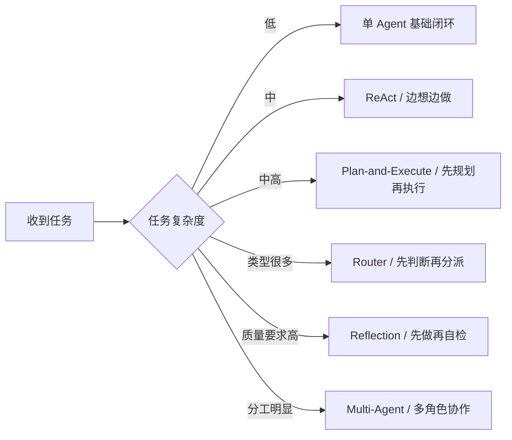
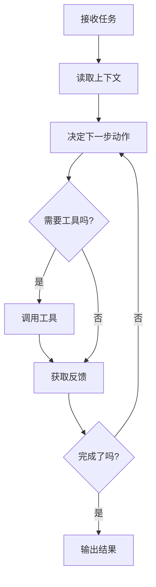
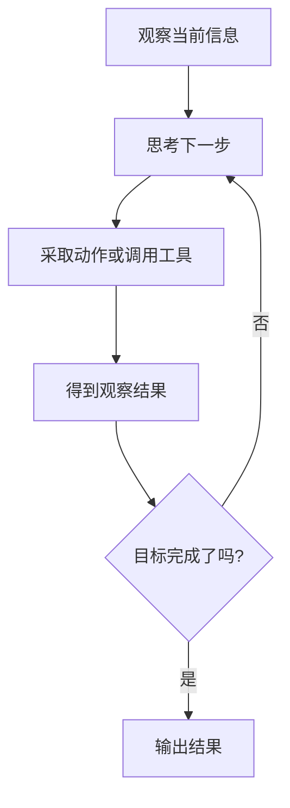
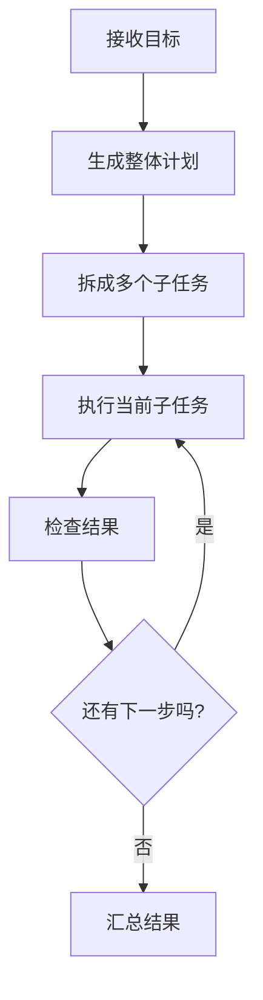
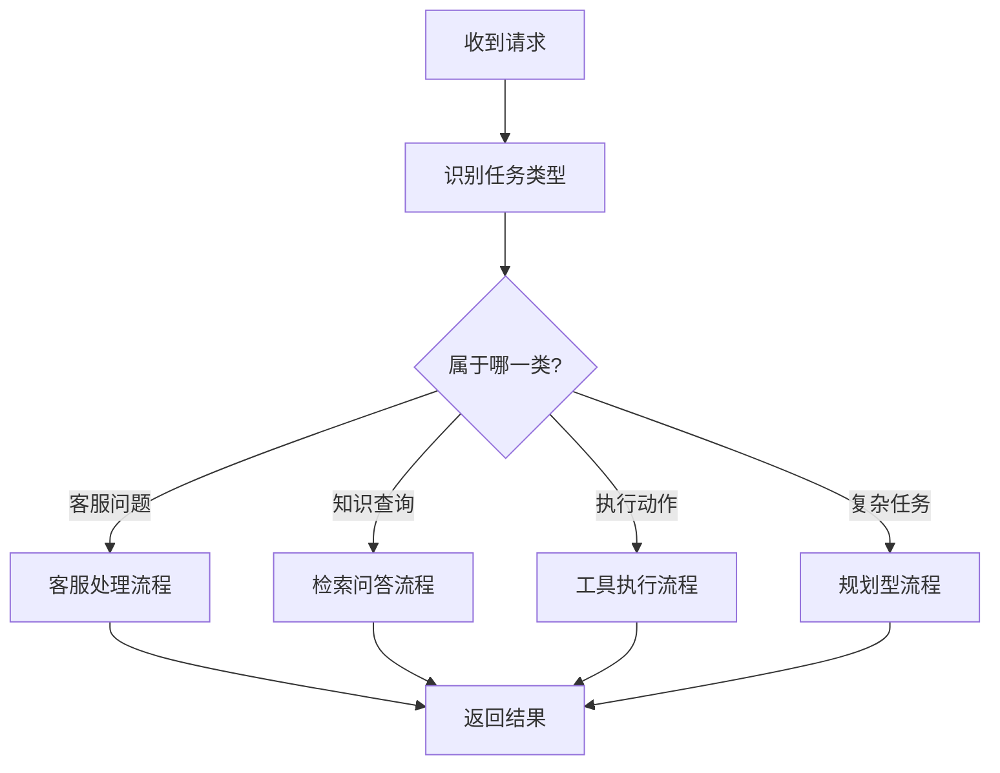
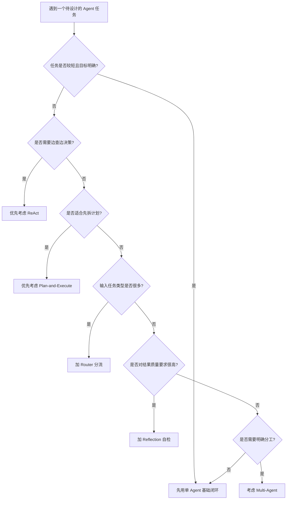

# 第四章 AI Agent 的常见工作流模式

## 1. 先说结论：很多 Agent 的差别，不在模型，而在工作流

如果前面几章回答的是：

- 什么是 AI Agent
- 它适合解决什么问题
- 一个 Agent 是如何构建的

那么这一章要回答的就是另一个很关键的问题：

**同样是 Agent，为什么有的像“边想边做”，有的像“先规划再执行”，有的又像“多人协作的团队”？**

答案通常不只是模型不同，  
更重要的是它们的**工作流模式（Workflow Pattern）**不同。

先说结论：

- **工作流模式，决定了一个 Agent 如何拆任务、何时调用工具、如何根据反馈继续推进。**
- **很多 Agent 的效果差异，不是因为模型差很多，而是因为流程组织方式不同。**
- **不是所有任务都需要复杂工作流。**
- **越复杂的工作流，通常越强大，但也越贵、越慢、越难调试。**

所以学习工作流模式，不是为了背几个英文名词，  
而是为了学会判断：

> 什么任务应该“边做边想”，什么任务应该“先规划再做”，什么任务应该“让多个角色分工”。
>

一句话说：

**工作流模式，就是 Agent 把任务推进下去的方法。**

## 2. 什么叫“工作流模式”？

你可以先把它理解成：

- 任务怎样被拆开
- 决策在什么时候发生
- 工具在什么时候被调用
- 结果如何进入下一轮
- 谁负责执行、谁负责检查、谁负责确认

从这个角度看，所谓工作流模式，并不神秘。  
它其实回答的是一个很朴素的问题：

**当 Agent 接到一个目标后，它到底按什么节奏做事？**

比如同样是“帮我完成一篇竞品分析”，不同 Agent 可能会这样工作：

- 有的先搜资料，再边查边写
- 有的先列出分析框架，再分步骤执行
- 有的先判断这是哪一类任务，再分派给不同子流程
- 有的先出第一版，再自己检查一遍再修改

这些差异，本质上都是工作流模式的差异。

从工程角度可以先记住这样一个公式：

```latex
工作流模式 = 决策顺序 + 工具调用方式 + 反馈机制 + 协作关系
```

这个公式说明了一件事：

- **决策顺序**决定先想什么、后做什么
- **工具调用方式**决定什么时候和外部环境交互
- **反馈机制**决定结果怎么进入下一轮
- **协作关系**决定是一个 Agent 做，还是多个角色分工做

所以，工作流不是“附加项”，  
而是 Agent 从“有能力”走向“能稳定完成任务”的关键部分。

### 2.1 为什么同一个模型，换个工作流效果就会不一样？

因为很多任务的难点，不在某一句话怎么写，  
而在于：

- 要不要先拆解任务
- 要不要先查信息
- 要不要中途检查结果
- 要不要把高风险步骤交给人确认
- 要不要把复杂任务分给不同角色

你可以把这件事类比成真实团队里的做事方式：

- 有的人适合边做边想
- 有的项目必须先列计划
- 有的工作要先分派给不同岗位
- 有的内容必须先复核再提交

Agent 也是一样。

下面这个对比表可以帮助你快速理解：

| 对比项 | 没有清晰工作流 | 有合适工作流 |
| --- | --- | --- |
| 任务推进 | 容易想到哪做哪 | 顺序更稳定 |
| 工具调用 | 可能乱用或漏用 | 更有节奏 |
| 结果质量 | 波动较大 | 更可控 |
| 失败处理 | 容易中途卡住 | 更容易补救和继续 |
| 调试与优化 | 难定位问题 | 更容易知道问题出在哪一环 |


所以，工作流模式的价值不是“看起来高级”，  
而是让 Agent 的行为更像一个可以被设计、被复用、被优化的系统。

## 3. 为什么不是所有任务都需要复杂工作流？

很多初学者一听到“工作流模式”，就容易有一个误区：

**模式越多，Agent 就越高级。**

其实不一定。

更准确地说：

- 任务简单时，简单流程往往更好
- 任务变复杂时，才需要更复杂的工作流
- 工作流不是越多越好，而是要和任务复杂度匹配

比如：

- 如果只是“总结一段文本”，单轮生成可能就够了
- 如果要“查资料后给建议”，边查边做的模式可能更合适
- 如果要“完成一个长任务”，先规划再执行会更稳
- 如果输入任务类型差别很大，先做路由分发会更自然
- 如果对结果质量要求高，自检反思流程就更重要
- 如果任务已经接近团队协作，多 Agent 才可能有意义

可以把常见模式先放在一张图里看：



这张图的重点不是给你一个绝对标准，  
而是告诉你：

**不同工作流模式，本质上是在应对不同类型的复杂性。**

## 4. 最常见的 6 种 Agent 工作流模式

下面我们按照“从简单到复杂”的顺序，来看最常见的 6 种模式。

### 4.1 单 Agent 基础闭环：最小可用模式

这是最基础、也最常见的一种模式。

它的特点是：

- 一个 Agent 独立完成任务
- 读上下文
- 必要时调用工具
- 根据结果继续下一步
- 最后输出结果

它通常适合：

- 目标明确
- 工具数量不多
- 路径不算太长
- 不需要复杂分工

比如：

- 整理会议纪要并同步待办
- 查询订单状态并回复用户
- 读取日志后生成初步问题分析

它的优点很明显：

- 结构简单
- 容易理解
- 好搭建、好调试
- 适合做第一版 Agent

缺点也很明显：

- 任务一旦太长，容易失控
- 任务一旦太复杂，Agent 可能中途走偏
- 质量检查和分工能力较弱

它的最小运行方式通常像这样：



如果你是初学者，最建议先从这种模式开始。  
因为它最容易让你真正看懂：

- Agent 到底怎么动起来
- 闭环到底是什么
- 工具和反馈在流程里扮演什么角色

### 4.2 ReAct：边想边做的模式

ReAct 可以理解成一种很经典的 Agent 工作流思路。  
它的核心不是记住这个英文名，而是理解它背后的节奏：

> 先观察，再思考，再行动，再根据结果继续下一轮。
>

所以它经常被理解成一种“边想边做”的模式。

这类模式通常适合：

- 信息不完整
- 任务推进过程中需要不断查资料
- 每一步结果会影响下一步决策
- 很难一开始就把整条路径规划清楚

比如：

- 排查一个线上故障
- 在代码库里定位问题
- 调研一个开放式问题
- 帮用户在多个系统里查找原因

它的运行节奏通常是：

1. 先看当前情况
2. 判断下一步最值得做什么
3. 调用一个工具
4. 获取结果
5. 再决定下一步

也就是说，它不强调“一开始就想完整计划”，  
而是强调：

**每走一步，就根据新信息更新判断。**

可以画成这样：



它的优势是：

- 很灵活
- 对信息不完整的任务很自然
- 容易与工具调用结合

它的风险也很明显：

- 容易绕圈
- 有时会多做很多步
- 成本和延迟可能变高
- 如果约束不好，可能出现“看似在努力，实际效率不高”

所以，ReAct 很适合探索型任务，  
但不一定适合那种“路径明确、步骤很多”的长任务。

### 4.3 Plan-and-Execute：先规划，再执行

如果说 ReAct 更像“边走边看”，  
那么 Plan-and-Execute 更像：

**先列一个计划，再按计划执行。**

这种模式通常包含两个阶段：

1. 规划阶段  
先把大任务拆成多个步骤或子任务。
2. 执行阶段  
再按顺序逐个完成这些步骤。

它特别适合下面这类任务：

- 任务比较长
- 最终目标很清楚
- 子步骤之间有明显顺序
- 如果没有整体规划，中途容易遗漏或返工

例如：

- 做一份完整的竞品研究
- 设计一次客户拜访安排
- 完成一个比较明确的代码重构任务
- 生成一套带结构的培训材料

它的运行逻辑大致像这样：



这种模式的优势是：

- 对长任务更稳
- 不容易漏步骤
- 更容易让人看懂它准备怎么做
- 便于中途插入人工确认

但它也有边界：

- 如果环境变化很快，先做好的计划可能很快过时
- 如果规划质量差，后面的执行也会被带偏
- 有时会多出一层规划成本

所以你可以这样记：

- ReAct 更适合不确定的探索型任务
- Plan-and-Execute 更适合目标清楚、路径较长的任务

### 4.4 Router：先判断，再分派

有些系统面对的不是“同一类任务”，  
而是很多不同类型的任务混在一起。

比如一个企业内部智能助手，可能同时会收到：

- 查订单
- 改密码
- 申请退款
- 查知识库
- 提交工单
- 查询项目状态

这时如果所有请求都走同一条流程，往往会很别扭。  
更自然的做法是：

**先判断这是什么任务，再把它送到合适的子流程、工具链或 Agent。**

这就是 Router 模式的核心。

它通常适合：

- 输入任务类型很多
- 每类任务的处理逻辑差别明显
- 不同任务需要不同工具或不同角色

它的优势在于：

- 更容易扩展
- 不同任务可以走最合适的处理链路
- 系统结构更清晰

它的风险在于：

- 路由判断如果错了，后面整条链都可能错
- 分类边界定义不清，会让系统很混乱

这个模式可以画成这样：



你可以把 Router 理解成系统里的“分诊台”或“总调度器”。

在很多真实产品里，它并不是全部工作流，  
而是一个更大工作流的入口层。

### 4.5 Reflection：先产出，再自检修正

有些任务最难的地方，不在“做第一版”，  
而在“怎么让结果更可靠”。

比如：

- 写一份重要邮件
- 生成一份分析报告
- 输出一段代码
- 做一份总结性文档

这类任务如果直接把第一版结果交出去，  
往往会有下面这些问题：

- 漏信息
- 逻辑不完整
- 结构不清晰
- 风格不统一
- 结论和证据对不上

这时很常见的一种模式就是：

1. 先生成初稿
2. 再检查结果
3. 发现问题后再修改
4. 直到达到可接受质量

这类模式通常被称为 Reflection、Review 或 Self-Refinement 一类的思路。  
你不一定非要记住术语，但要理解它的本质：

**不是一次出结果，而是让系统对自己的输出再看一遍。**

它适合：

- 对质量要求高的输出任务
- 容易漏项或出错的生成任务
- 需要先产出、再打磨的任务

它的优点是：

- 结果通常更完整
- 更容易发现明显错误
- 对文档、代码、分析类任务很有帮助

它的代价是：

- 会增加步骤
- 会增加时间和成本
- 如果检查标准不清晰，自检也可能流于形式

所以它最关键的不是“让 Agent 再看一遍”，  
而是：

- 让它知道要按什么标准检查
- 让它知道发现什么问题时必须修改

### 4.6 Multi-Agent：分工协作的模式

当任务再复杂一些时，一个 Agent 有时会显得又慢又乱。  
这时就可能会出现一种更复杂的模式：

**把不同工作交给不同角色的 Agent 分工完成。**

例如：

- 一个负责规划
- 一个负责检索信息
- 一个负责执行动作
- 一个负责审核结果

这就是多 Agent 协作模式。

它通常适合：

- 任务本身已经接近团队协作
- 不同环节的能力差异很大
- 一个 Agent 全包会导致上下文过载
- 需要更明确的职责分工

它的优势是：

- 分工更清晰
- 更容易针对不同角色做优化
- 复杂任务更容易被拆开

它的问题也很现实：

- 协调成本更高
- 上下文传递更复杂
- 一个环节出错可能影响后面全部环节
- 调试比单 Agent 难很多

所以多 Agent 不是“更高级就一定更好”，  
而是：

**当一个任务已经明显需要角色分工时，它才值得出现。**

## 5. 这几种模式到底有什么区别？

如果前面的内容你已经大致看懂了，  
现在可以把这些模式放在一张表里整体比较一下。

| 模式 | 核心特点 | 更适合什么任务 | 主要风险 |
| --- | --- | --- | --- |
| 单 Agent 基础闭环 | 一个 Agent 独立推进 | 目标明确、路径不长的任务 | 长任务容易失控 |
| ReAct | 边观察边决策边行动 | 探索型、信息不完整任务 | 容易绕圈、成本偏高 |
| Plan-and-Execute | 先规划再逐步执行 | 长任务、结构化任务 | 计划可能过时 |
| Router | 先识别类型再分派 | 多类型混合输入系统 | 路由错了整条链就偏 |
| Reflection | 先输出再自检修正 | 对质量要求高的生成任务 | 额外增加成本和延迟 |
| Multi-Agent | 多角色分工协作 | 复杂任务、明确分工任务 | 协调和调试复杂 |


如果要把它们再说得更直白一点：

- **单 Agent** 解决“先把基本闭环跑起来”
- **ReAct** 解决“我得边查边决定下一步”
- **Plan-and-Execute** 解决“这个任务太长，得先拆计划”
- **Router** 解决“入口任务太杂，得先分流”
- **Reflection** 解决“第一版不够稳，得再检查一轮”
- **Multi-Agent** 解决“一个人做太乱，得分工协作”

所以，工作流模式不是互相排斥的。  
现实中很多系统其实是组合使用的。

例如：

- 先用 Router 分流
- 再进入 Plan-and-Execute
- 其中某一步再用 ReAct 调工具
- 最后再用 Reflection 做质量检查

也就是说，**工作流模式更像积木，而不是只能选一个。**

## 6. 一个实用问题：到底该怎么选工作流模式？

如果你以后真的开始设计 Agent，  
最常见的问题不是“有哪些模式”，而是：

**面对一个具体任务，我到底该选哪种？**

这里给你一个非常实用的判断方法。  
先问自己下面 6 个问题：

1. 这个任务是不是一个短任务，单个 Agent 就能推进？
2. 它是不是需要边查边做，而不是一开始就能规划清楚？
3. 它是不是任务很长，最好先拆计划再执行？
4. 它的输入是不是很多类型，最好先分流？
5. 它的结果质量要求是不是很高，需要自检？
6. 它是不是已经明显需要多个角色分工？

大致可以按下面这个思路判断：



这张图想表达的核心是：

- 不要一开始就上最复杂模式
- 先选最小能解决问题的工作流
- 随着任务复杂度增加，再逐步加模式

这是一种非常重要的工程思维。  
因为很多 Agent 项目失败，不是因为模式太简单，  
而是因为一开始就把系统设计得太复杂。

## 7. 一个常见误区：工作流越复杂，Agent 就越强

这是非常典型的误区。

很多人做 Agent 时会不自觉地追求：

- 更多步骤
- 更多角色
- 更多工具
- 更多判断链路

但复杂度本身并不等于能力。  
很多时候它只意味着：

- 更高成本
- 更长延迟
- 更难调试
- 更多失败点

所以一个更成熟的判断方式应该是：

> 不是“我能不能把这个 Agent 设计得更复杂”，  
而是“这个任务是否真的需要这些复杂性”。
>

现实里更推荐的做法通常是：

1. 先做最小闭环
2. 看它到底卡在哪
3. 再针对性增加新的工作流机制

比如：

- 如果它总在探索任务里乱撞，就加 ReAct 约束
- 如果它做长任务经常漏步骤，就加 Plan-and-Execute
- 如果入口任务太杂，就加 Router
- 如果输出质量不稳，就加 Reflection
- 如果一个 Agent 负担太重，再考虑多 Agent

这才是更稳的演进方式。

## 8. 本章小结

这一章你可以先记住 6 句话：

1. **工作流模式决定了 Agent 如何拆任务、何时调用工具、怎样根据反馈继续推进。**
2. **很多 Agent 的效果差异，不只是模型差异，更是工作流差异。**
3. **简单任务不一定需要复杂工作流，模式要和任务复杂度匹配。**
4. **ReAct 适合边查边做，Plan-and-Execute 适合先规划再执行。**
5. **Router、Reflection 和 Multi-Agent 分别解决分流、自检和分工问题。**
6. **设计 Agent 时，最重要的不是一开始做最复杂，而是先选最小可用模式。**

如果只用一句话概括：

> AI Agent 的工作流模式，本质上是在回答一个问题：这个系统应该按什么节奏和方法，把目标一步步做成。
>

