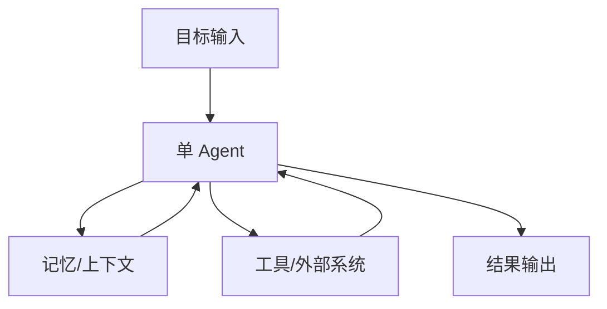
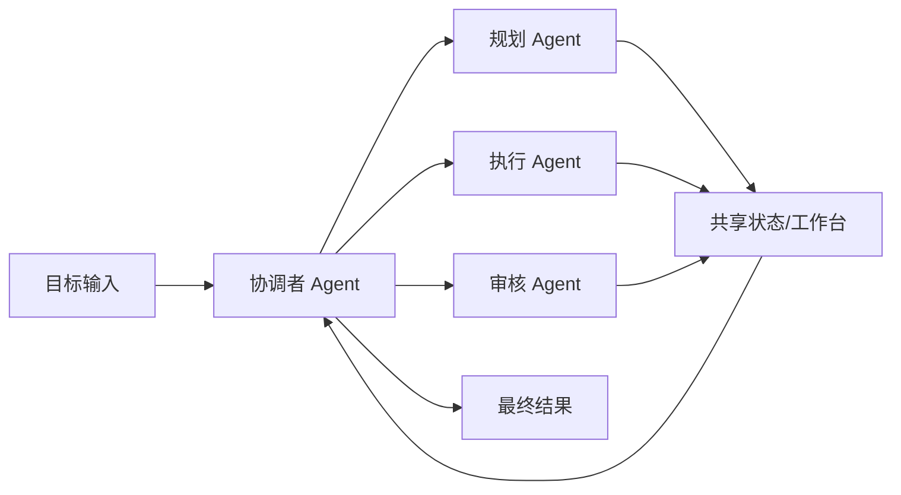

# 第五章 单 Agent 和多 Agent

## 1. 先说结论：不是 Agent 越多越强

如果前一章讲的是“常见工作流模式”，  
那么这一章要回答的是一个更容易让人纠结的问题：

**做 Agent 系统时，到底应该用单 Agent，还是多 Agent？**

很多人一开始会下意识觉得：

- 一个 Agent 不够强，就多加几个
- 一个角色不够，就拆成多个角色
- 一个流程不够复杂，就做成多 Agent 协作

但现实里，事情往往正好相反。

先说结论：

- **大多数 Agent 项目，应该先从单 Agent 开始。**
- **多 Agent 解决的是“分工问题”，不是“显得更高级”的问题。**
- **如果一个目标可以由同一个决策闭环稳定完成，那单 Agent 通常更好。**
- **只有当任务已经明显出现分工、上下文过载、职责差异或并行需求时，多 Agent 才真正值得。**

一句话说：

> 单 Agent 追求的是“先把事情稳定做成”，  
多 Agent 追求的是“把复杂事情拆开分工做成”。
>

所以这章最重要的，不是记住两个名词，  
而是学会判断：

**什么时候一个 Agent 就够了，什么时候必须拆成多个 Agent。**

## 2. 先把概念说清楚

### 2.1 什么是单 Agent？

单 Agent 不是指“只调用一次模型”，  
而是指：

**整个任务主要由一个 Agent 的决策闭环来负责。**

它可以：

- 有自己的角色和目标
- 读取上下文和记忆
- 调用多个工具
- 多轮推进任务
- 在必要时让人确认

但无论中间调用了多少工具、走了多少轮，  
真正负责判断“下一步做什么”的核心主体，仍然是这一个 Agent。

可以把它理解成：

- 一个负责人
- 一套上下文
- 一条主要决策链路

它的结构大致像这样：



例如：

- 一个会议纪要助手
- 一个代码排障助手
- 一个出差安排助手
- 一个客服处理助手

这些系统背后当然可能接很多工具，  
但从架构上看，它们仍然是单 Agent。

### 2.2 什么是多 Agent？

多 Agent 指的是：

**系统中存在多个相对独立的 Agent，它们以不同角色分工协作，共同完成一个更大的目标。**

这些 Agent 往往会有不同的职责，比如：

- 一个负责规划
- 一个负责检索信息
- 一个负责执行动作
- 一个负责审核结果

它们之间通常不是简单并排摆着，  
而是会有：

- 任务分派
- 上下文传递
- 中间结果交接
- 共享状态
- 最终汇总

一个典型的多 Agent 结构大致像这样：



这里最关键的一点不是“Agent 数量更多”，  
而是：

**多个 Agent 之间已经出现了真实的职责边界。**

### 2.3 不要把“多步骤流程”误认为“多 Agent”

这是初学者最容易混淆的一点。

比如一个系统会：

1. 先理解任务
2. 再查资料
3. 再生成结果
4. 再做一次自检

这不一定就是多 Agent。  
它也可能只是：

**一个 Agent 内部的多阶段工作流。**

所以一个很实用的判断方法是：

- 如果只是一个主体在完成多个步骤，更像单 Agent
- 如果已经出现多个相对独立的角色在交接任务，更像多 Agent

这件事很重要，因为：

**你不应该为了追求“多 Agent”而把本来一个 Agent 能做好的事，硬拆成很多段。**

## 3. 为什么很多场景单 Agent 就够了？

很多人做 Agent 的第一个误区是：

**还没把单 Agent 做稳，就急着做多 Agent。**

但大多数真实项目，一开始其实并不需要这么复杂。

单 Agent 往往已经足够的典型情况有下面几类。

### 3.1 目标本身比较单一

如果系统面对的是一个相对清晰、边界明确的目标，  
通常一个 Agent 就可以把它从头推进到尾。

例如：

- 帮我整理会议纪要并提炼待办
- 帮我读取日志并给出初步排障建议
- 帮我安排一次标准出差行程
- 帮我回复一个常见客服问题

这些任务当然可能有多步，  
但并不天然需要多个角色分工。

### 3.2 所需上下文基本在一个脑子里装得下

如果任务需要的信息量还没有大到“一个 Agent 很难稳定处理”，  
那么单 Agent 通常更自然。

比如它只需要读取：

- 当前对话
- 少量历史记录
- 几个工具返回结果
- 一个不太大的知识片段

这种情况下，硬拆成多个 Agent，  
反而会让上下文在多个角色之间来回传递，徒增复杂度。

### 3.3 工具集比较统一

如果任务所需工具都属于同一类能力，  
例如都是“查信息 -> 分析 -> 生成结果”，  
那么往往一个 Agent 就可以比较顺地完成。

例如：

- 查知识库 + 总结
- 查数据库 + 解释
- 读代码 + 定位问题

这类任务的关键难点，多数不在分工，  
而在于上下文质量、工具可用性和流程约束。

### 3.4 你更在意稳定性和可调试性

单 Agent 的一个巨大优势是：

**它更容易理解，也更容易调试。**

因为你更容易回答这些问题：

- 它为什么这么做？
- 它在哪一步出错？
- 它拿到了哪些上下文？
- 哪个工具调用失败了？

而一旦变成多 Agent，  
很多问题会变成：

- 是谁分派错了？
- 是谁把上下文传丢了？
- 是谁理解错了上一环节的输出？
- 是哪一次交接导致后面全偏了？

所以从工程角度看，  
单 Agent 往往是更好的起点。

## 4. 多 Agent 真正解决的是什么问题？

如果单 Agent 已经能完成很多事，  
那为什么还会出现多 Agent？

因为有些问题，真的不是“再给一个 Agent 多加一点 Prompt”就能解决的。

多 Agent 通常在解决下面几类问题。

### 4.1 一个 Agent 的上下文开始过载

当一个任务非常长、信息来源很多、步骤很多时，  
单 Agent 容易出现这些问题：

- 忘掉前面的关键约束
- 后面步骤把前面结论覆盖掉
- 工具结果太多，判断开始混乱
- 不同子任务互相干扰

这时把不同职责拆给不同 Agent，  
可以降低每个 Agent 需要同时处理的信息密度。

例如一份复杂研究任务里：

- 研究 Agent 负责搜集材料
- 分析 Agent 负责归纳结论
- 写作 Agent 负责组织输出

这样每个角色关注的内容更聚焦。

### 4.2 不同环节需要完全不同的能力重点

有些任务虽然属于同一个大目标，  
但其中不同阶段的判断标准其实差很多。

比如一个代码修复系统里：

- 一个角色擅长读代码和定位原因
- 一个角色擅长生成修复方案
- 一个角色擅长做安全和回归检查

如果把这些全塞给一个 Agent，  
它当然也不是完全做不了，  
但行为边界可能会比较模糊。

多 Agent 的价值就在于：

**让不同角色只对自己那部分结果负责。**

### 4.3 任务天然可以并行

有些任务不是一条线做到底，  
而是可以拆成多个相对独立的子任务同时推进。

例如：

- 同时调研多个竞品
- 同时分析多个日志片段
- 同时读取多个文档并提取结论

这时如果还用一个 Agent 顺序做，  
可能会比较慢。

而多 Agent 可以把这些子任务并行展开，  
再把结果汇总回来。

### 4.4 你需要更清晰的审查和责任分离

在某些高风险场景里，  
系统不仅要完成任务，还要更清楚地知道：

- 谁负责生成方案
- 谁负责复核
- 谁负责最终提交

比如：

- 自动写代码，但必须经过审查 Agent
- 自动起草邮件，但必须经过合规检查 Agent
- 自动处理工单，但必须经过策略校验 Agent

这时多 Agent 的意义不是“更聪明”，  
而是“更可控”。

### 4.5 一个实用判断公式

你可以先记住这样一个经验公式：

```latex
适合多 Agent = 可拆分任务 + 明显角色差异 + 上下文压力大 + 协调收益 > 协调成本
```

这里面最容易被忽略的，是最后一项：

**协调收益必须大于协调成本。**

因为只要你引入多 Agent，  
就一定会引入新的复杂性，比如：

- 角色划分
- 任务分派
- 上下文同步
- 输出格式约束
- 错误恢复

如果这些额外成本并没有换来明显收益，  
那就不值得。

## 5. 单 Agent 和多 Agent 到底有什么区别？

把前面的内容收拢一下，可以先看一张对比表。

| 对比项 | 单 Agent | 多 Agent |
| --- | --- | --- |
| 决策主体 | 一个核心主体 | 多个角色分工 |
| 系统结构 | 简单 | 更复杂 |
| 上下文管理 | 集中在一个闭环里 | 需要跨角色传递 |
| 工具使用 | 由一个主体统一调用 | 可由不同角色分别调用 |
| 调试难度 | 较低 | 较高 |
| 延迟与成本 | 通常更低 | 通常更高 |
| 适合场景 | 中短任务、边界清晰任务 | 复杂任务、明确分工任务 |
| 主要风险 | 长任务易失控 | 协调和交接容易出错 |

如果再说得更直白一点：

- **单 Agent 的难点是“一个人能不能稳定做完”**
- **多 Agent 的难点是“多个人能不能协同做好”**

这两类系统面对的问题并不一样。

所以架构选择时，不要只问：

- 哪个更高级？

更应该问：

- 哪个更适合这个任务的复杂度？
- 哪个更容易稳定落地？
- 哪个更方便排查问题和持续优化？

## 6. 多 Agent 常见的 3 种组织方式

多 Agent 并不是一种固定结构。  
现实里最常见的，通常有下面几种组织方式。

### 6.1 Supervisor-Worker：一个总控，多个执行者

这是最常见的一种结构。

它的思路是：

- 一个协调者 Agent 负责理解总目标
- 再把子任务分派给多个 Worker Agent
- 最后由协调者汇总结果

它适合：

- 任务可以被明确拆分
- 各子任务边界相对清楚
- 需要一个统一出口

例如：

- 总控负责拆研究任务
- 多个执行 Agent 分头调研不同对象
- 最后由总控汇总成报告

### 6.2 Planner-Executor-Reviewer：规划、执行、复核分离

这种结构很适合对质量和风险比较敏感的任务。

它的分工通常是：

- Planner 负责拆目标和规划步骤
- Executor 负责真正做事
- Reviewer 负责检查结果是否达标

这种方式的好处是：

- 责任边界清楚
- 更容易插入审核标准
- 更适合代码、文档、报告这类需要复核的任务

但代价也很明显：

- 步骤会变多
- 延迟会变高
- 如果交接格式不清晰，会来回返工

### 6.3 Router-Specialist：先分流，再由专门角色处理

如果系统面对很多不同类型的请求，  
一种很自然的方式是：

- 先由 Router 判断任务类型
- 再交给不同 Specialist Agent 处理

例如一个企业助手系统里：

- 账号问题给 IT Agent
- 订单问题给客服 Agent
- 知识查询给检索 Agent
- 复杂执行给任务 Agent

它很适合：

- 输入任务类型很多
- 每类任务工具链不同
- 各类请求需要不同风格和规则

它的关键难点在于：

**路由一旦错了，后面的整条链路都会偏。**

## 7. 该怎么选？一个实用判断框架

如果你在做设计时拿不准，可以先按下面 5 个问题判断。

### 7.1 这个任务有没有一个清晰的统一负责人？

如果答案是“有”，  
那通常更偏向单 Agent。

如果答案是“没有，一个角色很难同时做好全部事情”，  
那才更值得考虑多 Agent。

### 7.2 不同环节之间的能力差异大不大？

如果只是同一个角色在不同步骤里切换节奏，  
通常还是单 Agent 工作流就够了。

如果不同环节已经明显像不同岗位，  
例如“规划”“执行”“审核”真的是三种不同工作，  
那多 Agent 会更自然。

### 7.3 一个 Agent 能不能装下足够的上下文？

如果能，优先单 Agent。  
如果经常出现：

- 信息太多装不下
- 子任务互相干扰
- 一长就开始跑偏

那就说明单一闭环可能已经接近边界。

### 7.4 拆分之后，收益是不是明显大于成本？

这是最重要的一问。

因为多 Agent 会增加：

- 开发成本
- 调试成本
- 协调成本
- token 成本
- 延迟成本

如果拆分后的收益只是“看起来更像智能体团队”，  
那通常不值得。

### 7.5 你是否已经把单 Agent 跑通了？

这是一个非常实用的工程原则：

> 如果单 Agent 版本还没跑稳，  
通常不要急着上多 Agent。
>

因为很多问题其实不是“缺少多个 Agent”，  
而是：

- 提示词边界不清
- 上下文质量不够
- 工具不稳定
- 工作流没闭环
- 缺乏确认机制

这些基础问题不解决，  
即使拆成多个 Agent，也只是把问题拆散，而不是解决问题。

## 8. 从单 Agent 演进到多 Agent，正确顺序是什么？

如果你最后确实需要多 Agent，  
最好的做法通常不是一步到位，  
而是按下面这个顺序逐步演进。

### 8.1 第一步：先做一个能跑通的单 Agent 闭环

先验证最关键的事情：

- 目标是否定义清楚
- 上下文是否够用
- 工具是否可调用
- 结果是否对用户真的有价值

如果连这些都还没成立，  
过早拆分只会让系统更难理解。

### 8.2 第二步：找出真正的瓶颈环节

不要凭感觉拆。  
要根据真实问题来拆，比如：

- 某一类子任务特别容易出错
- 某一步审查要求特别强
- 某些信息检索可以独立并行
- 某个角色需要完全不同的提示词和工具

只有明确知道瓶颈在哪，  
拆分才有意义。

### 8.3 第三步：只拆最值得拆的一层

很多时候你并不需要一下子变成 5 个 Agent。

更稳的方式是：

- 先把“审核”拆出去
- 或者先把“规划”拆出去
- 或者先把“检索”拆出去

也就是说：

**最小化拆分，优先解决最大问题。**

### 8.4 第四步：定义清楚交接格式

多 Agent 最大的隐患之一，不是能力不够，  
而是交接混乱。

所以你至少要定义清楚：

- 上一环节输出什么字段
- 下一环节需要哪些输入
- 哪些结论是事实，哪些只是推测
- 哪些内容必须原样保留
- 出错时如何回退或重试

如果没有这些约束，  
多 Agent 很容易退化成“多个角色互相误解”。

### 8.5 第五步：保留一个最终责任主体

很多系统做着做着会出现一个问题：

**每个 Agent 都在做一点事，但没有一个 Agent 真正对最终结果负责。**

这是危险的。

一个更稳的做法通常是：

- 即使有多个 Agent
- 也保留一个总控或最终出口
- 它负责汇总、判断、确认和对外输出

这样系统的责任边界才不会散掉。

## 9. 常见误区：为什么很多“多 Agent 系统”反而更差？

最后再讲几个很常见的误区。

### 9.1 为了“显得高级”而拆多 Agent

这是最常见的问题。

明明一个 Agent 就能完成，  
却非要拆成：

- 任务理解 Agent
- 工具调用 Agent
- 格式整理 Agent
- 总结 Agent

这样做未必带来真实收益，  
反而会让系统：

- 更慢
- 更贵
- 更难调试

### 9.2 角色边界定义得很模糊

如果两个 Agent 都在做“分析”，  
但没人说清：

- 谁分析什么
- 谁拍板
- 谁负责最终产出

那系统很容易出现重复劳动和互相覆盖。

### 9.3 交接时没有结构化协议

如果 Agent 之间只是互相传一大段自然语言，  
又没有明确字段、状态和约束，  
信息会在传递过程中不断变形。

这也是为什么很多多 Agent 系统看起来很聪明，  
但一跑长任务就开始混乱。

### 9.4 没有共享状态或最终汇总机制

多 Agent 最大的问题之一是：

每个角色都只看见局部。

如果没有共享状态、黑板机制、统一任务单，  
或者没有一个最终汇总角色，  
系统就很容易出现：

- 重复工作
- 互相矛盾
- 结果不一致

## 10. 小结：先学会做“一个能成事的 Agent”，再学会做“会分工的 Agent 团队”

这一章最重要的，不是记住“单 Agent”和“多 Agent”这两个词，  
而是记住下面这几句话：

- **单 Agent 是默认起点，不是低级形态。**
- **多 Agent 不是更高级，而是更复杂。**
- **只有当任务真的需要分工时，多 Agent 才有价值。**
- **架构选择的标准，不是谁更酷，而是谁更稳定、更划算、更可控。**

所以从实践角度，一个更稳的顺序通常是：

1. 先做单 Agent
2. 把闭环跑通
3. 找到真正瓶颈
4. 再决定是否拆成多 Agent

一句话收尾：

> 单 Agent 解决“一个人把事做好”，  
多 Agent 解决“一组角色把复杂的事协同做好”。
>

理解了这点，你在设计 Agent 系统时，就不会轻易掉进“越复杂越先进”的误区里。
