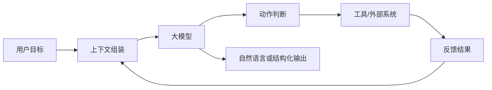
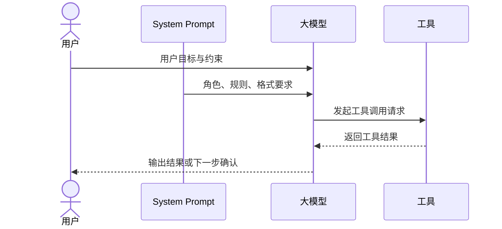

# 第六章 Agent 背后的大模型基础

## 1. 先说结论：Agent 离不开大模型，但不要把所有问题都归因于模型

前面几章我们一直在强调一件事：

- Agent 不等于大模型
- 做 Agent 也不只是写 Prompt
- 工作流、工具、记忆和约束同样重要

但这并不意味着模型不重要。

恰恰相反：

**大模型通常是 Agent 的认知核心。**

它负责理解任务、结合上下文、判断下一步、组织输出，  
很多 Agent 之所以“像个会做事的系统”，底层都离不开大模型的这些能力。

所以这一章要回答的是：

**大模型在 Agent 里到底扮演什么角色？我们又该理解哪些最基本的模型知识？**

先说结论：

- **大模型是 Agent 的大脑，但不是 Agent 的全部。**
- **很多 Agent 问题看起来像“模型不够强”，其实常常是上下文、工具、流程或约束的问题。**
- **理解 token、上下文窗口、消息结构、参数和工具调用方式，是做 Agent 的基础。**
- **像 `temperature` 这样的参数很重要，但它只能调行为风格，不能替代系统设计。**

一句话说：

> 做 Agent，不需要先成为大模型研究员，  
但至少要知道模型是怎么“看见任务、理解信息、输出动作”的。
>

## 2. 大模型在 Agent 里到底负责什么？

很多初学者会把 Agent 理解成：

- 前面是用户输入
- 中间是一个神奇的 LLM
- 后面就自动把事情做完

这种理解不完全错，但太粗了。

更准确地说，在一个 Agent 系统里，大模型通常负责下面几类核心工作。

### 2.1 理解输入

模型首先要做的是理解当前任务。

比如用户说：

- 帮我总结一下今天的客户会议
- 帮我看下这段代码为什么报错
- 帮我整理出下周出差计划

这时候模型要判断的并不只是“这句话是什么意思”，  
而是：

- 用户真正目标是什么
- 当前缺了哪些信息
- 有没有隐含约束
- 是该直接回答，还是先查信息、先问问题、先调用工具

所以从 Agent 角度看，  
模型不是在做普通聊天理解，  
而是在做：

**任务理解和行动判断。**

### 2.2 消化上下文

Agent 一般不会只把“用户这一句话”发给模型。  
它还会把很多相关信息一起放进去，例如：

- 系统角色说明
- 历史对话
- 用户偏好
- 业务规则
- 之前的工具调用结果
- 当前任务状态

模型需要在这些信息里判断：

- 哪些是当前最重要的
- 哪些只是背景
- 哪些约束不能违反
- 哪些结果应该进入下一步

所以很多 Agent 的质量，不只是取决于模型本身，  
还取决于：

**你给模型喂进去的上下文是不是对的。**

### 2.3 决定下一步动作

在 Agent 里，模型最关键的一件事往往不是“回答得漂不漂亮”，  
而是：

**决定接下来该做什么。**

比如它可能要判断：

- 先不要回答，先去查知识库
- 这个问题要调用日历工具
- 这个动作风险高，需要让用户确认
- 当前信息不够，应该先追问
- 这个任务已经完成，可以结束

也就是说，模型常常在扮演：

- 任务调度器
- 决策器
- 规划器
- 解释器

这也是为什么 Agent 对模型的要求，  
和普通聊天机器人不完全一样。

### 2.4 生成输出

最后模型还要把结果组织出来。

输出可能是：

- 给用户的一段自然语言回复
- 一个结构化 JSON
- 一次工具调用请求
- 一份计划
- 一段代码
- 一份总结报告

所以模型的输出能力，不只是“写得像不像人”，  
还包括：

- 能不能按要求输出结构
- 能不能把信息组织清楚
- 能不能稳定遵守格式

### 2.5 一个直观理解

你可以把 Agent 里的大模型，先理解成这样一个角色：

```text
输入信息的解释者 + 上下文的整合者 + 下一步动作的判断者 + 输出结果的组织者
```

但请注意：

它虽然负责“想”，  
却不一定负责“真的做”。

真正做动作的，往往是：

- 工具调用层
- 工作流控制层
- 外部系统

所以更完整的关系是：



这张图里最重要的一点是：

**模型负责认知和决策，系统负责执行和闭环。**

## 3. 什么是 Token？为什么它和 Agent 关系很大？

很多人在用模型 API 时，会很快碰到一个词：

`token`

如果只从字面上理解，它好像是个很技术的概念。  
但其实它和 Agent 非常相关。

### 3.1 Token 可以先粗略理解成“模型处理文本的基本单位”

模型并不是按“整句话”直接处理输入的。  
它会把文本切成更小的单位来处理，这些单位就叫 token。

你不用把它想得太复杂。  
学习阶段先记住两点就够了：

- 一个 token 不一定等于一个汉字
- 一个 token 也不一定等于一个英文单词

它更像是：

**模型内部读写文本时使用的切分单位。**

所以当你看到下面这些词时：

- input tokens
- output tokens
- token usage
- token cost

本质上都和一件事有关：

**模型这次读了多少、写了多少。**

### 3.2 为什么 token 会影响成本和速度？

因为模型每次工作时，都要处理输入 token，  
也要生成输出 token。

通常来说：

- 输入越长，处理越慢、成本越高
- 输出越长，生成越慢、成本也越高

所以 Agent 一旦开始：

- 带很多历史对话
- 带很多检索结果
- 带很多工具调用结果
- 连续跑很多轮

token 消耗就会快速上升。

这就是为什么 Agent 系统比普通单轮问答，  
更需要关心 token。

### 3.3 一个 Agent 为什么比普通聊天更容易“吃 token”？

因为 Agent 往往不仅要看用户这一句，  
还要看很多额外内容。

例如一次简单任务里，模型可能同时读到：

- 系统提示词
- 用户目标
- 历史对话
- 记忆摘要
- 检索片段
- 工具定义
- 上一步工具返回结果
- 当前任务状态

如果任务多轮推进，  
这些内容还会一轮轮累积。

所以你可以把 Agent 理解成：

**一个比聊天机器人更依赖上下文，也更依赖 token 预算的系统。**

## 4. 什么是上下文窗口？为什么长任务容易出问题？

理解了 token，下一步就要理解另一个核心概念：

`context window`，也就是上下文窗口。

### 4.1 上下文窗口是什么？

你可以把它先理解成：

**模型一次最多能“看见”的输入和输出总量。**

这不是严格学术定义，  
但对做 Agent 已经足够实用。

如果把模型比作一个正在处理任务的人，  
上下文窗口就像他当前桌面上一次能摊开的材料总量。

桌面再大，也不是无限的。  
材料太多，就必须：

- 压缩
- 摘要
- 丢弃一部分
- 分批处理

模型也是一样。

### 4.2 为什么上下文窗口对 Agent 特别重要？

因为 Agent 的任务天然更容易把窗口塞满。

例如：

- 任务不是一轮就结束
- 会连续调用工具
- 会不断产生中间结果
- 可能还要记住用户偏好和业务规则

如果这些东西都原封不动地一直往后带，  
很快就会出现几个典型问题：

- 早期信息被挤掉
- 关键信息淹没在大量无关内容里
- 模型注意力开始分散
- 成本和延迟快速升高

所以很多长任务做不好，不一定是模型不会，  
也可能是：

**模型已经“看不过来”了。**

### 4.3 长任务为什么会“越跑越糊”？

这是一种很常见的现象。

一开始 Agent 看起来挺正常，  
但任务跑着跑着就开始：

- 忘前面的要求
- 重复做过的事
- 把旧结论和新结论混在一起
- 工具结果引用错误
- 开始偏离目标

这里常见的原因包括：

- 历史太长，没有做摘要
- 工具输出太原始，没有提炼关键结果
- 每轮都把全部上下文照搬
- 没有明确的任务状态表示

所以对 Agent 来说，  
上下文管理几乎和模型能力一样重要。

### 4.4 一个实用原则：不要把“上下文变长”当成“上下文变好”

这是非常容易踩的坑。

很多人会觉得：

- 给模型更多信息，总比更少好

但实际上并不总是这样。

因为信息多不等于信息有用。  
如果大量无关内容混进来，  
反而会让模型更难抓住关键点。

所以更好的原则通常是：

- 给模型需要的信息
- 而不是把所有可能相关的信息都塞进去

换句话说：

**高质量上下文，比超长上下文更重要。**

## 5. 模型到底是怎么“看到任务”的？

很多时候我们说“给模型发一个请求”，  
但在实际系统里，模型看到的通常不是一段孤立文本，  
而是一组被组织好的消息。

### 5.1 常见的消息类型

在很多模型接口里，你会看到类似下面这些角色：

- `system`
- `user`
- `assistant`
- `tool`

可以先这样理解：

| 消息角色 | 作用 |
| --- | --- |
| `system` | 定义系统角色、目标、行为边界和规则 |
| `user` | 用户提出的任务、问题、补充信息 |
| `assistant` | 模型前面已经给出的回答或中间推理结果 |
| `tool` | 工具返回的数据或执行结果 |

这些角色并不是语法装饰，  
它们决定了模型如何理解这段上下文。

### 5.2 `system` 为什么重要？

`system` 消息通常用来告诉模型：

- 你是谁
- 你要解决什么问题
- 你有哪些规则
- 什么能做，什么不能做
- 什么情况下必须确认
- 输出应该遵循什么格式

从 Agent 角度看，  
`system` 很像：

- 角色设定
- 操作手册
- 任务边界
- 行为约束

如果这部分写得很模糊，  
后面的行为通常也会变得不稳定。

### 5.3 `user` 不只是“聊天内容”

在普通聊天里，`user` 看起来只是用户说的一句话。  
但在 Agent 里，`user` 消息常常还承担下面这些功能：

- 注入当前任务目标
- 给出补充限制条件
- 传入用户确认
- 改变任务优先级
- 提供额外资料

所以在 Agent 系统里，  
`user` 并不只是输入层，  
它也在持续影响任务状态。

### 5.4 `tool` 消息为什么关键？

Agent 和普通聊天最大的差别之一，  
就是工具调用结果会回到模型上下文里。

例如：

- 搜索结果
- 数据库查询结果
- API 返回状态
- 代码执行输出
- 文件内容摘要

这些信息一旦通过 `tool` 消息喂回模型，  
模型就能根据真实世界的反馈继续下一步。

这就是 Agent 形成闭环的关键环节之一。

### 5.5 一个完整流程可以长什么样？



这张图说明了一个很关键的点：

**模型看到的，不只是“用户问题”，而是一个被系统组织过的任务现场。**

## 6. Prompt 很重要，但不要把它神化

很多人学习大模型时，最先接触的是 Prompt。  
这当然没问题，因为 Prompt 的确很重要。

但在 Agent 里，要特别避免两个极端误区：

- 觉得 Prompt 不重要
- 觉得 Prompt 能解决一切

### 6.1 Prompt 真正解决什么？

一个好的 Prompt 通常会帮助模型明确：

- 当前目标是什么
- 输出格式是什么
- 优先级是什么
- 遇到不确定性怎么办
- 什么时候该调用工具
- 什么时候该先确认

所以 Prompt 的价值在于：

**把模型从“泛化的语言能力”引导到“当前任务所需的行为方式”。**

### 6.2 Prompt 不能替代系统设计

如果一个 Agent 有下面这些问题：

- 工具经常失败
- 上下文组织混乱
- 没有任务状态管理
- 缺少确认机制
- 长任务会丢信息

那你再怎么改 Prompt，  
效果通常也只会有限改善。

因为这些问题本质上不只是“模型说得不对”，  
而是：

**系统没把模型放在一个合适的工作环境里。**

所以一个更成熟的理解应该是：

- Prompt 很重要
- 但 Prompt 只是系统设计的一部分

## 7. 常见参数怎么理解？

说到大模型基础，很多人最关心的就是参数。  
尤其是：

- `temperature`
- `top_p`
- `max tokens`

这些参数确实值得理解，  
但要用正确方式理解。

### 7.1 `temperature`：控制输出的随机性

这是最常见、也最容易被提到的参数。

你可以先把它粗略理解成：

**模型输出时“有多敢发散”的程度。**

通常来说：

- 温度低，输出更稳定、更保守、更接近高概率答案
- 温度高，输出更发散、更多样，也更容易出现意外

它不是“聪明程度”调节器，  
更像：

**稳定性和多样性之间的一个平衡旋钮。**

### 7.2 什么场景适合低温度？

如果你的目标是：

- 稳定
- 可复现
- 少出花样
- 尽量遵守格式

那通常更适合低温度。

例如：

- 工具调用参数生成
- JSON 结构化输出
- 代码修改建议
- 流程判断
- 审核与分类任务

因为这些场景里，  
你更希望模型：

- 少一点自由发挥
- 多一点可控性

### 7.3 什么场景可以适当提高温度？

如果你的目标更偏向：

- 创意生成
- 文案发想
- 标题 brainstorm
- 多方案探索
- 风格化表达

那可以把温度适当调高一些。

因为这时你更在意：

- 不同表达方式
- 备选思路
- 新鲜感

但即便如此，也不是越高越好。  
太高可能会让结果开始漂。

### 7.4 一个非常重要的提醒

`temperature` 会影响输出风格，  
但它不能解决下面这些问题：

- 上下文不完整
- 工具结果错误
- 任务边界不清
- 工作流设计混乱
- 模型本身能力不够

所以如果一个 Agent 反复做错事，  
不要第一反应就去调温度。

先问自己：

- 它是不是根本没拿到关键信息？
- 它是不是拿到了错误工具结果？
- 它是不是不知道什么时候该停下来确认？

很多时候，真正的问题不在参数。

### 7.5 `top_p`：另一种控制采样范围的方法

`top_p` 也和输出随机性有关，  
只是它的调节方式和 `temperature` 不完全一样。

如果用非常通俗的话说，  
它更像是在控制：

**模型每一步从多大范围的候选答案里挑选。**

学习阶段你不用把它想得太数学化。  
一个很实用的建议是：

- 初学时优先理解 `temperature`
- 如果没有明确需求，不必一开始就频繁同时调很多采样参数

因为参数调得越多，  
越难判断到底是哪一个在起作用。

### 7.6 `max tokens`：限制模型最多输出多少

这个参数通常用来控制：

**本次生成最多可以吐出多少内容。**

它会影响几个事情：

- 能不能把回答说完
- 成本会不会失控
- 输出会不会太冗长

如果设得太小，可能出现：

- 回答被截断
- JSON 不完整
- 推理没说完

如果设得太大，可能出现：

- 成本升高
- 输出变啰嗦
- 延迟变长

所以它不是越大越好，  
而是要和任务匹配。

### 7.7 结构化任务里，比温度更重要的往往是输出约束

这是做 Agent 时一个很实用的经验。

如果你想让模型稳定输出：

- JSON
- 工具参数
- 分类标签
- 审核结论

很多时候最有效的不是去细调温度，  
而是：

- 明确字段定义
- 限制输出格式
- 给出合法示例
- 用结构化输出机制

换句话说：

**参数在调行为，约束在调边界。**

对 Agent 来说，后者常常更关键。

## 8. 为什么 Agent 特别依赖结构化输出和工具调用？

如果只是聊天，模型输出一段自然语言通常就够了。  
但 Agent 不一样。

Agent 往往要把模型输出接到系统动作上，  
所以输出必须更像“机器也能读懂的指令”。

### 8.1 什么是结构化输出？

结构化输出指的是让模型不要随便自由发挥一大段文本，  
而是按指定结构返回结果。

例如：

- JSON
- 固定字段表单
- 分类标签
- 参数对象

这样做的好处是：

- 程序更容易解析
- 工作流更容易衔接
- 错误更容易检测
- 行为更容易约束

### 8.2 为什么工具调用需要结构化？

因为如果模型只是说：

- “我建议你去查一下日历”

这还不算真正的 Agent 执行动作。

真正有用的是它能输出类似：

```json
{
  "tool": "calendar.search",
  "args": {
    "date": "2026-03-26",
    "owner": "user"
  }
}
```

也就是说，  
系统不仅知道“它想调用工具”，  
还知道：

- 调哪个工具
- 用什么参数
- 把结果回给谁

这时工具调用才真正能接上系统。

### 8.3 一个很常见的误区

很多人觉得：

- 模型只要足够强，自然就会稳定输出结构化结果

但现实里并不总是这样。  
尤其是任务一复杂、上下文一长、提示词一混乱，  
结构就很容易漂。

所以工程上通常会用下面这些手段提高稳定性：

- schema 限制
- response format 约束
- 字段校验
- 失败重试
- 工具调用白名单

这也是为什么做 Agent，  
不能只从“会不会聊天”来理解模型。

## 9. 选模型时，到底该看什么？

到了实践阶段，很多人都会碰到一个现实问题：

**模型这么多，到底怎么选？**

一个很常见的误区是只看：

- 谁最强

但对 Agent 来说，  
这远远不够。

更实用的选择维度通常包括下面几项。

### 9.1 能力是否匹配任务

先看它是否真的擅长你要做的事。

例如：

- 是更偏代码任务
- 还是更偏写作总结
- 是更偏工具调用
- 还是更偏长上下文理解

不是所有强模型在所有任务上都同样合适。

### 9.2 稳定性是否足够

对 Agent 来说，稳定性非常重要。

因为很多任务不是只跑一次，  
而是要高频、批量、持续运行。

所以要看：

- 输出格式稳不稳
- 工具调用稳不稳
- 多轮任务里会不会明显飘
- 相同输入下波动大不大

### 9.3 速度是否可接受

一个模型再强，  
如果每一步都很慢，  
多轮 Agent 体验就会明显变差。

尤其在下面这些场景里，速度很关键：

- 交互式助手
- 实时客服
- 多步工具调用
- 多 Agent 协作

因为这些场景里，  
延迟是会一层层累积的。

### 9.4 成本是否可承受

Agent 一般比单轮聊天更“烧 token”。  
所以模型成本必须认真看。

需要综合考虑的通常包括：

- 输入 token 成本
- 输出 token 成本
- 平均调用轮数
- 工具失败后的重试概率
- 是否需要多模型组合

如果只看单次价格，  
很容易低估真实系统成本。

### 9.5 工具调用和结构化能力是否成熟

对很多 Agent 来说，  
这甚至比文笔更重要。

因为系统更在意的是：

- 能不能稳定给出工具参数
- 能不能遵守结构化输出
- 能不能根据工具结果继续判断

如果这些能力不稳，  
系统就会经常在执行层掉链子。

### 9.6 一个简单实用的选择原则

可以先记住下面这个思路：

```text
选 Agent 模型 = 任务能力够用 + 输出稳定 + 延迟可接受 + 成本可承担
```

很多时候，  
最适合做 Agent 的并不一定是“单项最强”的模型，  
而是：

**综合表现最平衡的模型。**

## 10. 关于“大模型基础”，最容易出现的 5 个误区

最后再收一下几个常见误区。

### 10.1 误区一：模型越强，Agent 就一定越强

不一定。

如果：

- 上下文不对
- 工具不稳
- 工作流设计混乱
- 没有确认机制

那再强的模型也会表现不稳定。

### 10.2 误区二：温度调好了，问题就能解决

也不对。

温度主要影响的是：

- 稳定性
- 多样性
- 发散程度

它不是修复系统设计问题的万能旋钮。

### 10.3 误区三：上下文越长越好

不对。

真正有用的是：

- 相关
- 干净
- 有结构
- 能突出关键约束

而不是无差别堆信息。

### 10.4 误区四：Prompt 就是全部

Prompt 很重要，  
但它不是全部。

真正可用的 Agent，  
还要依赖：

- 记忆设计
- 工具设计
- 工作流
- 状态管理
- 约束和确认

### 10.5 误区五：只看模型排行榜，不看实际任务

排行榜可以参考，  
但不能直接替代你的任务验证。

因为真正重要的是：

- 在你的数据上表现如何
- 在你的流程里稳不稳
- 在你的成本约束下值不值

## 11. 小结：理解模型，是为了更好地设计 Agent

这一章最重要的，不是把所有模型术语都背下来，  
而是建立一个正确认识：

- **大模型是 Agent 的认知核心，但不是整个 Agent。**
- **token 和上下文窗口决定了模型能看多少、任务能跑多长。**
- **消息结构决定了模型是怎么理解系统角色、用户目标和工具反馈的。**
- **`temperature` 等参数有用，但它们只能微调行为，不能替代系统设计。**
- **对 Agent 来说，结构化输出、工具调用稳定性和上下文质量，往往比“文风好不好”更关键。**

所以学习大模型基础，不是为了从此只盯着参数，  
而是为了在做 Agent 时更清楚地知道：

- 哪些问题该怪模型
- 哪些问题其实是上下文问题
- 哪些问题是工具和流程问题

一句话收尾：

> 理解大模型，不是为了把一切都交给模型，  
而是为了知道应该让模型负责什么，不该让模型硬扛什么。
>
