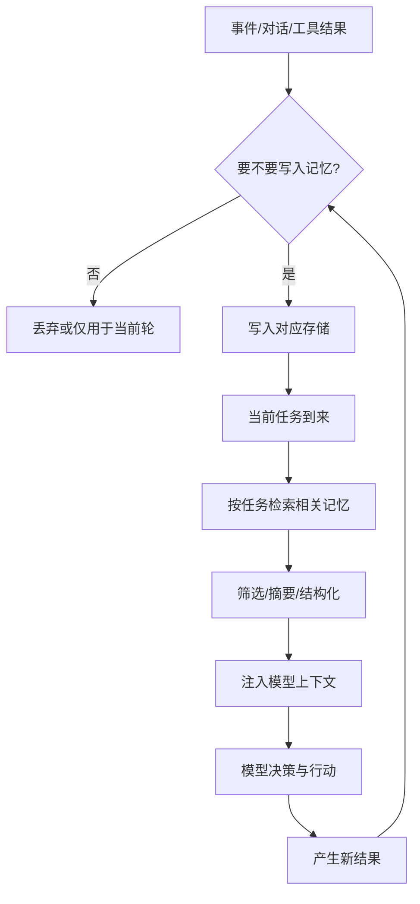
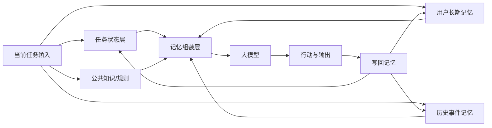

# 第七章 Agent 的记忆设计

## 1. 先说结论：没有记忆，Agent 很难把复杂任务真正做下去

前一章我们讲了大模型基础，提到一个很关键的问题：

- 模型一次能看到的上下文是有限的
- 任务一旦变长，信息就容易丢
- 如果上下文组织不好，Agent 会越跑越糊

那接下来一个很自然的问题就是：

**Agent 到底该怎么“记住”事情？**

这就是“记忆设计”要解决的问题。

先说结论：

- **记忆不是可有可无的附加项，而是很多 Agent 能不能连续工作的关键。**
- **没有记忆，Agent 往往只能做短任务；有了记忆，它才更像一个能持续做事的系统。**
- **记忆设计不是简单保存聊天记录，而是决定“什么该记、怎么记、什么时候取出来用”。**
- **真正有价值的记忆系统，通常由写入策略、存储结构、检索策略、注入方式和更新机制共同组成。**

一句话说：

> 记忆设计解决的不是“Agent 会不会说”，  
而是“Agent 能不能持续、稳定、带着过去的信息把事情做下去”。
>

所以这一章最重要的，不是记住几个术语，  
而是理解：

**一个 Agent 该记什么，不该记什么，又该怎样把记住的信息重新用起来。**

## 2. 先把“记忆”理解对

### 2.1 什么叫 Agent 的记忆？

这里说的“记忆”，不是在拟人化地说：

- 模型像人一样真的记住了什么

更准确地说，Agent 的记忆是：

**系统把过去的重要信息保存下来，并在合适的时候重新取出来参与当前决策的能力。**

也就是说，记忆不是模型脑子里“天然有”的东西，  
而是系统设计出来的一套机制。

这套机制通常要回答 3 个问题：

1. 什么信息值得保存？
2. 什么时候该把它取出来？
3. 取出来之后，以什么形式交给模型？

如果这三件事没有设计好，  
所谓“记忆”往往就会退化成：

- 一堆历史聊天记录
- 一个塞满旧内容的知识库
- 一个看起来很全、但实际很难用的数据堆

### 2.2 记忆不等于“把全部历史都带上”

这是最常见的误区之一。

很多人第一次做 Agent，会很自然地想到：

- 既然要有记忆，那就把所有历史对话都带给模型

表面上看，这确实像是在“记住过去”。  
但问题是：

- 历史越长，token 成本越高
- 噪音越多，模型越难抓重点
- 旧信息和新信息混在一起，反而容易误导决策

所以记忆不是“越多越好”，  
而是：

**越相关、越干净、越可用越好。**

### 2.3 记忆也不等于知识库

还有一个容易混淆的点是：

- 记忆
- 知识库
- RAG

这三者有关，但不完全一样。

可以先粗略区分成这样：

| 概念 | 更关注什么 |
| --- | --- |
| 记忆 | 系统过去发生过什么、用户偏好是什么、当前任务进行到哪 |
| 知识库 | 外部世界有哪些相对稳定的资料和事实 |
| RAG | 怎样把外部资料检索出来，再喂给模型 |

所以一个 Agent 的“记忆”不只是查文档。  
它还包括：

- 这位用户过去喜欢什么
- 上一轮任务已经做到哪一步
- 这个工具刚刚调用失败过
- 某个高风险动作必须先确认

这些内容很多并不属于传统意义上的知识库。

### 2.4 为什么没有记忆的 Agent 会显得很笨？

因为它每次都像第一次接手任务。

例如一个没有记忆的出差助手，可能会反复出现这些问题：

- 明明上次说过“优先高铁”，这次又推荐飞机
- 明明已经确认过预算，这次又重新问一遍
- 明明前一步已经查过日历，后一步又重新查
- 明明之前工具失败过，它还继续重复同样调用

这时你会明显感觉到：

它不是在“连续做事”，  
而是在“每一轮重新开始”。

所以从体验和系统角度看，  
记忆本质上解决的是：

- 连续性
- 一致性
- 个性化
- 复用过去结果

## 3. 为什么记忆对 Agent 这么重要？

### 3.1 因为很多任务不是一轮完成的

普通问答系统很多时候是一问一答。  
但 Agent 经常不是。

它可能要：

1. 接收目标
2. 查信息
3. 调工具
4. 等待反馈
5. 再继续下一步
6. 中途还可能被用户修改目标

这类任务如果没有记忆，  
就很难形成真正的闭环。

### 3.2 因为上下文窗口永远不是无限的

上一章我们已经讲过，  
模型一次能处理的上下文是有限的。

所以即使你想把所有历史都塞进去，  
现实里也很快会遇到限制：

- 成本越来越高
- 延迟越来越长
- 关键信息越来越容易被淹没

记忆设计的意义就在于：

**不是把所有过去都塞给模型，而是把最值得保留、最值得取回的内容以更好的方式组织起来。**

### 3.3 因为很多高价值能力都依赖“过去”

如果一个 Agent 想做到下面这些事，  
通常都离不开记忆：

- 理解用户长期偏好
- 记住组织规则
- 复用过去任务的中间结果
- 从历史执行中总结经验
- 在多轮任务中保持一致
- 在跨天、跨周任务里知道之前做到哪

也就是说，  
很多人真正期待的“像助手一样工作”，  
底层其实就是在期待：

**这个系统能记住关键的过去。**

### 3.4 因为记忆会直接影响行为质量

一个有记忆的 Agent 和一个没记忆的 Agent，  
在行为上会出现很明显的差别。

例如：

| 场景 | 没有记忆 | 有记忆 |
| --- | --- | --- |
| 用户偏好 | 每次都重新问 | 能直接沿用历史偏好 |
| 长任务推进 | 容易忘前面做过什么 | 能接着上一步继续 |
| 工具结果复用 | 重复查、重复算 | 能复用已有结果 |
| 风险控制 | 容易遗漏历史约束 | 能记住必须确认的规则 |
| 个性化体验 | 像陌生人 | 更像持续合作的助手 |

所以记忆不是“让系统更聪明一点”的锦上添花，  
而是很多体验从“能用”到“好用”的分水岭。

## 4. 一个 Agent 的记忆系统通常由哪些部分组成？

从工程角度看，可以先记住这样一个公式：

```text
记忆系统 = 写入策略 + 存储结构 + 检索策略 + 注入方式 + 更新/遗忘机制
```

这个公式非常实用，  
因为它提醒你：

- 记忆不只是“存一下”
- 更重要的是“存什么、怎么取、怎么更新”

### 4.1 写入策略：什么情况下要记？

不是所有信息都值得写进记忆。

如果什么都记，  
很快就会出现：

- 噪音越来越多
- 错误信息被永久保存
- 检索结果越来越杂

所以你需要先定义：

- 哪些信息是长期有价值的
- 哪些只需要在当前任务里保留
- 哪些根本不该写入

### 4.2 存储结构：记忆放在哪里？

不同类型的记忆，  
适合放在不同地方。

例如：

- 当前任务状态，适合存在结构化状态对象里
- 用户偏好，适合存在用户画像表里
- 历史事件摘要，适合存在事件日志或检索库里
- 团队共享规则，适合存在知识库或配置中心里

也就是说，  
“记忆系统”通常不是一个桶，  
而是多个存储方式的组合。

### 4.3 检索策略：什么时候取，按什么取？

有了存储，不代表就有了可用记忆。

真正影响效果的是：

- 当前任务来了之后，取哪部分记忆
- 按关键词取，还是按语义取
- 取多少条
- 是先筛选还是先总结

如果检索策略设计不好，  
就很容易出现：

- 该取的没取到
- 不该取的全取来了
- 结果一堆但没有重点

### 4.4 注入方式：怎么把记忆交给模型？

即使检索到了有用内容，  
如果你只是把原始数据一股脑塞进 Prompt，  
效果也未必好。

更常见的做法是：

- 先做摘要
- 先结构化
- 先按优先级排序
- 再用清晰字段告诉模型哪些是必须遵守的事实

这一步解决的是：

**记忆怎样从“存储的数据”变成“可被模型理解和利用的上下文”。**

### 4.5 更新/遗忘机制：旧记忆怎么办？

这是很多系统最容易忽略的一环。

因为记忆不是写进去就永远正确。

例如：

- 用户偏好会变化
- 业务规则会过期
- 某次任务结论后来被推翻
- 旧的工具接口已经不适用

如果没有更新和遗忘机制，  
Agent 很快就会被旧记忆污染。

所以一个真正可用的记忆系统，  
一定要考虑：

- 怎么改写
- 怎么失效
- 怎么删除
- 怎么处理冲突

### 4.6 一张图看完整流程



这张图最重要的一点是：

**记忆是一个循环系统，不是一次性的存档动作。**

## 5. 常见的记忆类型有哪些？

理解记忆设计，一个非常好的方法是先把记忆分层。  
最常见的分法可以分成下面几类。

### 5.1 短期记忆：当前任务的工作台

短期记忆通常指：

- 当前对话上下文
- 当前任务状态
- 最近几步工具调用结果
- 这一轮任务必须立即用到的信息

它更像是 Agent 的“工作台”或“草稿区”。

特点通常是：

- 生命周期短
- 与当前任务强相关
- 对连续多步决策非常重要

例如一个排障 Agent 的短期记忆里，可能会放：

- 当前报错信息
- 刚刚读取的日志摘要
- 已经试过哪些排查步骤
- 哪个假设已经被排除

这些信息对当前任务极其重要，  
但未必值得永久保存。

### 5.2 长期记忆：跨任务仍然有价值的信息

长期记忆通常保存的是：

- 用户偏好
- 相对稳定的业务规则
- 长周期任务进度
- 过去积累的经验

它的特点是：

- 生命周期更长
- 可能跨多次任务使用
- 更适合做个性化和连续协作

例如：

- 用户偏好高铁优先
- 审批动作必须二次确认
- 某个项目的默认输出格式
- 某个团队的术语和工作习惯

### 5.3 情景记忆：过去发生过的具体事件

这类记忆更像“事件记录”。

它保存的是：

- 某次任务发生了什么
- 做过哪些动作
- 最终结果如何
- 有没有异常或特殊处理

例如：

- 上次给这个客户发过什么报价
- 昨天的任务为什么失败
- 某个工具在上周出现过超时
- 某个 Bug 曾经是怎样被修复的

情景记忆的价值在于：

- 帮助 Agent 复盘过去
- 避免重复踩坑
- 在相似场景里复用经验

### 5.4 语义记忆：抽象出来的规则和知识

如果说情景记忆保存的是“发生过什么”，  
那么语义记忆更像是：

**从很多具体事件里抽象出来的稳定知识。**

例如：

- 某个系统的字段含义
- 某类问题的常见处理规则
- 某团队的标准操作流程
- 某种文档的固定结构

它和知识库很接近，  
但在 Agent 视角下，它仍然是记忆的一部分，  
因为它会持续影响决策。

### 5.5 共享记忆：多个 Agent 或多个流程共享的公共上下文

在单 Agent 场景里，  
这一层不是必须的。  
但在多 Agent 或复杂工作流里，  
共享记忆会很重要。

它通常包括：

- 共享任务状态
- 公共规则
- 团队知识
- 中间产物
- 当前谁负责什么

如果没有这类共享记忆，  
多 Agent 很容易出现：

- 重复工作
- 信息不一致
- 互相覆盖

### 5.6 一个实用总表

| 记忆类型 | 保存什么 | 生命周期 | 典型用途 |
| --- | --- | --- | --- |
| 短期记忆 | 当前任务上下文、最近结果 | 短 | 连续多步推进 |
| 长期记忆 | 偏好、规则、长期状态 | 长 | 个性化与持续协作 |
| 情景记忆 | 过去发生过的事件 | 中到长 | 复盘与经验复用 |
| 语义记忆 | 抽象知识和规则 | 长 | 稳定决策依据 |
| 共享记忆 | 多角色共享状态和资料 | 视场景而定 | 协作一致性 |

## 6. 短期记忆该怎么设计？

很多 Agent 的第一层记忆，  
其实不是长期存储，  
而是短期记忆。

因为绝大多数任务首先要解决的是：

**这一轮任务怎样别丢信息。**

### 6.1 不要只存聊天记录，要存任务状态

很多系统的短期记忆只保存：

- 用户说了什么
- 模型回了什么

这当然有帮助，  
但往往还不够。

Agent 更需要的是结构化任务状态，比如：

- 当前目标
- 已完成步骤
- 待完成步骤
- 已确认约束
- 已拿到的关键事实
- 当前风险点

因为在多步任务里，  
真正决定下一步行为的，往往不是聊天原文，  
而是：

**任务当前进行到哪了。**

### 6.2 对工具结果要做“提炼”，不要只做“堆积”

这是另一个很关键的点。

如果工具调用结果每次都原封不动保留，  
短期记忆很快就会变成一大堆原始数据。

更好的做法通常是：

- 保留原始结果的引用
- 同时生成一份任务相关摘要
- 把真正影响下一步决策的内容提炼出来

例如：

- 不要把整页日志全文一直往后带
- 而是提炼成“关键错误、出现时间、相关模块、已排除项”

这样短期记忆才真正可用。

### 6.3 长任务里要用摘要机制

任务一长，短期记忆如果不压缩，  
很快就会撞上上下文窗口限制。

这时通常会采用：

- 滚动摘要
- 里程碑摘要
- 阶段性状态快照

例如每完成一个阶段，就把这一段的关键信息压成一段简洁摘要：

- 已完成什么
- 还剩什么
- 哪些结论已经确认
- 哪些问题仍未解决

这样就能把长任务变成一系列可控状态块。

### 6.4 一个实用短期记忆结构

例如你可以把短期记忆先理解成下面这类结构：

```json
{
  "goal": "定位线上接口超时原因并给出处理建议",
  "confirmed_constraints": [
    "不能直接重启生产服务",
    "需要先给出风险评估"
  ],
  "completed_steps": [
    "已读取最近30分钟日志",
    "已确认数据库连接数正常"
  ],
  "open_hypotheses": [
    "可能是下游接口超时",
    "可能是缓存击穿"
  ],
  "latest_tool_findings": [
    "超时主要集中在 /order/create",
    "峰值开始于 14:05"
  ]
}
```

这类结构的价值在于：

- 模型更容易理解
- 状态更容易维护
- 也更容易给人类看

## 7. 长期记忆该怎么设计？

如果说短期记忆解决的是“当前任务别断片”，  
那么长期记忆解决的是：

**跨任务、跨时间之后，系统还能不能接着过去继续做事。**

### 7.1 最适合进入长期记忆的是什么？

最适合长期保存的，通常是那些：

- 相对稳定
- 可复用
- 对未来任务有持续价值

的信息。

常见包括：

- 用户偏好
- 长期角色信息
- 稳定业务规则
- 持续项目状态
- 经验证有效的处理经验

### 7.2 什么不适合轻易进入长期记忆？

这同样重要。

不适合直接长期保存的，通常包括：

- 一次性噪音信息
- 还没验证的猜测
- 可能很快过期的临时状态
- 情绪性表达
- 没有未来复用价值的细节

例如用户随口说一句：

- “今天先随便找一家酒店”

这不一定代表“以后都喜欢随便安排酒店”。  
如果系统把这种一次性话语直接固化成长期偏好，  
后面就很容易出问题。

### 7.3 长期记忆最好是“被确认的”，不是“凭空猜的”

这是做长期记忆时非常重要的原则。

因为长期记忆一旦写错，  
影响会持续很久。

更稳的做法通常是：

- 只有在用户明确表达或系统高置信识别时才写入
- 重要偏好最好经过确认
- 高风险规则不要自动生成长期记忆

例如：

- “以后出差默认优先高铁，可以记住吗？”
- “你之前三次都选择了晨间航班，是否作为默认偏好？”

这样写入的长期记忆会更可靠。

### 7.4 长期记忆不一定要“原句保存”

很多时候长期记忆更适合以结构化方式保存。

例如不要直接保存：

- “用户上次说不太喜欢太晚到酒店，因为第二天还要见客户”

而是提炼成：

```json
{
  "preference_type": "travel",
  "key": "arrival_time",
  "value": "prefer_not_too_late",
  "confidence": 0.86,
  "source": "confirmed_conversation",
  "last_updated": "2026-03-25"
}
```

这样做好处很明显：

- 更容易检索
- 更容易更新
- 更容易做冲突处理

## 8. 怎样决定“写什么，不写什么”？

很多记忆系统做不好，不是因为模型不够强，  
而是因为写入策略太随意。

所以一个很实用的问题是：

**到底什么信息值得被写进记忆？**

### 8.1 一个基本判断标准

一条信息如果同时满足下面几个条件，  
通常更值得写：

- 对未来任务可能有帮助
- 不是一次性噪音
- 相对稳定
- 可以被较清楚地表达

反过来，如果一条信息：

- 很临时
- 很模糊
- 没经过验证
- 未来大概率用不上

那通常不值得写。

### 8.2 可以先问 4 个问题

每次想写入一条记忆时，  
都可以先问：

1. 这条信息未来还会被用到吗？
2. 它是稳定事实，还是临时状态？
3. 如果写错了，后果大不大？
4. 它更适合短期记忆，还是长期记忆？

这四个问题会帮你过滤掉很多低质量写入。

### 8.3 一个实用写入原则

可以先记住下面这个简单规则：

```text
只写入“未来会有用、当前足够可信、放错地方代价不高”的信息
```

这听起来不花哨，  
但非常实用。

## 9. 检索记忆时，最容易踩什么坑？

写进去是一回事，  
能不能在对的时刻拿出来，是另一回事。

很多系统记忆失败，  
不是因为没有存，  
而是因为：

- 取不出来
- 取错了
- 取出来太多

### 9.1 不是所有相关记忆都要一次性全取

如果每次都把所有相似内容都拿回来，  
很快就会出现：

- 上下文太长
- 内容互相冲突
- 模型注意力被分散

所以检索时通常要有选择：

- 只取最相关的几条
- 先按任务类型过滤
- 先按时间或可信度排序

### 9.2 记忆检索最好带“当前任务意图”

例如：

- 同样是一个用户
- 他的记忆里可能有出差偏好、写作偏好、审批规则、会议习惯

如果当前任务是“安排出差”，  
那最该拿出来的是：

- 交通偏好
- 酒店预算
- 行程风格

而不是把他写报告的排版习惯也一起塞进来。

这说明一件事：

**检索不是按“这个人是谁”来取，  
而是按“这个任务现在需要什么”来取。**

### 9.3 检索后往往还要再筛一层

即使检索结果本身相关，  
也不代表它们都应该直接进模型上下文。

常见还需要做的事情包括：

- 去重
- 合并相似项
- 标明时间
- 区分事实和推测
- 标明置信度

这样模型看到的才不是一堆杂乱碎片，  
而是更可用的“记忆包”。

### 9.4 注入给模型时，要让它知道什么最重要

例如同样是三条记忆：

- 用户偏好高铁优先
- 去年有一次接受过晚班飞机
- 上次出差选择了离客户近的酒店

这三条并不是同等重要。  
更好的做法是明确告诉模型：

- 哪些是长期默认偏好
- 哪些只是一次性例外
- 哪些是可以参考但不强制的历史选择

这会显著提升模型对记忆的使用质量。

## 10. 记忆该怎样更新、冲突和遗忘？

很多人做记忆系统时，最开始只关注“怎么存”，  
却很少关注“旧记忆怎么办”。

但现实里，  
记忆如果不会更新，  
迟早会变成负担。

### 10.1 用户偏好是会变的

例如用户以前喜欢：

- 高铁优先

后来可能变成：

- 时间更优先，必要时接受飞机

如果系统永远坚持旧偏好，  
就会越来越像“记错了的人”。

所以长期记忆通常要保留：

- 更新时间
- 来源
- 置信度

必要时还要支持：

- 覆盖
- 合并
- 降权

### 10.2 旧规则可能会过期

例如：

- 某个审批流程改了
- 某个工具接口换了
- 某个团队约定被新规则替代

这些都说明：

**不是所有长期记忆都该永久有效。**

所以很多记忆都适合带上：

- 生效时间
- 失效时间
- 版本号

### 10.3 冲突记忆必须有处理策略

如果系统同时拿到两条相互冲突的记忆：

- “用户偏好高铁优先”
- “用户近两次都主动选了飞机”

它就不能简单全信。

更稳的做法包括：

- 让更新更近的记录优先
- 让经过用户确认的记录优先
- 让高置信度记录优先
- 必要时直接向用户确认

### 10.4 遗忘不是缺点，而是能力

很多人一听“遗忘”会觉得：

- 这是不是记忆系统做得不够好？

其实恰恰相反。

一个不会遗忘的系统，  
很容易变成一个被旧信息淹没的系统。

所以遗忘机制的价值在于：

- 清理过期内容
- 降低噪音
- 让检索更精准
- 控制成本

从工程角度看，  
“记住什么”和“忘掉什么”同样重要。

## 11. 记忆系统有哪些常见实现思路？

写到这里，很多人会问：

**这些记忆到底在工程上通常怎么做？**

这里不追求把技术细节讲到最深，  
而是给你一个足够实用的整体图景。

### 11.1 最简单的方式：对话缓冲区 + 摘要

这是很多 Agent 最容易起步的一种方式。

做法通常是：

- 保留最近几轮原始对话
- 再加一段滚动摘要

它的优点是：

- 好实现
- 对单 Agent 很够用
- 适合中短任务

它的不足是：

- 不适合复杂长期偏好管理
- 不擅长精细检索
- 容易把很多不同性质的信息混在一起

### 11.2 状态对象/任务对象

如果你的 Agent 是明显的任务型系统，  
通常很适合单独维护一个结构化状态对象。

例如：

- 当前目标
- 已完成步骤
- 已确认限制
- 当前待处理项
- 风险标记

这种方式特别适合：

- 工作流型 Agent
- 长步骤任务
- 需要人机协作确认的系统

它的优势在于：

- 清晰
- 稳定
- 对模型也友好

### 11.3 检索式记忆库

如果记忆开始变多，  
例如要保存大量历史事件、经验或用户偏好，  
就常常会引入检索式记忆库。

这类系统通常会做：

- 存储记忆条目
- 为条目建立索引
- 按当前任务检索相关记忆

它更适合：

- 长期运行的 Agent
- 个性化助手
- 需要复用历史经验的系统

### 11.4 混合式方案：短期状态 + 长期检索

很多真正可用的 Agent，  
最后都会走向混合方案。

例如：

- 当前任务状态放在结构化对象里
- 用户长期偏好放在画像库里
- 历史事件摘要放在检索记忆库里
- 公共规则放在知识库里

这种组合方式更符合现实，  
因为不同类型的信息，本来就不适合同一种存法。

### 11.5 一个简单的架构示意



这张图说明的是：

**Agent 的记忆设计，往往是一套分层系统，而不是单个数据库。**

## 12. 做记忆设计时，最常见的 6 个误区

### 12.1 误区一：把全部历史都当记忆

这往往会导致：

- 成本高
- 噪音多
- 重点不清

“有历史”不等于“有记忆设计”。

### 12.2 误区二：什么都自动写入长期记忆

如果写入门槛太低，  
长期记忆很快就会污染。

尤其是：

- 模糊表达
- 一次性状态
- 未验证推测

都不适合轻易固化。

### 12.3 误区三：只关注存储，不关注检索

很多系统“存了很多”，  
但真正任务来了：

- 不知道该取什么
- 取出来也没法用

这类记忆系统从效果上看，  
几乎等于没有。

### 12.4 误区四：记忆没有时间维度

如果一条记忆没有：

- 时间
- 来源
- 置信度

后面就很难判断：

- 它还准不准
- 它该不该覆盖旧记忆
- 它是不是一次性例外

### 12.5 误区五：长期记忆和当前状态混在一起

例如把：

- 当前任务中的临时发现
- 用户的长期偏好
- 团队的稳定规则

全部混在同一个列表里。

这样会让检索和更新都变得非常混乱。

### 12.6 误区六：以为记忆系统会自动带来“学习能力”

记忆确实能让 Agent 看起来更连续，  
但“记住了”不等于“学会了”。

如果系统没有：

- 明确的经验抽取逻辑
- 冲突处理机制
- 质量校验

那它可能只是把过去的错误也一起记住了。

## 13. 一个实用的设计顺序：从最小记忆开始

如果你现在要真的做一个 Agent，  
最稳的方式通常不是一上来就做“大而全的记忆系统”，  
而是分步骤来。

### 13.1 第一步：先搞定短期任务状态

先让系统能回答下面几个问题：

- 当前目标是什么
- 目前做到哪一步
- 已经确认了哪些约束
- 上一步工具结果是什么

只要这一步没做好，  
长任务通常就已经不稳了。

### 13.2 第二步：再补最有价值的长期记忆

比如优先补这些：

- 用户明确确认过的偏好
- 稳定业务规则
- 跨任务会复用的重要状态

不要一开始就什么都记。

### 13.3 第三步：再考虑历史经验复用

等系统已经稳定之后，  
再考虑：

- 如何记录历史事件
- 如何提炼经验
- 如何在相似任务里复用

因为这一层设计难度明显更高。

### 13.4 第四步：最后再优化更新和遗忘策略

当记忆开始积累后，  
再逐步加上：

- 置信度
- 时间衰减
- 覆盖策略
- 删除机制

这会让系统从“会记住”走向“记得更靠谱”。

## 14. 小结：记忆设计的本质，是让 Agent 在时间里保持连续性

这一章最重要的，不是把所有记忆分类都背下来，  
而是记住下面几件事：

- **记忆不是简单存历史，而是决定什么该保留、什么该被重新拿来用。**
- **短期记忆解决当前任务不断片，长期记忆解决跨任务连续协作。**
- **好的记忆系统一定包含写入、存储、检索、注入、更新和遗忘。**
- **不是记得越多越好，而是记得越准、越相关、越可用越好。**
- **对 Agent 来说，记忆设计和模型能力一样，都是系统成败的关键部分。**

一句话收尾：

> 记忆不是给 Agent 增加“人格感”，  
而是让它在面对长任务、旧约束和连续协作时，不会每次都从零开始。
>
