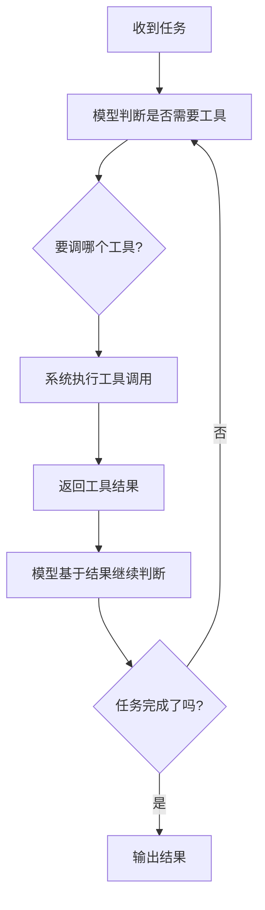
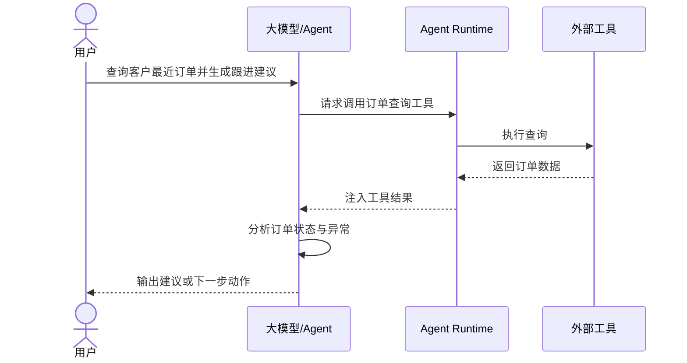
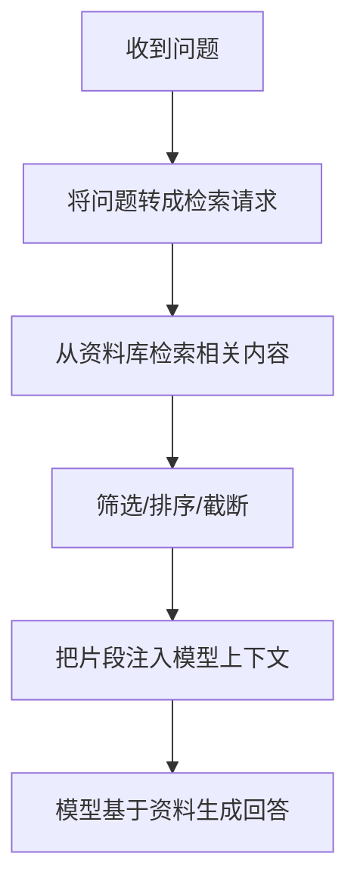

# 第八章 Agent 的工具调用与 RAG

## 1. 先说结论：没有工具调用，Agent 很多时候只能“会分析”；没有 RAG，Agent 很多时候只能“凭记忆回答”

前面几章我们已经讲过：

- 大模型负责理解、判断和组织输出
- 记忆系统负责让 Agent 不至于每次都从零开始

但如果一个 Agent 既不能调用工具，  
也不能有效读取外部知识，  
它很快就会遇到两个典型问题：

- 知道该做什么，但做不了
- 看起来会回答，但回答不一定基于最新、最真实的信息

这就是为什么做 Agent，  
工具调用和 RAG 都非常关键。

先说结论：

- **工具调用解决的是“Agent 怎么和外部世界交互”。**
- **RAG 解决的是“Agent 怎么在回答和决策前拿到外部知识”。**
- **工具调用更偏执行能力，RAG 更偏信息获取能力。**
- **两者经常会一起出现，因为很多真实任务既要查信息，也要做动作。**

一句话说：

> 工具调用让 Agent 从“会想”走向“会做”，  
RAG 让 Agent 从“靠已有知识回答”走向“基于外部资料回答”。
>

所以这一章最重要的，不是背术语，  
而是理解：

**什么时候该查知识，什么时候该调工具，什么时候两者要一起配合。**

## 2. 什么叫工具调用？

### 2.1 工具调用，不是让模型“想象自己调用了工具”

这里说的工具调用，指的是：

**模型在决策后，能够触发系统去执行某个外部能力，并把结果再反馈回来。**

这个外部能力可以是很多东西：

- 搜索网页
- 查询数据库
- 读取文件
- 调用企业内部 API
- 执行代码
- 发送消息
- 创建工单
- 修改系统状态

所以工具调用的本质不是“多了一段提示词”，  
而是：

**Agent 和真实环境之间有了可执行接口。**

### 2.2 为什么普通聊天和工具调用差别很大？

因为普通聊天里，模型最多只能说：

- 你可以去查一下日历
- 你可以打开某个系统看看
- 你可以用这个 SQL 查一下

但有了工具调用之后，  
它可以真正发起动作，例如：

- 直接查询你的日历
- 直接读取日志
- 直接调用订单接口
- 直接把结果取回来继续判断

这会带来一个根本变化：

**系统不再只是给建议，而是开始实际参与任务推进。**

### 2.3 一个最小工具调用闭环长什么样？



这张图最关键的一点是：

**工具调用不是一次性的外挂，而是 Agent 决策闭环的一部分。**

## 3. 为什么 Agent 必须有工具调用能力？

### 3.1 因为很多任务不是“回答一下”就结束

现实里的很多任务都需要和外部系统交互。  
例如：

- 查订单状态
- 查会议日程
- 拉取日志
- 读代码库
- 发消息
- 更新 CRM
- 创建 Jira 工单

如果没有工具调用，  
模型最多只能：

- 说“应该怎么做”
- 给你一个步骤建议

但做不到真正推进任务。

### 3.2 因为模型本身看不见实时世界

大模型再强，  
也不是天然知道：

- 今天的订单状态
- 现在数据库里的值
- 当前线上服务是不是报错
- 这封邮件有没有发出去

这些都必须通过外部工具或系统拿到。

所以从 Agent 角度看，  
工具调用的一个核心作用就是：

**把模型从封闭的语言空间接到真实世界。**

### 3.3 因为很多动作必须落到系统里才算完成

例如一个客服 Agent：

- 不是只要“建议用户退款”
- 而是要真的发起退款流程

例如一个项目助手：

- 不是只要“建议创建任务”
- 而是要真的把任务建到系统里

这说明一件事：

**Agent 的价值不只是理解任务，而是把任务推到真实结果。**

而这几乎一定需要工具调用。

## 4. 常见工具可以分成哪几类？

从学习角度看，可以先把工具分成 3 类。

### 4.1 查询类工具：拿信息

这类工具主要解决：

**Agent 知不知道当前环境里的真实信息。**

常见例子：

- 搜索引擎
- 数据库查询
- 知识库检索
- 文件读取
- 日历查询
- 订单信息查询

这类工具的特点是：

- 主要是读，不是改
- 风险相对较低
- 在很多 Agent 里使用频率很高

### 4.2 处理类工具：算和加工

这类工具主要解决：

**Agent 自己算不动、处理不稳、或需要借助专门程序处理的问题。**

例如：

- 代码执行
- 数据分析
- 表格处理
- 文档解析
- 图像处理
- 文件格式转换

它们的价值在于：

- 比纯语言推理更准确
- 对结构化任务更稳
- 能提升复杂任务处理能力

### 4.3 控制类工具：真正做动作

这类工具最接近“执行层”。

例如：

- 发邮件
- 发消息
- 建工单
- 改状态
- 提交审批
- 更新数据库
- 调业务接口

它们解决的是：

**Agent 能不能把判断变成真实动作。**

同时它们也往往风险最高，  
所以通常更需要：

- 权限控制
- 人类确认
- 幂等处理
- 审计日志

### 4.4 一个实用总表

| 工具类型 | 核心作用 | 典型例子 | 风险特点 |
| --- | --- | --- | --- |
| 查询类 | 获取外部信息 | 搜索、数据库、知识库、读文件 | 相对较低 |
| 处理类 | 加工和计算 | 代码执行、解析、转换、分析 | 中等 |
| 控制类 | 执行动作 | 发消息、改状态、调业务接口 | 较高 |

## 5. 工具调用是怎么工作的？

从工程角度看，一个工具调用过程通常包含下面几步。

### 5.1 模型先判断“需不需要工具”

不是所有请求都要调用工具。  
模型首先要判断：

- 当前信息够不够
- 这个任务是该直接回答，还是先查
- 是该先调查询工具，还是直接执行动作

这个判断很重要，  
因为如果模型：

- 该查的时候不查
- 不该查的时候乱查

系统效果都会很差。

### 5.2 模型再决定“调哪个工具”

例如：

- 要查订单，就调订单查询接口
- 要查会议时间，就调日历接口
- 要看代码，就调代码读取工具

这一步本质上是在做：

**任务意图到工具能力的映射。**

### 5.3 系统负责真正执行，不是模型自己执行

这是一个很关键的边界。

模型可以输出：

- 想调哪个工具
- 要带什么参数

但真正去执行工具调用的，  
通常是你的程序、平台或中间层。

也就是说：

- 模型负责决策
- 系统负责执行

这也是为什么工具调用必须有工程约束，  
而不是只靠模型“自觉”。

### 5.4 工具结果要回到上下文里

如果系统只是调完工具，  
却没有把结果正确喂回模型，  
那 Agent 就没法基于现实反馈继续推进。

所以通常会有下一步：

- 把工具结果格式化
- 注入到上下文里
- 让模型继续判断下一步

这时 Agent 才形成真正闭环。

### 5.5 一个时序图



## 6. 工具设计时，最容易忽略什么？

很多人第一次做 Agent 工具，会把重点全放在：

- 能不能调通

但真实系统里，更重要的问题往往是：

- 工具定义清不清楚
- 参数边界稳不稳
- 返回结果是不是对模型友好

### 6.1 工具要“职责单一”

如果一个工具什么都能做，  
模型就很难稳定用对。

例如一个工具既能：

- 查订单
- 改订单
- 删订单

但又没有清晰区分，  
风险会很高。

更稳的做法通常是：

- 一个工具干一类清晰的事
- 名称和参数尽量语义明确

### 6.2 参数要结构化、可约束

例如比起让模型输出：

- “帮我查一下昨天王强的订单”

更可用的是要求它输出：

```json
{
  "customer_name": "王强",
  "date": "2026-03-24"
}
```

因为结构化参数更容易：

- 校验
- 拒绝非法输入
- 重试
- 调试

### 6.3 返回结果不要只给原始大块数据

如果一个工具返回的是海量原始数据，  
模型不一定能高效利用。

更好的做法往往是：

- 返回必要字段
- 给出简洁摘要
- 保留原始结果引用
- 明确错误码和状态

也就是说，  
工具返回值不是“给人看的报表”，  
而是“给 Agent 下一步决策用的上下文材料”。

### 6.4 错误处理要被设计出来

工具不可能永远成功。  
所以必须提前想清楚：

- 超时怎么办
- 参数错了怎么办
- 权限不够怎么办
- 返回为空怎么办

如果没有这些设计，  
Agent 一遇到真实环境波动就容易卡住。

## 7. 什么是 RAG？

讲完工具调用，再来看另一个高频概念：

`RAG`

RAG 全称是 `Retrieval-Augmented Generation`，  
可以先把它简单理解成：

**先检索外部资料，再让模型基于这些资料生成结果。**

### 7.1 RAG 解决的核心问题是什么？

它主要解决两个现实问题：

1. 模型的训练知识不是实时的
2. 模型不可能天然知道你的私有文档、内部资料和最新数据

例如：

- 公司内部制度
- 产品最新版本说明
- 项目文档
- 会议记录
- 知识库文章
- 操作手册

这些内容如果不接给模型，  
模型通常只能：

- 靠已有知识猜
- 或者干脆回答得很泛

而 RAG 的作用就是：

**先把相关资料找出来，再让模型“带着资料说话”。**

### 7.2 一个最小 RAG 流程长什么样？



这张图里最关键的是：

**RAG 不是先回答，再去找依据；而是先找依据，再回答。**

### 7.3 RAG 和“直接把整个知识库塞给模型”有什么不同？

区别非常大。

如果你把大量资料一股脑全塞进去，  
很快会出现：

- token 爆炸
- 噪音很多
- 模型抓不住重点

RAG 的核心价值就在于：

- 不把所有资料都带上
- 而是只在当前问题下，取最相关的一小部分

这也是为什么 RAG 在工程上更可扩展。

## 8. RAG 到底怎么工作的？

### 8.1 第一步：把资料切成可检索的片段

文档通常不会直接整篇拿来检索。  
更常见的做法是：

- 按段落切分
- 按章节切分
- 按语义块切分

因为只有把资料切成较小片段，  
系统才更容易：

- 精确命中相关内容
- 控制注入长度
- 提高检索质量

### 8.2 第二步：为片段建立索引

这样当前问题来了之后，  
系统就可以根据：

- 关键词
- 语义相似度
- 元数据过滤

去找到更相关的片段。

### 8.3 第三步：检索最相关内容

比如用户问：

- “我们公司的差旅报销标准里，酒店上限是多少？”

系统就应该优先找：

- 差旅政策
- 报销规则
- 酒店标准

而不是把整个员工手册都送进去。

### 8.4 第四步：把检索结果整理后注入模型

检索到结果之后，  
也不是直接原样扔给模型就结束。

通常还会做：

- 去重
- 排序
- 截断
- 标注来源
- 提取最关键字段

因为检索结果质量，  
会直接影响后面生成质量。

### 8.5 第五步：模型基于资料生成答案

这时候模型不是“凭印象说”，  
而是：

- 参考检索片段
- 结合当前问题
- 输出结论

如果设计得好，  
它还可以：

- 引用来源
- 指出资料不足
- 明确哪些结论来自文档，哪些是推断

## 9. 工具调用和 RAG 是什么关系？

这是非常容易混淆的一点。

### 9.1 RAG 通常也依赖工具

从工程角度看，  
RAG 往往就是一种特殊的信息获取工具链。

例如：

- 检索器本身是一个工具
- 文档搜索接口是一个工具
- 向量检索服务也是工具能力的一部分

所以你完全可以把 RAG 理解成：

**以知识检索为核心的一类工具调用模式。**

### 9.2 但 RAG 和一般工具调用关注点不完全一样

它们的区别可以先这样理解：

| 项目 | 工具调用 | RAG |
| --- | --- | --- |
| 核心目标 | 和外部系统交互、获取信息或执行动作 | 给模型补充外部知识 |
| 常见输出 | 查询结果、执行结果、状态变化 | 文档片段、知识片段、来源信息 |
| 更偏向 | 行动与系统交互 | 知识获取与基于资料回答 |
| 是否一定会执行动作 | 不一定 | 通常不会直接执行动作 |

换句话说：

- **工具调用是大类**
- **RAG 更像其中“知识检索增强”这一类能力**

### 9.3 在真实系统里，两者经常连着出现

例如一个 IT 支持 Agent 可能会这样工作：

1. 先用 RAG 查内部排障文档
2. 再用工具调用读取当前服务状态
3. 然后结合两者给出建议
4. 最后在确认后执行某个操作

这个例子说明：

**RAG 负责让 Agent 知道该怎么做，  
工具调用负责让 Agent 真正去查、去做。**

## 10. 什么时候该用 RAG，什么时候该用普通工具调用？

### 10.1 当问题是“去哪里找资料”时，更偏 RAG

例如：

- 公司制度怎么规定
- 某个产品接口文档怎么写
- 这个项目之前的设计方案是什么
- 历史会议里怎么讨论过这个问题

这类问题核心是：

**先找到相关资料。**

所以更适合用 RAG。

### 10.2 当问题是“去哪个系统查状态或做动作”时，更偏工具调用

例如：

- 当前订单状态是什么
- 这个接口今天有没有报错
- 帮我发条消息
- 帮我创建一个任务

这类问题更偏向：

- 查实时系统状态
- 或执行真实动作

所以更适合普通工具调用。

### 10.3 一个实用判断法

你可以先问：

- 这个任务缺的是“知识”还是“状态/动作”？

如果缺的是：

- 文档、规则、说明、历史资料

更偏 RAG。

如果缺的是：

- 实时数据、系统状态、外部执行

更偏工具调用。

如果两者都缺，  
那就两者一起上。

## 11. 工具调用和 RAG 为什么经常一起出现？

因为真实任务很少只有一种需求。

例如一个销售 Agent：

- 要先查公司销售手册和报价策略
- 再查客户 CRM 最新状态
- 再生成跟进建议
- 最后可能还要帮你创建跟进任务

这里面：

- 查销售手册，适合 RAG
- 查 CRM 状态，适合工具调用
- 创建任务，适合控制类工具

也就是说，  
一个完整 Agent 很多时候会同时有：

- 知识获取链路
- 状态查询链路
- 执行动作链路

这三者组合起来，  
系统才真正像一个能工作的 Agent。

## 12. 做 RAG 时，最容易踩什么坑？

### 12.1 误区一：以为只要上了向量库就有了好 RAG

不是。

RAG 的质量不只取决于检索技术，  
还取决于：

- 文档切分好不好
- 元数据设计清不清楚
- 排序策略合不合理
- 注入上下文是不是干净

如果这些没做好，  
即使接了检索系统，效果也可能很一般。

### 12.2 误区二：检索回来太多内容

很多系统觉得：

- 取回来越多越保险

但实际上：

- 太多会增加噪音
- 会浪费 token
- 会让模型抓不住重点

所以真正好的 RAG，  
不是“检得多”，  
而是“检得准”。

### 12.3 误区三：不区分事实和推断

如果系统把：

- 检索片段里的事实
- 模型自己补出来的推断

混在一起，  
用户很容易误以为所有结论都有来源支撑。

所以更成熟的做法通常是：

- 标来源
- 标时间
- 明确哪些是文档原意
- 明确哪些是基于文档做的推断

### 12.4 误区四：文档更新了，检索库却没更新

这是非常现实的问题。

如果资料源变了，  
而 RAG 索引没更新，  
系统就可能一直拿旧内容回答。

所以做 RAG，  
不能只看“检索效果”，  
还要看：

- 文档同步机制
- 索引更新机制
- 版本控制

## 13. 做工具调用时，最容易踩什么坑？

### 13.1 误区一：工具能力太宽，模型很难稳定调用

工具如果设计成“大而全”，  
模型常常会：

- 不知道该不该用
- 不知道该怎么填参数
- 在边界场景下乱调用

所以工具能力越清晰，  
通常越容易稳定。

### 13.2 误区二：没有权限和确认机制

尤其对控制类工具来说，  
如果没有：

- 权限校验
- 高风险动作确认
- 审计日志

那系统非常危险。

### 13.3 误区三：只让模型自己判断成功失败

如果工具执行完之后，  
系统没有结构化状态返回，  
而只是给模型一段模糊文本，  
它就很难可靠地判断：

- 到底成功了没有
- 失败是哪里失败
- 应不应该重试

### 13.4 误区四：工具结果不做摘要和压缩

尤其在多步任务里，  
如果每个工具结果都大段原样塞回上下文，  
很快就会把窗口吃满。

这时就必须：

- 摘要
- 保留关键字段
- 丢掉无关噪音

## 14. 一个实用设计顺序：先把“查”和“做”分开

如果你现在要搭一个 Agent，  
比较稳的方式通常不是一开始就把所有能力糊在一起，  
而是按下面顺序来。

### 14.1 第一步：先解决“它能不能拿到对的信息”

先问自己：

- 任务需要哪些资料？
- 这些资料是实时状态，还是文档知识？
- 是通过工具查，还是通过 RAG 查？

这一步没想清楚，  
后面行为就会一直不稳。

### 14.2 第二步：再解决“它拿到信息后怎么判断”

也就是说：

- 查到信息以后，怎样进入模型上下文
- 哪些字段最关键
- 哪些情况要追问
- 哪些情况要确认

### 14.3 第三步：最后再接“执行类动作”

也就是：

- 发消息
- 改状态
- 建工单
- 调业务 API

因为执行动作风险更高，  
应该在“查”和“判断”已经比较稳的前提下再加。

### 14.4 一个简单公式

可以先记住这样一个思路：

```text
先让 Agent 查得对，再让 Agent 判断得稳，最后再让 Agent 做得动
```

这比一上来就追求“全自动执行”通常更靠谱。

## 15. 小结：工具调用和 RAG，分别解决“怎么做”和“知道什么”

这一章最重要的，不是把工具调用和 RAG 当成两个孤立概念，  
而是理解它们在 Agent 里的分工：

- **工具调用让 Agent 能连接真实系统、获取实时状态、执行真实动作。**
- **RAG 让 Agent 能基于外部资料、内部文档和最新知识来判断和回答。**
- **两者经常配合出现，因为真实任务既需要查知识，也需要查状态，还可能需要做动作。**
- **真正决定效果的，不只是“有没有接上工具/检索”，而是工具设计、检索质量、结果注入方式和风险控制。**

一句话收尾：

> RAG 让 Agent 不再只靠脑子里已有的东西回答，  
工具调用让 Agent 不再只停留在“告诉你怎么做”。
>
