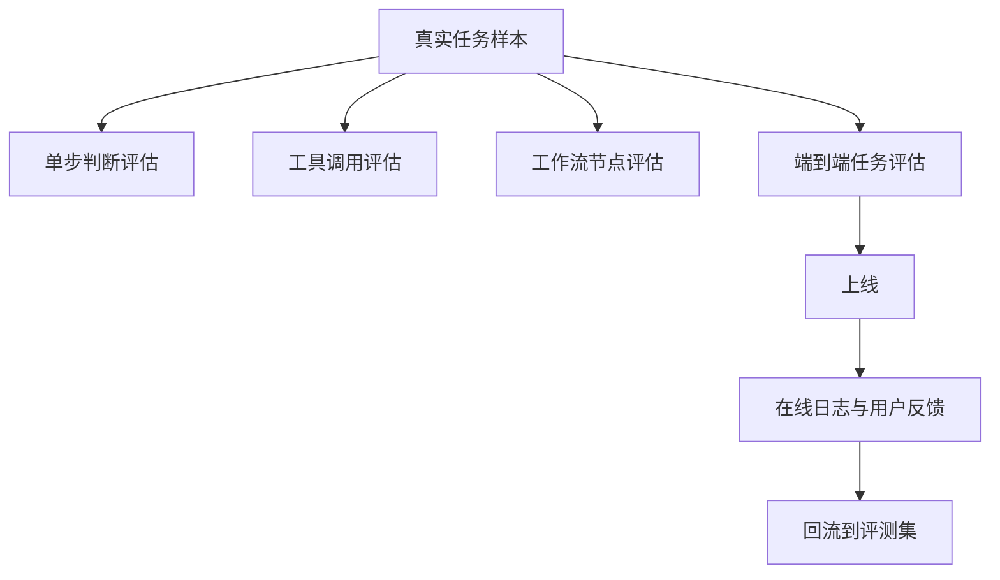

# 第九章 Agent 的评估与测试

## 1. 先说结论：不评估的 Agent，很难稳定上线

前面几章我们一直在讲：

- Agent 是围绕目标持续推进任务的系统
- 它会调用工具、读取记忆、组织工作流
- 它不只是“回答一句话”，而是会在过程中不断做判断

那接下来一个非常现实的问题就是：

**你怎么知道这个 Agent 真的好用？**

很多团队做 Agent 时，最容易掉进一个错觉：

- Demo 跑通了，就以为系统可用了
- 某几个案例效果很好，就以为整体稳定了
- 模型看起来很聪明，就以为真实任务里也能稳定完成

但实际工程里，真正决定一个 Agent 能不能长期使用的，  
往往不是“它偶尔能不能惊艳一次”，  
而是：

**它能不能在一批真实任务里，稳定、可控、可重复地把事情做成。**

先说结论：

- **Agent 不能只靠主观感觉评估，必须有可重复的测试和评估方式。**
- **做 Agent，不只是测最终答案，还要测过程、工具调用、状态变化、成本和风险。**
- **普通聊天评估主要看“说得对不对”；Agent 评估更要看“事情有没有真的做成”。**
- **评估不是上线前最后补的一步，而是 Agent 设计本身的一部分。**

一句话说：

> 评估不是给 Agent 打分好看，  
而是为了知道它到底哪里可靠，哪里不可靠，下一步该怎么改。

## 2. 为什么 Agent 特别需要评估？

### 2.1 因为 Agent 不是一次回答，而是一段过程

普通问答系统很多时候只需要回答：

- 这句话理解得对不对
- 这个答案事实对不对
- 这段表达是否自然

但 Agent 往往不是这样。

它更像是在完成一段连续动作：

1. 理解目标
2. 读取上下文
3. 决定下一步
4. 调用工具
5. 根据结果继续推进
6. 在必要时请求确认
7. 最后完成任务

所以它的好坏，不只体现在最后一句输出，  
还体现在整段过程是否合理。

比如一个“报销处理 Agent”，  
最后给用户回了一句“已提交成功”，  
这句话本身看起来没问题，  
但背后可能有几种完全不同的真实情况：

- 它真的把报销单提交到了系统里
- 它只是生成了一个草稿，没有真正提交
- 它提交了，但金额填错了
- 它提交成功了，但没有走正确审批流

从聊天角度看，  
这四种情况都可能长得很像。  
但从 Agent 角度看，它们差别非常大。

### 2.2 因为“看起来完成”和“真的完成”差别很大

这是 Agent 最容易让人误判的地方。

很多 Agent 输出很像一个完成汇报：

- “我已经帮你查过了”
- “我已经创建好了”
- “我已经发送给对方了”

如果系统没有做验证，  
这些话很容易给人一种“任务已经完成”的感觉。

但真正应该问的是：

- 查到的信息是不是对的
- 创建的对象是不是落到正确系统
- 发送动作是不是发给了正确的人
- 最终状态是不是和目标一致

所以评估 Agent 时，  
不能只看它说了什么，  
更要看：

**系统状态有没有真的发生你预期的变化。**

### 2.3 因为 Agent 的出错方式比普通聊天更复杂

普通聊天常见的问题大致是：

- 幻觉
- 事实错误
- 逻辑不清
- 表达跑偏

但 Agent 的错误会更多样：

- 选错工具
- 工具参数填错
- 调用了不该调用的动作
- 忘记读取关键上下文
- 步骤顺序错了
- 任务做到一半卡住
- 工具失败后没有恢复
- 对外说“完成了”，但实际上没有完成

这些错误里，  
有些是模型理解问题，  
有些是工作流问题，  
有些是工具设计问题，  
有些是状态管理问题。

如果没有评估框架，  
你很难知道问题到底出在哪里。

### 2.4 因为没有评估，就很难真正迭代

很多团队做 Agent 时会不断改：

- Prompt
- 模型
- 工具说明
- 工作流
- 检索策略
- 记忆写入规则

问题是，如果每次改完都只是“自己试两个例子看看”，  
那你几乎无法判断：

- 这次修改到底有没有变好
- 哪类任务变好了
- 有没有把另一类任务改坏
- 成本是不是上去了
- 风险是不是更大了

所以评估的真正价值，不只是验收。  
它更像是 Agent 演进过程里的“仪表盘”。

## 3. 先把“测试”和“评估”区分清楚

很多人会把“测试”和“评估”混着说。  
在 Agent 系统里，这两个概念最好分开理解。

### 3.1 测试关注“系统有没有按设计工作”

测试更偏工程验证。

它通常在问：

- 这个工具接口能不能正常调用
- 参数校验是否生效
- 工作流分支有没有走对
- 失败重试有没有触发
- 高风险动作是否要求确认
- 结果是否被正确写回状态

也就是说，测试主要看：

**系统机制有没有按预期运作。**

例如：

- 给 `create_ticket` 一个缺少必填字段的输入，系统是否会拒绝执行
- 工具超时时，是否会走降级逻辑
- 审批类动作是否一定会进入确认节点

这些问题，本质上都更像软件测试。

### 3.2 评估关注“系统在真实任务里到底好不好用”

评估更偏任务效果。

它通常在问：

- 这个 Agent 在真实任务里成功率高不高
- 哪类任务最容易失败
- 它是不是经常多走很多无效步骤
- 它的工具调用是否稳定
- 代价是否可接受
- 用户是否还愿意继续用

也就是说，评估主要看：

**系统在真实任务目标上，表现到底怎样。**

### 3.3 两者在 Agent 里必须一起做

只做测试，不做评估，  
你可能会得到一个“机制都对，但任务还是做不成”的系统。

只做评估，不做测试，  
你可能会看到成功率下降，  
却不知道是工具坏了、路由错了，还是记忆注入出了问题。

所以在 Agent 里，更实用的理解是：

| 维度 | 它在回答什么问题 |
| --- | --- |
| 测试 | 系统是不是按设计工作？ |
| 评估 | 它在真实任务里是不是好用？ |

真正成熟的 Agent 团队，  
通常会把两者一起做。

## 4. 一个 Agent 到底该评估什么？

很多人一说评估，就只想到“答案准不准”。  
但 Agent 的评估维度通常比这更宽。

### 4.1 结果是否真的完成任务

这是最核心的一层。

最终应该先看：

- 任务有没有完成
- 完成结果是不是符合目标
- 关键约束有没有满足

比如：

- 旅行规划 Agent 是否真的安排在预算内
- 客服 Agent 是否真的解决工单，而不只是回复用户
- 代码 Agent 是否真的修掉了问题，而不是只解释原因

如果任务本身都没有完成，  
后面很多指标都没有太大意义。

### 4.2 过程是否合理、稳定、可复现

有些 Agent 虽然最终把事做成了，  
但过程非常不稳定：

- 同一个任务今天能做成，明天做不成
- 有时一步就完成，有时绕十几步
- 工具调用顺序飘忽不定
- 经常因为无关上下文跑偏

所以评估不能只看最终成败，  
还要看过程质量。

典型问题包括：

- 步骤数是否明显过多
- 是否经常做无效调用
- 是否容易中途卡住
- 是否容易重复同一动作

### 4.3 工具调用是否正确

这是 Agent 和普通聊天最大的不同之一。

很多时候任务失败，  
不是因为模型“不懂”，  
而是因为：

- 调错工具
- 参数结构不稳定
- 忘了校验前置条件
- 工具失败后没有正确恢复

所以工具层面至少要看：

- 选工具是否正确
- 参数是否完整
- 调用是否成功
- 返回结果是否被正确理解
- 失败后是否采取合理补救动作

### 4.4 成本、速度和资源消耗是否可接受

一个 Agent 也许成功率不错，  
但如果它：

- 平均要走 12 步
- 每次都调最贵模型
- 检索内容特别长
- 延迟高到用户无法接受

那它也未必真能落地。

所以评估 Agent 时，  
成本和时延不是“附加指标”，  
而是系统设计的一部分。

### 4.5 风险和协作体验是否可控

很多 Agent 不是纯自动完成，  
而是要和人协作。

这时还要看：

- 该确认的时候有没有确认
- 不该频繁打扰时是否保持克制
- 风险动作是否被正确拦截
- 失败信息是否足够清楚

所以一个完整的 Agent 评估，  
通常至少要同时看下面这几类东西：

| 维度 | 典型问题 |
| --- | --- |
| 任务结果 | 有没有真的完成目标 |
| 过程质量 | 是否稳定、是否绕圈、是否易卡住 |
| 工具调用 | 工具选得对不对，参数稳不稳 |
| 成本与延迟 | 花费是否值得，速度是否可接受 |
| 风险与协作 | 该拦的时候有没有拦，该问的时候有没有问 |

## 5. 常见的评估层次有哪些？

一个 Agent 系统通常不是“只测一层”就够了。  
更实用的做法是分层评估。

### 5.1 单步能力评估：先看模型在关键节点会不会判断

Agent 里很多节点其实都包含关键判断，例如：

- 要不要调用工具
- 该调用哪个工具
- 当前信息够不够
- 是否需要向用户追问
- 这一步是否属于高风险动作

这些节点可以单独拿出来评估。

例如你可以准备一些样本，专门测：

- 哪些输入应该直接回答
- 哪些输入应该先查资料
- 哪些输入应该先向用户澄清
- 哪些输入必须先确认再执行

这类评估的好处是：

- 问题定位更清楚
- 反馈周期更短
- 修改后更容易看出改善是否来自某个节点

### 5.2 工具调用与结构化输出评估

很多 Agent 的稳定性问题，  
最后都卡在结构化输出和工具调用这里。

这层可以专门评估：

- 工具选择正确率
- 参数字段完整率
- 参数值合法率
- 工具失败后的恢复率
- 最终工具结果和任务目标是否一致

例如一个 CRM Agent：

- 该搜索客户时是否调用 `search_customer`
- 该创建工单时是否调用 `create_ticket`
- 创建工单时 `customer_id`、`priority`、`summary` 是否齐全

如果这一层不稳，  
端到端成功率一般也很难稳。

### 5.3 工作流节点评估：看链路是不是在关键地方掉了

对于更复杂的 Agent，  
仅仅测工具还不够，  
还要看工作流里的关键节点。

比如一个 Plan-and-Execute 工作流，  
你可以分别看：

- 计划拆分是否合理
- 子任务顺序是否正确
- 执行结果是否被回写到状态
- 计划过时后是否会调整

比如一个 Router 系统，  
你可以看：

- 路由是否把任务送到正确子流程
- 错误路由后有没有补救
- 不确定任务是否会先澄清而不是乱分发

### 5.4 端到端任务评估：看真实目标能不能完成

这是最接近真实使用的一层。

你给 Agent 一个完整任务，  
然后看：

- 最后有没有完成
- 完成质量如何
- 代价如何
- 过程中是否触发了不该触发的风险

端到端评估最有价值，  
但也最难做，  
因为它牵涉所有组件。

### 5.5 在线评估与真实反馈

离线评估再完整，  
也不可能覆盖真实世界所有情况。

所以一个成熟的 Agent 通常还需要在线反馈：

- 用户是否中途接管
- 用户是否频繁重试同类任务
- 哪些节点最常失败
- 哪些任务最常被人工修正

离线评估更像“考试”，  
在线评估更像“实战统计”。

两者要结合看。



## 6. 怎么构造一套有用的评测集？

### 6.1 从真实任务回放开始，不要只靠“想象题”

很多评测集之所以没什么用，  
不是因为指标设计错了，  
而是因为题本身就不贴近真实任务。

最常见的问题是：

- 样本太干净
- 输入太规范
- 背景信息太完整
- 没有用户口语、模糊表达和脏数据

但真实世界往往刚好相反：

- 用户说得不完整
- 输入里带错别字和歧义
- 工具返回不稳定
- 上下文缺失或冲突

所以更好的起点通常是：

- 真实用户任务回放
- 线上历史工单
- 内部操作日志中的典型任务
- 人工整理的失败案例

也就是说，  
不要先问“我能编出哪些题”，  
而要先问：

**真实世界里，大家到底在拿这个 Agent 做什么。**

### 6.2 样本要覆盖主路径、边界情况和失败场景

一个有用的评测集，  
不能只覆盖最理想的主流程。

通常至少要包含三类样本：

1. 主路径样本  
任务常见、流程清楚，是系统最常处理的情况。

2. 边界样本  
信息不全、表达模糊、状态冲突、工具返回异常。

3. 高风险失败样本  
如果出错会造成明显损失，例如误发送、误更新、误删除、误审批。

如果评测集里只有主路径样本，  
你很容易得到一个“看起来成功率很高”的错觉。

### 6.3 一个任务最好不只保存输入，还要保存判定依据

评测集最好不只是：

- 输入一句话
- 输出一个标准答案

因为很多 Agent 任务并没有唯一标准答案。

更实用的样本结构通常包括：

- 任务输入
- 相关上下文
- 允许使用的工具
- 期望结果
- 关键过程约束
- 禁止出现的错误

比如：

```text
任务：帮我安排下周去北京出差，控制在 3000 元以内
上下文：用户偏好高铁优先；周三上午必须到场；公司要求住协议酒店
允许工具：日历、差旅搜索、酒店搜索、预订系统
期望结果：生成符合预算和时间约束的方案；执行前要求用户确认
关键约束：不能直接自动下单；必须优先查日历冲突
禁止错误：忽略预算、忽略确认、跳过协议酒店限制
```

这种样本会比“请生成出差计划”更适合评估 Agent。

### 6.4 评测集要版本化，而不是越积越乱

很多团队一开始会积累一些案例，  
但慢慢就会出现问题：

- 样本来源不清
- 样本质量参差不齐
- 老案例已经不适配新流程
- 大家不知道该看哪一版结果

所以评测集最好像代码一样管理：

- 有版本号
- 有样本来源说明
- 有变更记录
- 能区分基础集、回归集、高风险集

这样评估结果才可比。

## 7. 指标该怎么定？

### 7.1 先分清“核心指标”和“解释指标”

Agent 评估里，一个很实用的做法是把指标分成两层：

1. 核心指标  
直接说明这个系统值不值得用。

2. 解释指标  
帮助你理解为什么成功或失败。

例如：

- 任务成功率通常是核心指标
- 平均步数、工具调用次数、澄清次数通常是解释指标

如果没有核心指标，  
你会陷入“数据很多，但不知道结论是什么”。

如果没有解释指标，  
你会知道变差了，  
却不知道为什么变差。

### 7.2 任务成功率：最重要，但不能定义得太含糊

“成功率”几乎所有人都会看，  
但最大的问题是：

**成功到底怎么定义？**

例如一个客服 Agent，  
下面几种定义可能完全不同：

- 用户收到了回复就算成功
- 工单状态被正确推进才算成功
- 问题最终被解决才算成功
- 不仅解决，还要符合 SLA 才算成功

所以成功率一定要写清楚判定标准。  
否则这个指标很容易失真。

### 7.3 关键错误率：很多时候比平均成功率更重要

有些错误即使出现得不多，  
也比一般失败更危险。

例如：

- 给错人发邮件
- 错删数据
- 错误审批
- 泄露敏感信息
- 在未确认情况下执行高风险动作

这类问题往往应该单独统计“关键错误率”。

因为一个系统即使总体成功率不错，  
只要关键错误率不够低，  
它也很难放心使用。

### 7.4 工具调用成功率与恢复率

对 Agent 来说，  
工具层面的指标通常非常关键。

你可以看：

- 工具选择正确率
- 参数校验通过率
- 工具执行成功率
- 工具失败后恢复率

例如：

- 有 90% 的样本选对了工具
- 其中 80% 的参数一次生成正确
- 工具失败后，有 60% 的情况能自动恢复

这些指标会直接告诉你问题更多出在：

- 决策层
- 结构化输出层
- 工具本身
- 恢复策略

### 7.5 平均步数、延迟和成本

很多 Agent 不是“做不成”，  
而是“做得太贵、太慢、太绕”。

所以经常还要看：

- 平均步骤数
- 平均耗时
- 平均 token 消耗
- 平均工具调用次数

这些指标未必直接代表对错，  
但会明显影响可用性和落地价值。

### 7.6 人工接管率和用户修正率

如果一个 Agent 表面上经常成功，  
但用户总是：

- 中途打断
- 手动改结果
- 重新下指令
- 不愿意继续执行自动动作

那说明它的真实可用性可能并没有看起来那么高。

所以有些场景里，  
还应关注：

- 人工接管率
- 人工修正率
- 用户二次追问率
- 用户放弃率

### 7.7 一个实用指标表

| 指标 | 它回答什么问题 |
| --- | --- |
| 任务成功率 | 最终目标有没有做成 |
| 关键错误率 | 有没有出现高风险错误 |
| 工具选择正确率 | 决策层稳不稳 |
| 参数正确率 | 结构化输出稳不稳 |
| 恢复率 | 遇到错误后能不能继续推进 |
| 平均步数 | 会不会绕太多无效流程 |
| 平均延迟 | 用户是否等得起 |
| 平均成本 | 系统是否可持续运行 |
| 人工接管率 | 用户对自动化是否真的信任 |

## 8. 怎么判断结果好坏？

Agent 评估里，  
最大的现实问题之一是：

**很多任务没有唯一标准答案。**

这时就需要设计合理的判定方式。

### 8.1 能规则判定的，先规则判定

如果一个任务结果可以被明确规则检查，  
优先用规则，不要一开始就让模型当裁判。

例如：

- 是否真的创建了工单
- 是否真的写入了目标字段
- 预算是否小于 3000 元
- 是否触发了确认节点
- 是否按要求输出了结构化字段

规则判定的优点是：

- 一致性高
- 成本低
- 容易自动化

### 8.2 不能硬判定的，再用 rubric

有些任务无法完全靠规则判定，  
例如：

- 计划拆分是否合理
- 总结是否覆盖关键点
- 回复是否足够清楚
- 用户沟通是否自然、克制

这时可以设计 rubric，也就是评分标准。

比如把结果按几个维度打分：

- 是否覆盖目标
- 是否遵守约束
- 是否缺少关键步骤
- 是否存在明显误导

rubric 的关键不是“多复杂”，  
而是：

**评分维度是否稳定、能重复使用。**

### 8.3 模型评委可以用，但不能完全依赖

很多团队会让另一个模型来评估输出。  
这在 Agent 里是可以用的，  
但有几个前提：

- 先把评分标准写清楚
- 先能规则判定的尽量规则判定
- 高风险任务不要只靠模型评判
- 最好做人工抽检，校验模型评委是否可靠

模型评委更适合：

- 大规模初筛
- 文本质量的相对比较
- 没有唯一答案时的辅助判断

它不适合变成唯一真理。

### 8.4 最好保留人工抽检

尤其是在下面这些场景：

- 高风险业务
- 样本量不大
- 任务定义还在变化
- 你对评分规则还不够有把握

人工抽检的价值在于：

- 发现自动评估漏掉的问题
- 发现“表面成功、实际失败”的情况
- 帮你不断修正评分标准

## 9. 为什么很多 Agent Demo 很好看，一上线就不稳？

### 9.1 Demo 输入通常太干净

演示时常见的情况是：

- 输入表达清楚
- 上下文完整
- 工具返回稳定
- 没有脏数据
- 没有冲突指令

但真实用户不会按 demo 来配合你。  
所以 demo 好看，  
并不代表真实任务稳定。

### 9.2 只看最终答案，不看中间过程

很多 demo 只展示：

- 最后生成了什么
- 最终说了什么

但没有展示：

- 用了哪些工具
- 走了几步
- 为什么选择这条路径
- 有没有中途失败后恢复

这会掩盖掉很多结构性问题。

### 9.3 演示环境和真实环境不一样

很多时候 demo 里的工具环境非常理想：

- 数据是预先准备好的
- 权限是完全开放的
- 失败情况被人工规避
- 外部系统响应稳定

但上线后：

- 数据脏了
- 权限收紧了
- 工具超时了
- 用户会给出更多异常输入

这时问题就会集中出现。

### 9.4 没有回归评估，系统会越改越不稳

Agent 最怕的一种情况是：

- 改了一次 Prompt，A 类任务变好
- 再改一次工具说明，B 类任务变好
- 结果 C 类任务突然变差

如果没有回归集，  
你很难发现这种“修一处，坏一处”的情况。

所以很多 Agent 一上线就显得不稳，  
不是因为模型突然变差了，  
而是因为它从来没有经过足够接近真实世界的评估。

## 10. 做 Agent 评估时，最常见的 6 个误区

### 10.1 误区一：只看主观感觉，不看可重复指标

“我感觉这版更聪明了”这种判断，  
在早期探索阶段可以有，  
但不能成为长期标准。

如果没有可重复指标，  
团队讨论很容易变成：

- 你觉得更好
- 我觉得更差
- 但谁都拿不出稳定证据

### 10.2 误区二：只测最终答案，不测过程和动作

Agent 的价值不只是生成文本，  
而是推进任务。

如果只看最后一句输出，  
你会漏掉大量关键问题：

- 工具是否真正执行
- 参数是否正确
- 是否走了不必要的步骤
- 是否越权操作

### 10.3 误区三：把模型评委当成最终标准

模型评委能提升效率，  
但不是万能。

尤其在高风险场景里，  
如果没有规则校验和人工抽检，  
你很容易把不稳定判断当成标准答案。

### 10.4 误区四：测试集太少，而且过于理想化

如果你的评测集只有：

- 十几个样本
- 都是标准输入
- 没有失败样本

那它很难真正反映系统质量。

### 10.5 误区五：不区分高风险错误和普通失败

普通失败和高风险错误，  
不能放在一个篮子里看平均值。

例如：

- “没完成任务”是一类失败
- “错发给老板”是另一类失败

后者的严重性可能高得多。

### 10.6 误区六：评估只做一次，不持续更新

Agent 系统会持续变化：

- Prompt 会改
- 模型会换
- 工具会变
- 业务规则会更新

所以评估也必须持续更新。  
否则它很快就会失去代表性。

## 11. 一个实用落地顺序：先能复现，再能比较，最后能监控

### 11.1 第一步：先沉淀一批真实任务样本

一开始不用追求上百上千。  
先沉淀 20 到 50 个高代表性的真实任务，  
往往已经很有价值。

重点是样本质量，而不是一开始就追求数量。

### 11.2 第二步：给关键节点加日志和可回放能力

至少要能看到：

- 输入是什么
- 读了哪些上下文
- 调了哪些工具
- 参数是什么
- 工具返回了什么
- 最后结果是什么

没有这些信息，  
后面很多失败都很难定位。

### 11.3 第三步：建立离线回归评估

让每次系统变化后都能重新跑一遍核心样本，  
对比：

- 成功率
- 高风险错误
- 平均成本
- 平均步数

这样你才能真正比较版本。

### 11.4 第四步：把高风险样本单独拎出来

例如：

- 资金操作
- 对外发送
- 删除更新
- 审批流变更

这些样本应该单独看，  
不要混在平均指标里。

### 11.5 第五步：上线后补在线监控和用户反馈闭环

真正成熟的评估闭环通常是：

- 离线样本测试
- 上线真实日志
- 用户反馈回流
- 新失败样本再进入回归集

这样评测集才会越来越接近真实世界。

## 12. 小结：评估不是给 Agent 打分，而是让它稳定变好

这一章最重要的，不是记住多少指标名词，  
而是建立一个判断：

**Agent 不是“跑通一次”就算成功，  
而是要在真实任务里持续稳定地完成目标。**

你至少可以记住下面几点：

1. **Agent 评估不能只看最终文本，还要看过程、动作、工具调用和状态变化。**
2. **测试回答“系统是否按设计工作”，评估回答“它在真实任务里是否真的好用”。**
3. **一个成熟的评估体系，通常要同时覆盖单步判断、工具调用、工作流节点和端到端任务。**
4. **真实任务回放、关键错误率、回归评估和在线反馈，是 Agent 迭代中非常关键的四件事。**
5. **评估的目标不是追求一个好看的分数，而是知道系统哪里稳、哪里不稳、该怎么继续改。**

所以从工程视角看：

> 做评估，不是因为你不相信 Agent，  
而是因为你希望它不只是偶尔聪明，而是长期可靠。
