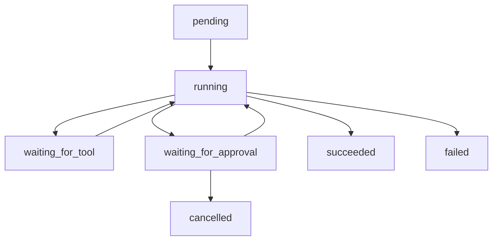

# 第十一章 Agent 的工程化与生产落地

## 1. 先说结论：能跑通 Demo，不等于能稳定运行

前面几章我们已经把 Agent 的核心部分讲得差不多了：

- 什么是 Agent
- 它适合解决什么问题
- 它怎么构建
- 它有哪些工作流模式
- 单 Agent 和多 Agent 怎么选
- 模型、记忆、工具、RAG、评估、安全分别怎么理解

但如果你真的开始做一个 Agent 项目，  
很快就会遇到一个新的问题：

**为什么很多 Agent 看起来已经能跑了，可一到真实环境里就开始变得很难维护、很难排查、很难放大规模？**

原因通常不是“模型突然不行了”，  
而是你已经从“原型阶段”进入了“工程化阶段”。

先说结论：

- **能演示，不等于能上线；能上线，也不等于能稳定运行。**
- **Agent 的工程化重点，不只是把能力堆起来，而是把状态、调度、日志、失败恢复、成本和权限组织好。**
- **很多 Agent 项目真正难的地方，不在第一次跑通，而在第 1000 次还能不能稳定跑通。**
- **生产级 Agent 更像一个长期运行的系统，而不是一个只会生成答案的接口。**

一句话说：

> 工程化要解决的，不是“Agent 会不会做事”，  
而是“它能不能长期、稳定、可控地做事”。

## 2. 从原型到生产，系统到底多了什么？

### 2.1 原型关注“能不能做成一次”

大多数 Agent 项目一开始都很像这样：

- 接一个模型
- 配几个工具
- 给一段 Prompt
- 手动跑几个任务
- 看看结果好不好

这一步非常重要，  
因为它验证的是：

- 这个任务值不值得做 Agent
- 这条链路有没有基本可行性
- 模型和工具组合能不能形成闭环

但它通常还不需要考虑太多工程问题。

### 2.2 生产关注“能不能稳定做成很多次”

一旦系统开始面向真实任务，  
你就不得不考虑很多原型阶段不明显的问题：

- 任务做到一半中断了怎么办
- 工具超时了怎么办
- 同一个任务执行了两次怎么办
- 用户离线了怎么办
- 日志不全时怎么排查
- 成本突然升高怎么办

也就是说，  
生产环境会逼你面对一个事实：

**Agent 不只是推理系统，还是运行系统。**

### 2.3 原型主要追求“能力成立”，生产必须追求“可运营”

一个可运营的 Agent，  
通常至少要回答下面这些问题：

- 它的任务状态放在哪里
- 它失败时怎么恢复
- 它的关键步骤能不能观察
- 它的成本能不能管住
- 它的版本变化能不能回归验证
- 它的权限和审计是否清楚

这就是为什么很多 Agent Demo 看起来很强，  
但一旦进入真实场景就开始显得脆弱。

## 3. Agent 工程化到底在解决什么？

### 3.1 稳定性：不要让系统只在理想输入下能跑

工程化的第一目标通常是稳定性。

也就是：

- 遇到脏输入还能不能合理处理
- 工具偶尔失败时会不会直接崩
- 长任务中断后能不能恢复
- 外部系统变慢时会不会拖垮整条链路

真正可用的 Agent，  
不需要永远完美，  
但至少不能稍微出点偏差就整体失控。

### 3.2 可观测性：出了问题要知道问题在哪

很多 Agent 系统真正痛苦的地方不是“失败了”，  
而是：

- 不知道它为什么失败
- 不知道失败发生在哪一步
- 不知道是模型、工具、状态还是外部系统的问题

所以工程化的第二目标通常是可观测性。

### 3.3 可控性：系统边界要能被管理

这部分和前一章安全设计密切相关。

一个生产级 Agent，  
通常需要明确：

- 什么动作允许自动执行
- 什么动作必须确认
- 什么情况下要停止
- 什么情况下要重试
- 谁有权接管

没有这些控制点，  
系统越自动，风险往往越难管。

### 3.4 可迭代性：每次改动都要能知道变好了还是变坏了

Agent 系统会持续变化：

- Prompt 会改
- 模型会换
- 工具会扩
- 路由会变
- 记忆策略会调

所以工程化还要解决一个问题：

**系统怎样在持续变化中保持可比较、可回归、可演进。**

## 4. 一个生产级 Agent 通常有哪些基础设施？

### 4.1 任务状态管理：知道它现在做到哪一步了

普通聊天很多时候只需要一次请求上下文。  
但 Agent 常常涉及：

- 多步任务
- 异步任务
- 多轮确认
- 工具结果回写
- 任务暂停和恢复

这时系统通常需要明确的任务状态，例如：

- `pending`
- `running`
- `waiting_for_input`
- `waiting_for_approval`
- `succeeded`
- `failed`
- `cancelled`

没有状态管理，  
系统很容易在长任务里“断片”。

### 4.2 调度与队列：让任务不只靠一次同步请求跑完

很多任务不适合一直同步等着：

- 需要等待外部系统返回
- 需要等待人工确认
- 需要跑很长时间
- 需要批量处理很多任务

这时往往需要：

- 任务队列
- 异步执行器
- 定时器
- 事件驱动机制

这样 Agent 才能从“一个聊天回合”变成“一个可持续推进的任务系统”。

### 4.3 工具网关或执行层：把模型输出和真实系统动作隔开

模型输出不应该直接等于系统动作。  
中间通常还需要一层执行层或工具网关来负责：

- 参数校验
- 权限检查
- 超时控制
- 审计记录
- 错误归一化

这层的价值在于：

**让模型负责决策，系统负责执行约束。**

### 4.4 日志、追踪和回放：让行为路径可见

生产环境里最怕“只看到最后报错，看不到过程”。

所以通常需要记录：

- 输入是什么
- 读了哪些上下文
- 调了哪些工具
- 工具参数是什么
- 工具返回了什么
- 模型在关键节点做了什么判断
- 最终输出和状态是什么

更进一步的话，  
最好还能做任务回放，  
这样问题定位会快很多。

### 4.5 评估与监控：把质量和运行状态接起来

前一章讲的是评估。  
到了工程化阶段，  
评估通常要和监控结合起来。

你会开始关心：

- 成功率有没有下降
- 哪类任务最容易失败
- 平均步数有没有突然上升
- 某个工具是不是变得更不稳定了
- 某个模型版本是不是让成本变高了

也就是说，  
评估不再只是离线打分，  
而开始变成持续监控的一部分。

## 5. 为什么 Agent 特别需要可观测性？

### 5.1 因为失败原因通常不只一种

一个 Agent 失败，  
背后可能是很多完全不同的问题：

- 模型理解错了
- 记忆注入不对
- 工具选错了
- 参数结构坏了
- 外部系统超时了
- 权限不够
- 状态没写回去

如果日志不够细，  
这些问题在结果层面看起来都可能只是：

> 任务失败了。

但它们的修法完全不同。

### 5.2 至少要能看到“任务轨迹”

对 Agent 来说，  
最有价值的不是一条最终日志，  
而是任务轨迹。

也就是这次任务经历了什么：

1. 收到什么输入
2. 加载了哪些上下文
3. 做了什么判断
4. 调用了哪些工具
5. 每一步得到什么结果
6. 在哪里失败或结束

这条轨迹越清楚，  
系统就越容易排查。

### 5.3 最好把关键节点结构化记录下来

如果所有日志都只是大段文本，  
后面分析会很痛苦。

更实用的方式通常是结构化记录关键节点，例如：

- 任务 ID
- 用户或会话 ID
- 当前阶段
- 使用模型
- 工具名
- 调用结果
- 耗时
- token 消耗
- 是否触发人工确认

这样后面才方便做：

- 统计
- 检索
- 聚类失败原因
- 对比版本效果

### 5.4 可回放能力往往非常值钱

一旦系统复杂起来，  
很多问题很难靠“看日志猜”来定位。

如果你能把一次任务尽量回放出来，  
你就更容易判断：

- 当时到底看到了什么上下文
- 为什么做了这个决策
- 如果换一个版本会不会更好

所以可回放能力，  
往往是 Agent 工程化里非常高价值的一部分。

## 6. 长任务、异步任务和人机协作任务该怎么处理？

### 6.1 不是所有 Agent 任务都该同步跑完

很多初学者会默认：

- 用户发来请求
- 系统立即跑完整条链
- 立刻返回结果

但现实里很多任务并不适合这样做：

- 要等外部接口
- 要等人工确认
- 要做较长时间的数据处理
- 要批量跑很多子任务

这时异步处理往往更合理。

### 6.2 任务状态机可以帮你把流程拆清楚

对于长任务，  
很实用的一种方法是设计清楚状态机。

例如：

状态机的价值在于：

- 你知道任务现在停在哪里
- 你知道下一步该由谁推进
- 你知道失败后能不能恢复

### 6.3 Checkpoint 很重要

如果一个任务很长，  
每次中断都从头开始，  
成本会非常高。

所以很多 Agent 系统会在关键节点保存 checkpoint，  
也就是中间状态快照。

例如：

- 已完成的步骤
- 已确认的参数
- 已获取的工具结果摘要
- 当前待办子任务

这样任务恢复时，  
不必全部重做。

### 6.4 人机协作本质上也是一种异步状态

当系统进入：

- 等用户确认
- 等人工补充信息
- 等审核

这些场景时，  
本质上都意味着任务进入了一个“暂停等待”的状态。

所以从工程视角看，  
人机协作不只是产品交互问题，  
也是状态管理问题。

## 7. 失败恢复该怎么设计？

### 7.1 先分清哪些失败适合重试，哪些不适合

不是所有失败都该自动重试。

更适合重试的通常是：

- 网络抖动
- 暂时超时
- 某些外部系统短时不可用

不适合盲目重试的通常是：

- 参数本身就错了
- 权限不够
- 任务目标不清
- 高风险动作被拒绝

如果不区分，  
系统很容易陷入无效重试。

### 7.2 尽量让失败信息可分类

很多系统失败后只返回一句：

> 执行失败。

这几乎没什么帮助。

更有价值的是把失败尽量分成几类：

- 输入问题
- 权限问题
- 工具不可用
- 参数错误
- 上下文不足
- 业务规则冲突

这样后面才能决定：

- 重试
- 降级
- 请求人工
- 终止任务

### 7.3 可以考虑降级路径和兜底路径

一个成熟的 Agent 系统，  
往往不只有一条理想路径。

例如：

- 主模型失败后切备用模型
- 主工具失败后改走只读查询
- 全自动失败后转人工确认
- 复杂流程失败后退化成草稿生成

这不是“承认系统不够强”，  
而是承认真实世界需要弹性。

### 7.4 补偿和恢复设计，往往比“绝不失败”更现实

对很多真实业务来说，  
与其假设系统永远不出错，  
不如提前设计：

- 错了怎么发现
- 错了怎么撤回
- 错了怎么补救
- 错了怎么通知相关人

这会让系统的韧性强很多。

## 8. 成本和性能怎么平衡？

### 8.1 Agent 天然比普通单轮问答更“烧资源”

前面讲模型基础时提过，  
Agent 往往更容易消耗：

- 更多 token
- 更多工具调用
- 更多轮推理
- 更多状态读写

所以一旦任务量变大，  
成本和性能就会成为非常现实的问题。

### 8.2 不同步骤不一定都需要最强模型

很多系统一开始为了稳妥，  
会全部用同一个最强模型。  
这通常不是长期最优解。

更常见的工程化思路是按步骤选能力：

- 简单路由或提取，用轻量模型
- 核心复杂判断，用强模型
- 固定结构转换，优先规则或轻量模型

这样往往能显著降低成本。

### 8.3 上下文要压缩，不要无节制堆积

很多 Agent 随着任务变长，  
会不断把更多内容塞进上下文：

- 历史对话
- 旧工具结果
- 检索片段
- 中间总结

如果不做压缩，  
成本、延迟和噪声都会一起上升。

所以工程化阶段通常要考虑：

- 摘要机制
- 关键状态提炼
- 只注入当前必要上下文
- 检索结果二次筛选

### 8.4 步数和工具预算也要可控

如果一个 Agent 没有步数和调用预算，  
它很容易：

- 绕圈
- 过度探索
- 重复调用同一个工具

所以很多系统会限制：

- 最大步数
- 最大工具调用次数
- 最大 token 预算
- 单任务最长运行时长

这既是成本控制，  
也是稳定性控制。

## 9. 从原型走到生产，正确的演进顺序是什么？

### 9.1 第一步：先做一个能跑通的最小闭环

也就是先验证：

- 任务是否真的适合做 Agent
- 工具和模型能不能形成基本闭环
- 用户是否真的愿意使用

这一步不要一上来就把工程化做得太重。

### 9.2 第二步：补评估和日志

在闭环证明基本成立后，  
下一步通常不是立刻加很多花哨能力，  
而是：

- 补评测集
- 补关键日志
- 补问题定位能力

因为没有这些，  
后面所有优化都会很盲。

### 9.3 第三步：补权限和人机协作控制点

也就是把：

- 哪些动作自动做
- 哪些动作要确认
- 哪些动作不让做

先画清楚。

### 9.4 第四步：把长任务和异步执行能力补起来

当任务开始变长、量开始变大时，  
再补：

- 状态机
- 队列
- checkpoint
- 恢复机制

这时工程化投入会开始真正显现价值。

### 9.5 第五步：最后再做模型路由和成本优化

成本优化当然重要，  
但通常不应该过早做。

因为在系统还不稳定时，  
过早优化成本，  
往往会让问题更难诊断。

更合理的顺序通常是：

- 先让系统可用
- 再让系统稳定
- 最后再让系统更便宜

## 10. 做 Agent 工程化时，最常见的 6 个误区

### 10.1 误区一：把 Agent 当成一个普通聊天接口

如果只把它当成“多加几个工具的聊天机器人”，  
你很容易忽略：

- 状态
- 调度
- 恢复
- 审计
- 成本

这些生产级问题。

### 10.2 误区二：只关注能力，不关注运行

很多团队会不断追求：

- 更强模型
- 更多工具
- 更复杂工作流

但如果运行侧没有跟上，  
系统会越来越难维护。

### 10.3 误区三：日志只记最终结果，不记过程

Agent 的很多问题都发生在中间环节。  
如果只记最终结果，  
你会失去大部分定位能力。

### 10.4 误区四：长任务没有明确状态和恢复点

只要任务会跨多步、跨时间、跨系统，  
状态管理就迟早会变成刚需。

### 10.5 误区五：太早做复杂优化，太晚做基础设施

比如：

- 系统还没稳定，就急着做多模型路由
- 还没搞清主要失败点，就开始精调各种参数

这会让系统更复杂，  
但未必更可用。

### 10.6 误区六：没有把评估、安全和工程化连起来看

真实项目里，这三者通常是连着的：

- 没有评估，就不知道系统哪里不稳
- 没有安全边界，就不敢放开自动化
- 没有工程基础设施，就算找到问题也难持续修

如果把它们拆开看，  
很多事情会做得很碎。

## 11. 一个实用上线清单：先问这 10 个问题

在一个 Agent 准备进入更真实环境前，  
你至少可以先问自己这 10 个问题：

1. 这个任务状态是否可见，能知道现在做到哪一步？
2. 核心工具调用是否有权限校验和参数校验？
3. 失败时是否能区分可重试和不可重试？
4. 是否有关键日志，能看到主要行为路径？
5. 是否有离线回归集，改动后能比较版本？
6. 高风险动作是否有确认或其他控制点？
7. 长任务是否支持暂停、恢复或 checkpoint？
8. 是否能看见成本、延迟和工具调用量？
9. 是否预留了人工接管或降级路径？
10. 如果它今天坏了，团队能不能在较短时间内定位问题？

如果这 10 个问题里，  
有很多都答不上来，  
那说明系统可能还更接近“原型”，  
而不是“生产级 Agent”。

## 12. 小结：工程化的本质，是把 Agent 变成一个长期可运营的系统

这一章最重要的，不是记住多少基础设施名词，  
而是建立一个很实际的判断：

**Agent 从原型走向生产，真正增加的不是“更聪明”，  
而是“更稳定、更可观察、更可控制、更可恢复”。**

你至少可以记住下面几点：

1. **原型解决“能不能做成一次”，工程化解决“能不能稳定做成很多次”。**
2. **状态管理、调度、执行层、日志追踪、评估监控和失败恢复，是生产级 Agent 的关键基础设施。**
3. **长任务、人机协作和异步任务，本质上都要求系统有明确状态机和恢复能力。**
4. **成本优化很重要，但通常应该排在“可用、稳定、可控”之后。**
5. **一个成熟的 Agent，不只是会调用模型和工具，而是能作为一个长期运行系统被运营、被调试、被迭代。**

所以从系统建设视角看：

> Agent 的工程化，不是给 Demo 外面包一层壳，  
而是把它真正变成一个可以长期运行的产品能力。
