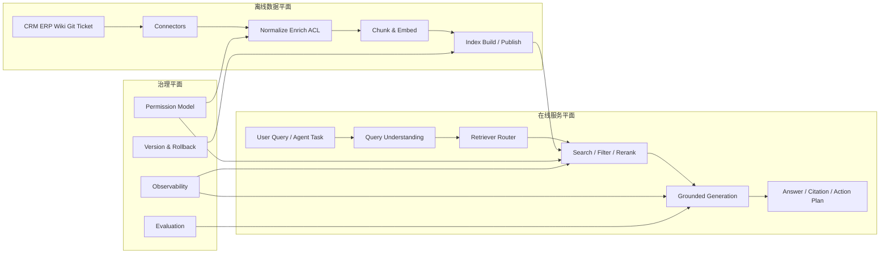

# 01. 整体架构设计

## 1. 先说结论：企业级 RAG 的核心架构，应该同时看“离线知识生产链路”和“在线问答决策链路”

很多团队画 RAG 架构图时，只画下面这条线：

> 用户提问 -> 检索 -> 大模型生成 -> 返回答案

这条线没错，  
但它只描述了 **在线查询链路**。

真正的企业级 RAG，至少还要补上另一条同样重要的线：

> 企业系统数据 -> 采集 -> 清洗 -> 切片 -> 建索引 -> 版本发布 -> 在线可检索

如果没有这条离线链路，  
线上检索质量通常很快会掉下去，原因包括：

- 数据源结构不统一
- 权限字段没有被保留
- 文档版本和索引版本不一致
- 删除和更新没有被传播
- chunk 粒度不稳定，召回结果波动很大

所以更准确地说：

**企业级 RAG 不是一个“模型调用流程”，而是一个由离线数据工程、在线检索服务、生成层和治理层共同组成的系统。**

## 2. 企业级 RAG 的目标不只是“答出来”，还包括 5 个工程目标

### 2.1 正确性

答案需要尽可能基于可信来源，  
并能引用到文档、记录或规则条款。

### 2.2 新鲜度

索引里的内容要能跟上业务系统变化，  
否则模型答得再流畅，也是在放大过期信息。

### 2.3 权限一致性

用户能在 RAG 中看到的信息，  
必须和他在 CRM、ERP、知识库、代码仓库里的可见范围一致。

### 2.4 延迟和成本平衡

检索、重排序、生成都要花时间和钱。  
企业级系统不能只追求最准，还要考虑并发和单位查询成本。

### 2.5 可演进性

数据源会增加，模型会切换，索引会重建，  
如果系统耦合太深，后面每次调整都很痛苦。

## 3. 一套推荐的总体分层

这张图里最关键的不是模块名字，  
而是三层分工：

- **数据平面**：负责把异构数据变成可检索资产
- **服务平面**：负责把用户问题变成稳定答案
- **治理平面**：负责让系统可控、可追踪、可回滚

## 4. 推荐把系统拆成 6 个明确层次

### 4.1 Source Connectors

负责接入企业现有系统，例如：

- CRM、ERP、工单系统
- Confluence、SharePoint、Notion、内部 Wiki
- GitLab、GitHub Enterprise、代码制品库
- 邮件、审批、法务制度库

这一层最重要的不是“把数据读出来”，  
而是保留：

- 源系统主键
- 更新时间
- 删除标记
- 组织、部门、角色、租户信息
- 文档版本号

### 4.2 Knowledge Processing

负责规范化、清洗、去噪、切片、元数据补全和 embedding。

这一层是 RAG 质量最容易被低估的地方。  
很多线上效果不稳，问题不在模型，而在：

- chunk 太长，召回不精确
- chunk 太短，语义丢失
- 表格、代码、附件没有被正确解析
- 标题层级、章节路径、业务标签没有进入索引

### 4.3 Index & Storage

负责把文档或 chunk 存进检索引擎，  
可能是：

- 向量数据库
- Elasticsearch / OpenSearch
- PostgreSQL + `pgvector`
- RedisSearch
- 内存 HNSW / FAISS

这里的关键不是“选哪种存储”，  
而是保证：

- 支持按权限过滤
- 支持版本切换
- 支持增量更新
- 支持重建和回滚

### 4.4 Retrieval & Ranking

负责查询改写、路由、召回、过滤、重排序和上下文拼装。

这一层通常决定：

- 是不是能把真正相关的内容找出来
- 是不是能把无权内容挡在检索阶段
- 是不是能把有限 token 留给最有价值的上下文

### 4.5 Grounded Generation

负责把检索结果组织成答案，  
包括：

- 引用来源
- 结构化回答
- 不确定时拒答或降级
- 输出给 Agent 的下一步动作建议

### 4.6 Agent Orchestration

当 RAG 不只是回答问题，  
而是要进一步：

- 查询订单
- 调用审批
- 建立工单
- 触发 CRM 更新

这时就需要 orchestration 层来决定：

- 何时只做检索问答
- 何时触发工具调用
- 何时让人确认

## 5. 推荐把“控制流”和“数据流”分开设计

这是企业级设计里非常重要的一点。

### 5.1 数据流

数据流回答的问题是：

- 数据从哪里来？
- 如何清洗、切分、嵌入和建索引？
- 如何传播更新和删除？
- 如何切版本和回滚？

### 5.2 控制流

控制流回答的问题是：

- 查询请求进来后怎么路由？
- 先查全文还是先查语义？
- 什么时候做 rerank？
- 什么时候交给 Agent 做多步执行？
- 什么时候拒答或转人工？

如果把这两类逻辑混在一个服务里，  
会很快出现：

- 查询路径里包含重型数据处理逻辑
- 索引构建耦合在线接口
- 一次重建影响线上稳定性

## 6. 一个更适合企业的最小可落地拓扑

### 6.1 在线服务

- `api-gateway`：统一入口，处理鉴权、限流和租户上下文
- `query-service`：查询理解、路由、检索编排
- `generation-service`：模型调用、答案合成、引用包装
- `agent-service`：多步任务、工具调用、人机确认

### 6.2 离线服务

- `connector-worker`：拉取或订阅源系统变更
- `processing-worker`：清洗、切片、embedding、元数据丰富
- `indexer-worker`：写入索引、维护别名、切版本

### 6.3 共用基础设施

- `message bus`：Kafka、NATS、Redis Streams
- `object storage`：保存原始文档、解析结果、快照
- `metadata db`：MySQL / PostgreSQL，保存数据源状态和版本元数据
- `search store`：RedisSearch、Elasticsearch、Postgres + `pgvector` 等
- `observability`：Prometheus、Grafana、OpenTelemetry、日志平台

## 7. 架构设计时最容易忽略的 7 个决定点

1. **索引粒度**  
是按文档、章节、段落还是代码符号建索引。

2. **权限传播模型**  
是把 ACL 复制到 chunk，还是查询时再到源系统校验。

3. **更新时效**  
是分钟级、小时级还是天级同步。

4. **删除策略**  
源文档删掉后，是立即删索引，还是先 tombstone 再异步清理。

5. **结果解释性**  
是否必须返回引用、版本号、更新时间和命中理由。

6. **失败降级**  
检索超时后，是返回全文检索结果、缓存结果还是直接拒答。

7. **Agent 边界**  
哪些场景只做问答，哪些场景允许跨系统动作。

## 8. 常见误区

### 8.1 把 RAG 当成单一模型应用

如果只看 prompt 和模型，  
大概率会低估数据治理和权限设计的复杂度。

### 8.2 把向量检索当成默认答案

很多企业数据是强结构化、强关键词、强权限过滤的，  
这类场景往往先做全文检索或字段检索更稳。

### 8.3 用一个统一索引承载所有业务

客服知识、代码库、合同条款、财务制度，  
往往不该共用同一套 chunk 策略和召回参数。

## 9. 本篇给出的实际决策建议

如果你要启动一个企业级 RAG 项目，  
建议先按下面顺序做：

1. 明确业务目标和失败代价
2. 盘点数据源、权限边界、更新频率
3. 确定在线链路和离线链路的服务边界
4. 先定义模块接口，再选底层检索存储
5. 先做可观测性和版本机制，再做大规模接入

## 10. 小结

- 企业级 RAG 至少同时包含离线知识生产链路和在线检索生成链路
- 架构设计的重点不是“接一个模型”，而是处理数据、权限、版本和治理
- 向量数据库只是索引实现之一，不是架构起点
- 先把数据流和控制流拆开，后续系统才容易扩展和运维
