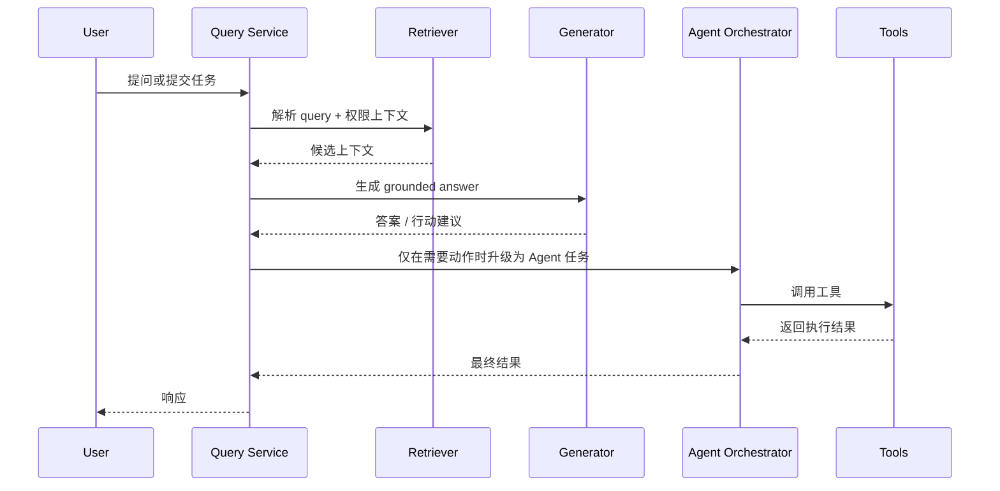

# 02. 模块职责划分

## 1. 先说结论：企业级 RAG 最怕的不是模块多，而是职责不清

在很多项目里，  
下面这些逻辑经常被塞进同一个服务：

- 拉取文档
- 切分 chunk
- 调 embedding
- 检索
- 组装 prompt
- 调模型
- 调工具

这样短期看似快，  
长期几乎一定会遇到几个问题：

- 代码边界模糊，改一处牵一片
- 线上查询服务混入离线任务，稳定性差
- 很难单独压测检索效果和生成效果
- 出问题时很难判断责任在 ingestion、retrieval 还是 generation

所以本篇最重要的结论是：

**`ingestion`、`retrieval`、`generation`、`agent orchestration` 必须是清晰分层，而不是概念上的标签。**

## 2. 推荐的职责边界

### 2.1 Ingestion

负责把外部数据源变成可检索资产。

核心职责：

- 连接源系统并拉取变更
- 规范化文档结构
- 文本提取、附件解析、表格和代码块处理
- chunk 切分
- 元数据补全
- 生成 embedding
- 写入索引
- 传播删除和版本信息

不应该承担的职责：

- 面向用户的查询路由
- prompt 组织
- 大模型生成答案
- Agent 多步任务控制

关键输入：

- 源系统记录
- 更新事件
- 权限和组织元数据

关键输出：

- `chunk`
- `metadata`
- `embedding`
- `index version`

关键指标：

- 同步延迟
- 解析失败率
- chunk 数量波动
- embedding 吞吐
- 索引发布时长

### 2.2 Retrieval

负责把用户问题转成最合适的召回策略。

核心职责：

- 查询理解
- 查询改写
- 检索路由
- 权限过滤
- 稀疏 / 稠密 / 混合召回
- 重排序
- 上下文窗口打包

不应该承担的职责：

- 直接从源系统做复杂写操作
- 直接生成最终用户可见文案
- 执行多步工具调用流程

关键输入：

- 用户 query
- 用户身份和权限上下文
- 业务场景标签

关键输出：

- 候选文档列表
- 置信度或相关性得分
- 可引用上下文

关键指标：

- `recall@k`
- `precision@k`
- 首次命中率
- 无结果率
- 检索 p95 延迟

### 2.3 Generation

负责把已检索到的上下文组织成稳定输出。

核心职责：

- 生成结构化 prompt
- 引用来源
- 控制回答格式
- 控制拒答、澄清和降级
- 返回 JSON、Markdown 或字段化结果

不应该承担的职责：

- 直接决定索引策略
- 直接访问底层存储做查询
- 直接决定是否调用企业工具

关键输入：

- 候选上下文
- 输出模板
- 任务类型

关键输出：

- 用户答案
- 引用列表
- 结构化决策建议

关键指标：

- 引用命中率
- 幻觉率
- 格式成功率
- token 成本
- 端到端延迟

### 2.4 Agent Orchestration

负责多步任务推进，而不只是一次性回答。

核心职责：

- 判断当前任务是“直接回答”还是“继续动作”
- 管理工具调用顺序
- 处理确认节点
- 管理任务状态和中间结果
- 记录审计轨迹

不应该承担的职责：

- 直接解析原始文档
- 直接实现底层检索引擎
- 把所有普通问答都强行改造成 Agent 流程

关键输入：

- 用户任务
- 检索结果
- 工具定义
- 安全和审批策略

关键输出：

- 动作计划
- 工具调用记录
- 最终结果或待人工确认项

关键指标：

- 任务完成率
- 平均步骤数
- 人工接管率
- 越权拦截率
- 失败回滚率

## 3. 一个推荐的接口组合

下面这种接口设计，  
比较适合在 Go 工程里把职责切开：

```go
type SourceConnector interface {
    PullChanges(ctx context.Context, cursor string) ([]SourceRecord, string, error)
}

type ChunkPipeline interface {
    Process(ctx context.Context, record SourceRecord) ([]Chunk, error)
}

type Retriever interface {
    Retrieve(ctx context.Context, query QueryContext) ([]Candidate, error)
}

type Generator interface {
    Generate(ctx context.Context, req GenerationRequest) (GenerationResult, error)
}

type Orchestrator interface {
    Run(ctx context.Context, task AgentTask) (TaskResult, error)
}
```

这样的好处是：

- `ingestion` 可以单独横向扩展
- `retrieval` 可以独立做压测和评估
- `generation` 可以单独切模型和 prompt 版本
- `orchestration` 可以在不改检索底座的情况下做任务编排演进

参考代码见：  
[examples/module_interfaces.go](./examples/module_interfaces.go)

## 4. 更适合生产的调用顺序



这个顺序背后的意思是：

**不是所有任务都应该一上来进入 Agent 编排。**

很多企业查询类请求，其实只需要：

- 检索
- 生成
- 返回引用

只有当任务涉及：

- 多步决策
- 跨系统写操作
- 审批或人工确认

才应该进入 orchestration。

## 5. 各模块的典型失败模式

### 5.1 Ingestion 常见失败

- 源系统字段变更导致解析失败
- 文档已删除但索引还在
- 新旧版本混在同一索引
- embedding 队列阻塞导致索引延迟

### 5.2 Retrieval 常见失败

- 关键词强的问题被错误地只走向量检索
- ACL 过滤缺失导致越权召回
- 混合召回后没有 rerank，噪声过大
- 查询扩展过度，召回面太宽

### 5.3 Generation 常见失败

- 引用了检索上下文，但回答仍然编造成因果关系
- 上下文超长，真正关键证据被截断
- 输出格式不稳定，无法被下游系统消费

### 5.4 Orchestration 常见失败

- 把无需多步的任务也包成 Agent，成本失控
- 工具调用失败没有补偿策略
- 缺少人工确认节点，产生误操作风险

## 6. 推荐的团队协作分工

如果团队规模允许，  
比较稳的分工方式是：

- 平台 / 后端工程师：`ingestion`、索引、查询服务、接口治理
- 搜索 / 算法工程师：召回策略、rerank、评估体系
- AI 应用工程师：生成层、prompt、结构化输出、Agent 编排
- 业务系统负责人：源系统字段语义、权限模型、变更事件
- SRE / 平台运维：容量、监控、备份、故障恢复

## 7. 模块边界的决策依据

### 7.1 为什么 `retrieval` 和 `generation` 要分开

因为它们优化目标不同：

- `retrieval` 优化的是“找对”
- `generation` 优化的是“说清楚”

这两个目标混在一起，  
后面很难定位问题。

### 7.2 为什么 `ingestion` 必须独立

因为它依赖外部系统变化、数据格式解析、批处理和消息堆积，  
这些都不应该影响在线查询稳定性。

### 7.3 为什么 `orchestration` 应该是可选层

因为很多企业级场景并不需要 Agent。  
如果把所有 RAG 请求都交给 Agent，会增加：

- 延迟
- 复杂度
- 安全风险

## 8. 小结

- 这四个模块不是抽象概念，而是应该落到明确服务边界
- `ingestion` 负责产出知识资产，`retrieval` 负责找，`generation` 负责说，`orchestration` 负责做
- 模块边界清楚后，评估、回滚、扩容和替换底层技术都会容易很多
