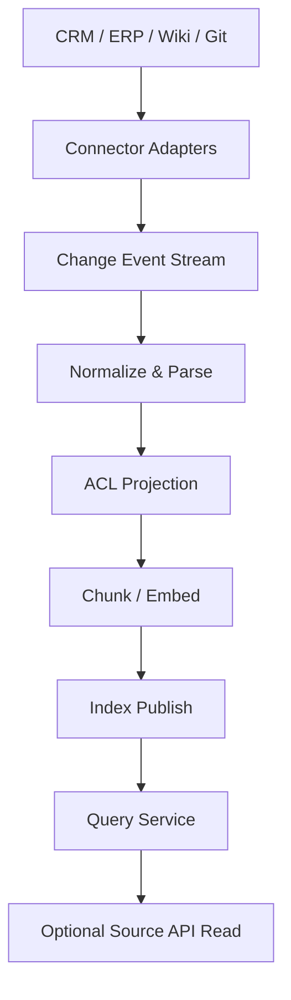

# 03. 与企业系统集成

## 1. 先说结论：企业级 RAG 的成败，往往先取决于接入能力，而不是检索算法

很多 POC 之所以效果不错，  
是因为只接了一个干净知识库。

但真正到了企业环境，  
你会很快面对这些现实：

- 知识分散在 CRM、ERP、Wiki、Git、邮件、工单、文件系统
- 不同系统的权限口径不一致
- 数据更新方式不一致，有的拉 API，有的走事件，有的只能导出文件
- 有的内容天然适合离线索引，有的内容更适合查询时实时读取

所以本篇最重要的观点是：

**企业级 RAG 不是“先建一个知识库，再让大家来用”，而是“先适配企业里已经存在的系统边界，再做统一检索层”。**

## 2. 接入企业系统时要先做的 4 件事

### 2.1 盘点数据源类型

建议先把数据源分成四类：

1. **结构化业务数据**  
例如客户、订单、合同、工单、审批记录。

2. **半结构化文档**  
例如知识库页面、FAQ、制度文档、会议纪要。

3. **非结构化附件**  
例如 PDF、Word、Excel、扫描件、图片。

4. **代码与工程资产**  
例如代码仓库、API 文档、CI 日志、运行手册。

不同类型对应不同接入和索引策略。

### 2.2 定义系统主键和文档身份

无论源数据长什么样，  
都要统一出一套内部主键，例如：

- `tenant_id`
- `source_system`
- `source_object_type`
- `source_object_id`
- `source_version`
- `acl_fingerprint`

如果这一步不做，  
后续会很难处理：

- 增量更新
- 删除传播
- 权限回放
- 引用回源

### 2.3 明确更新机制

不同系统的更新传播方式通常有 4 种：

- 定时轮询 API
- Webhook / 事件订阅
- CDC / binlog
- 文件导入导出

建议优先级通常是：

> 事件驱动 > CDC > 定时轮询 > 人工导入

### 2.4 明确权限继承方式

要先确定：

- ACL 是来自源系统原生权限，还是需要平台重建
- 是按用户、角色、部门还是租户控制
- 检索时能否直接过滤，还是需要命中后再回源校验

## 3. 四类常见集成模式

### 3.1 全量镜像 + 增量同步

适合：

- 文档库
- Wiki
- 制度库
- FAQ

做法：

- 先做一次全量抓取
- 后续通过更新时间或事件做增量同步
- 离线生成 chunk 和索引

优点：

- 查询快
- 离线预处理空间大
- 容易做版本发布

缺点：

- 数据新鲜度依赖同步链路
- 权限变化传播需要额外设计

### 3.2 查询时联邦拉取

适合：

- 强实时结构化业务数据
- 变化频率极高的数据
- 不适合复制到索引的数据

做法：

- query 先做意图识别
- 结构化问题直接调用业务 API
- 返回结构化结果后再交给生成层

典型例子：

- “客户 A 最近三张工单状态是什么？”
- “这个合同当前审批到哪一步了？”

这种问题往往直接查 CRM / ERP 更准确，  
不应该强行做离线 embedding。

### 3.3 混合镜像 + 实时回源

适合：

- 需要低延迟召回
- 但答案又强依赖最新状态

做法：

- 索引里保留可检索的主干知识
- 查询命中后，对关键字段再回源确认

典型例子：

- 售后问答先从知识库找标准流程
- 再到订单系统查用户订单当前状态

### 3.4 事件驱动知识更新

适合：

- 工单、审批、知识条目等经常变化的数据
- 对索引新鲜度有明确 SLA 的系统

做法：

- 业务系统发出更新事件
- connector 消费事件并拉增量数据
- processing worker 重建相关 chunk
- indexer 发布新版本或增量覆盖

## 4. CRM、ERP、知识库的集成建议

### 4.1 CRM

适合接入的内容：

- 客户标签
- 产品资料
- 历史工单摘要
- 售前 / 售后流程知识

不建议直接 embedding 的内容：

- 高频变化的实时交易字段
- 需要严格事务一致性的状态字段

推荐模式：

- 知识类字段做离线索引
- 状态类字段查询时直连 CRM API

### 4.2 ERP

适合接入的内容：

- 采购流程说明
- 财务制度
- 供应商管理文档

注意点：

- ERP 的字段语义复杂，建议保留业务对象类型和状态码字典
- 很多问题更适合“检索制度 + 查询实时单据”组合回答

### 4.3 知识库

这是最适合做离线索引的一类数据源。

关键点：

- 保留标题层级和面包屑路径
- 保留页面作者、更新时间、空间归属
- 保留原始链接和版本号
- 处理附件和嵌入表格

## 5. 企业集成时最关键的 5 个工程问题

### 5.1 删除怎么处理

源系统删除不传播到索引，  
很快会出现“源里没有了，RAG 还答得出来”的问题。

推荐做法：

- 记录 tombstone
- 索引里打删除标记
- 周期性物理清理

### 5.2 权限变化怎么传播

如果用户从 A 部门调到 B 部门，  
历史 ACL 也可能需要重新计算。

推荐做法：

- 权限元数据和文档元数据分离存储
- 支持按 `acl_fingerprint` 重新投影

### 5.3 附件和富文本怎么解析

企业文档里大量关键信息在：

- PDF
- Word
- Excel
- 图片
- 表格

如果只抓正文文本，  
效果通常会被低估。

### 5.4 回源链接怎么保留

回答必须能跳回源系统，  
否则很难让业务方信任，也不方便二次处理。

### 5.5 审计怎么做

要能追踪：

- 哪次回答用到了哪些文档
- 哪次检索在什么权限上下文下执行
- 哪个 connector 何时同步了哪条数据

## 6. 推荐的集成拓扑

这个拓扑背后有两个要点：

1. **接入层负责适配源系统差异，不要把源系统特殊逻辑散落到检索服务里**
2. **在线查询时允许“索引检索 + 源系统回源确认”并存**

## 7. Go 技术栈下的实现建议

### 7.1 连接器层

- `net/http` 或 `resty`：调用内部 REST API
- `grpc-go`：对接内部 gRPC 服务
- Kafka / NATS 客户端：消费变更事件

### 7.2 解析和处理层

- 使用 worker pool 控制并发解析
- 将原始文件和解析结果分别落盘到对象存储
- 将失败任务放入 dead-letter 队列

### 7.3 元数据层

- PostgreSQL / MySQL：保存 source cursor、任务状态、索引版本
- Redis：短期缓存和任务幂等键

## 8. 小结

- 企业级 RAG 首先是一项集成工程
- CRM、ERP、知识库不应该被一刀切地用同一种索引策略处理
- 最稳的设计通常是“离线镜像 + 实时回源 + 权限前置”
- 系统集成做得越规范，后面检索效果和治理成本越可控
