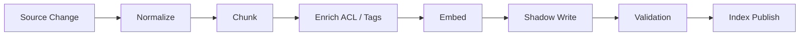

# 02. 写入更新与混合检索

## 1. 先说结论：RedisSearch 在生产里真正难的不是“查”，而是“持续正确地写”

很多 RedisSearch 演示只展示：

- 写一批向量
- 执行一次 KNN
- 返回 top-k

但到了生产环境，  
真正复杂的是：

- 文档不断更新
- 权限会变化
- chunk 策略会变化
- embedding 模型会升级
- 查询既要语义召回，也要标签和全文过滤

所以本篇的重点不是“怎么搜”，  
而是 **怎么把写入、更新、版本和查询编成长期稳定的链路**。

## 2. 一条推荐的写入链路



这里最关键的是 `Shadow Write` 和 `Publish` 两步。  
也就是说：

- 先写到候选版本
- 验证通过后再切换线上 alias

而不是边算边覆盖线上索引。

## 3. 数据写入与更新策略

### 3.1 全量构建 + 版本切换

适合：

- 大版本切换
- chunk 策略变化
- embedding 模型切换

做法：

- 新建 `index_version`
- 全量重建
- 对账验证
- alias 切换

优点：

- 结果干净
- 回滚容易

缺点：

- 资源成本高

### 3.2 增量 upsert

适合：

- 日常文档更新
- FAQ 和知识条目修订

做法：

- 根据 `doc_id + chunk_id` 覆盖写入
- 更新 `updated_at`
- 记录最新 `dataset_version`

关键点：

- 要明确哪些更新会引起 chunk 重新切分
- 不能只改正文不改版本字段

### 3.3 Tombstone 删除

适合：

- 源系统删除
- 权限撤销

做法：

- 先打删除标记或记录删除事件
- 异步做物理清理

优点：

- 避免线上直接硬删带来的不一致

### 3.4 双写过渡

适合：

- 新旧索引并存验证
- 迁移 embedding 模型

做法：

- 同时写入新旧两个索引
- 线上抽样双读对比
- 验证通过后切换

## 4. 查询链路里怎么做混合检索

### 4.1 向量 + 标签过滤

适合：

- 多租户
- 角色权限
- 文档类型筛选

示例思路：

```text
(@tenant_id:{tenant-a} @doc_type:{faq|kb} @acl_roles:{support})=>[KNN 20 @embedding $query_vec AS score]
```

### 4.2 全文 + 向量融合

适合：

- 既有强关键词，也有自然语言改写

常见做法：

1. 全文召回一批
2. 向量召回一批
3. 结果归一化
4. 做加权融合或 rerank

### 4.3 标签 + 时间衰减

适合：

- 文档新鲜度很重要
- 同主题文档很多

做法：

- 先按标签过滤
- 再把 `updated_at` 作为排序因子之一

## 5. 一套更稳的混合检索流程

### 5.1 查询理解

先判断问题更像：

- 关键词型
- 语义型
- 状态型
- 合规型

### 5.2 召回

- 关键词型：全文优先
- 语义型：向量或混合
- 状态型：检索 + 回源

### 5.3 融合

可以采用：

- 线性加权
- Reciprocal Rank Fusion
- cross-encoder rerank

### 5.4 上下文压缩

把最相关的 chunk 重新整理成：

- 按主题去重
- 按文档聚合
- 按 token 预算裁剪

## 6. RedisSearch 查询优化建议

### 6.1 控制返回字段

不要默认把整条记录所有字段都回给应用层。  
只回：

- `doc_id`
- `chunk_id`
- `title`
- `body`
- `updated_at`
- 必要元数据

### 6.2 批量 pipeline

离线写入时：

- embedding 计算和 Redis 写入分离
- Redis 命令使用 pipeline

### 6.3 分环境和分业务线建 alias

建议使用：

- `idx:rag:dev:current`
- `idx:rag:prod:current`

而不是让应用层直接写死物理索引名。

### 6.4 先过滤再 KNN

如果可以先按租户、文档类型、角色缩小候选集，  
通常比先全局 KNN 再后过滤更稳。

## 7. 企业级维护要提前内置哪些字段

1. `dataset_version`
2. `index_version`
3. `embedding_model`
4. `acl_fingerprint`
5. `source_system`
6. `source_updated_at`
7. `ingested_at`

这些字段一开始不保留，  
后面治理和审计都会吃力。

## 8. 线上常见问题和处理思路

### 8.1 命中老版本内容

通常说明：

- alias 没切干净
- 老索引没下线
- 查询条件没有限定 `index_version`

### 8.2 命中无权内容

通常说明：

- ACL 字段没写入
- 过滤条件只做在应用层，没有进查询表达式

### 8.3 更新后迟迟查不到

通常要排查：

- 事件是否到达
- embedding 队列是否堆积
- shadow version 是否已发布

## 9. 代码参考

RedisSearch 的 Go 写入、混合查询和 alias 管理示例见：  
[examples/redisearch_repository.go](./examples/redisearch_repository.go)

## 10. 小结

- RedisSearch 的生产难点在持续写入、增量更新和版本切换
- 混合检索比纯向量检索更贴近大多数企业场景
- 把 ACL、版本和更新时间内置进索引，是后面长期维护的关键
