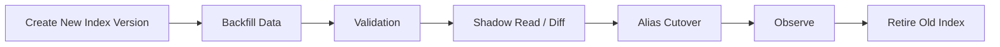

# 02. 索引重建与运维手册

## 1. 先说结论：重建索引不应该是临时脚本，而应该是可重复执行的标准作业

企业级 RAG 一旦进入生产，  
索引重建迟早会发生：

- embedding 模型升级
- chunk 规则调整
- 字段映射变更
- 权限模型变更
- 索引损坏或效果下降

如果重建依赖某个工程师临时跑脚本，  
系统迟早会在版本切换或回滚上出问题。

所以本篇最重要的判断是：

**索引重建要被产品化成一条标准作业流，而不是一次性工具。**

## 2. 哪些情况应该触发重建

### 2.1 数据结构变化

例如：

- 新增重要字段
- 标签体系重构
- 文档类型细分

### 2.2 索引策略变化

例如：

- 从 FLAT 切到 HNSW
- 调整 `M`、`EF_RUNTIME`
- 调整全文权重

### 2.3 内容处理策略变化

例如：

- chunk 粒度变化
- 表格解析器升级
- 代码切片方式变化

### 2.4 权限模型变化

例如：

- 新增保密级别
- 角色体系重构
- 租户隔离规则变化

## 3. 一条推荐的零停机重建流程

### 3.1 Create New Index Version

创建新的物理索引名，例如：

- `idx:rag:prod:20260412:01`

### 3.2 Backfill Data

从对象存储或元数据数据库读取要重建的数据，  
批量重写索引。

### 3.3 Validation

校验：

- 文档数
- chunk 数
- ACL 字段覆盖率
- 空 embedding 比例
- 查询基线样例结果

### 3.4 Shadow Read / Diff

让部分线上查询同时打到新旧索引，  
比较：

- top-k 结果差异
- 延迟差异
- 无结果率差异

### 3.5 Alias Cutover

确认通过后，  
把线上 alias 从旧索引切到新索引。

### 3.6 Observe

切换后持续观察：

- 延迟
- 错误率
- 用户反馈
- 低引用率

### 3.7 Retire Old Index

不要立即删除旧索引。  
建议保留一个观察窗口再清理。

## 4. 重建作业至少要支持什么能力

1. **幂等执行**
2. **断点续跑**
3. **分批回填**
4. **进度可观测**
5. **失败回滚**
6. **版本标记**

## 5. 一套推荐的运维检查表

### 5.1 重建前

- 当前 alias 指向清楚吗
- 目标索引参数确认了吗
- 数据源快照是否可用
- 回滚路径是否明确

### 5.2 重建中

- 写入吞吐是否稳定
- 失败任务是否进入重试或死信
- 内存和 CPU 是否接近阈值
- 新索引文档数是否持续增长

### 5.3 切换后

- 检索 p95 是否异常
- 无命中率是否异常
- 用户追问率是否上升
- 权限异常是否上升

## 6. 常见故障与处理建议

### 6.1 新索引召回显著变差

优先排查：

- chunk 规则变化
- 向量维度错误
- 过滤条件变严
- 权重或字段缺失

### 6.2 切换后延迟大涨

优先排查：

- `EF_RUNTIME` 是否过高
- 是否缺少过滤前置
- 查询模板是否扩大了候选集

### 6.3 回滚失败

通常说明：

- alias 管理不规范
- 旧索引被过早清理
- 版本元数据未记录完整

## 7. 周期性运维动作建议

### 7.1 每日

- 检查同步延迟
- 检查失败任务
- 检查查询异常峰值

### 7.2 每周

- 复盘低质量回答样本
- 查看热词和无结果查询
- 校验备份和恢复链路

### 7.3 每月

- 做一次容量评估
- 抽样验证 ACL
- 评估是否需要局部或全量重建

## 8. 代码参考

索引重建作业的 Go 示例见：  
[examples/rebuild_job.go](./examples/rebuild_job.go)

## 9. 小结

- 索引重建必须被标准化和可观测化
- 零停机的关键在于新版本构建、双读验证、alias 切换和保留回滚窗口
- 真正稳定的 RAG 系统，都会把重建当成常规运维动作
