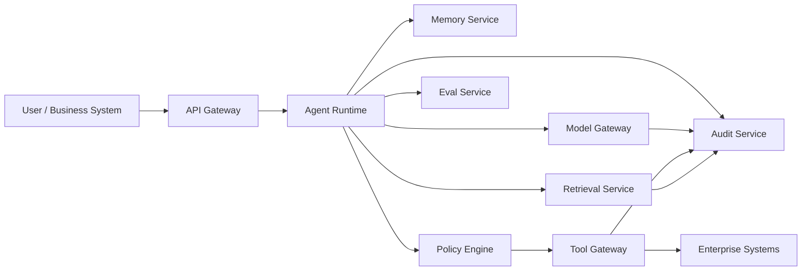

# 01. Agent 平台参考架构

## 1. 先说结论：企业级 Agent 平台要把“模型决策”和“系统约束”拆开

模型可以负责理解、规划和生成，但不能直接成为系统权限边界。

企业级架构应该把能力拆成几层：

- Agent Runtime 负责任务推进
- Model Gateway 负责模型调用治理
- Tool Gateway 负责工具执行约束
- Policy Engine 负责权限和审批
- Memory Service 负责记忆读写
- Retrieval Service 负责外部知识检索
- Eval Service 负责回归和质量评估
- Audit Service 负责行为留痕

核心原则是：

> 模型可以建议下一步，但真实动作必须经过系统级策略、校验和审计。

## 2. 推荐总体架构



## 3. 核心模块职责

| 模块 | 主要职责 | 不应该做什么 |
| --- | --- | --- |
| API Gateway | 鉴权、租户上下文、限流、trace id | 不承载 Agent 业务逻辑 |
| Agent Runtime | 状态机、任务编排、checkpoint、人工确认 | 不直接绕过策略调用工具 |
| Model Gateway | 模型路由、超时、成本、版本、内容过滤 | 不保存业务真相 |
| Tool Gateway | 参数校验、幂等、dry-run、执行后核验 | 不信任模型输出 |
| Policy Engine | RBAC/ABAC、审批策略、动作风险分级 | 不写在 Prompt 里当软约束 |
| Retrieval Service | 查询理解、召回、rerank、权限过滤 | 不执行业务写操作 |
| Memory Service | 记忆写入审批、过期、来源追踪 | 不自动保存未经确认事实 |
| Eval Service | 离线评估、回归、上线门槛、报告 | 不只看最终文本 |
| Audit Service | 关键行为、版本、证据、工具调用留痕 | 不记录不可治理的大段散文本 |

## 4. 请求流

一次典型任务建议按下面顺序走：

1. API Gateway 注入 `tenant_id`、`user_id`、`roles`、`trace_id`。
2. Agent Runtime 创建或恢复任务状态。
3. Runtime 调 Retrieval Service 获取必要上下文。
4. Runtime 调 Policy Engine 判断任务和动作风险等级。
5. Runtime 调 Model Gateway 做规划或生成。
6. 如果需要工具动作，先进入 Tool Gateway 做参数校验、权限校验和 dry-run。
7. 高风险动作进入人工确认。
8. 执行后做结果核验，并写入 Audit Service。
9. 输出时附带引用、状态、置信度和下一步建议。

## 5. 状态模型

生产级 Agent 至少要有明确状态：

| 状态 | 含义 |
| --- | --- |
| `pending` | 任务已创建，尚未执行 |
| `running` | 正在执行 |
| `waiting_for_tool` | 等待工具返回 |
| `waiting_for_approval` | 等待人工确认 |
| `waiting_for_input` | 等待用户补充信息 |
| `succeeded` | 已成功完成 |
| `failed` | 已失败，可复盘 |
| `cancelled` | 被用户或系统取消 |
| `compensating` | 正在执行补偿动作 |

状态变化必须进入审计日志。

## 6. 关键数据结构

### 6.1 任务上下文

```json
{
  "task_id": "task_123",
  "tenant_id": "tenant_a",
  "user_id": "u_001",
  "roles": ["support_agent"],
  "scene": "customer_support",
  "risk_level": "medium",
  "trace_id": "trace_abc",
  "status": "running"
}
```

### 6.2 工具调用记录

```json
{
  "tool_call_id": "call_123",
  "tool_name": "create_ticket",
  "risk_level": "low_write",
  "idempotency_key": "task_123:create_ticket:1",
  "dry_run": false,
  "approved_by": null,
  "started_at": "2026-05-05T10:00:00Z",
  "result_status": "succeeded"
}
```

### 6.3 生成版本

```json
{
  "model": "model-name",
  "model_version": "2026-05",
  "prompt_version": "support-answer-v3",
  "policy_version": "agent-policy-v2",
  "retrieval_index_version": "idx-20260505-01"
}
```

## 7. 企业级实现建议

1. Tool Gateway 必须独立于 Prompt。
2. Policy Engine 应该支持按租户、角色、动作、资源和风险等级判断。
3. 高风险动作必须有 idempotency key、dry-run 和执行后核验。
4. Agent Runtime 必须有最大步数、最大工具调用次数和最大成本预算。
5. Eval Service 应该能基于历史 trace 回放。
6. Audit Service 应该能按 `task_id`、`trace_id`、`user_id`、`tool_name` 查询。

## 8. 和 RAG 平台的关系

RAG 是 Agent 的知识上下文来源之一，但不是 Agent 全部。

- RAG 解决“基于外部知识回答和判断”
- Tool Gateway 解决“真实动作如何执行”
- Policy Engine 解决“什么动作允许执行”
- Agent Runtime 解决“多步任务如何推进”

企业级项目不要把这些能力混成一个大函数。

