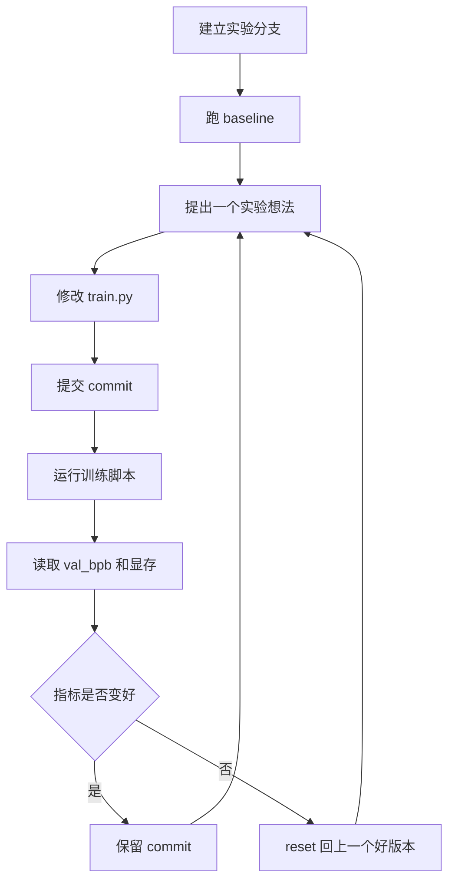
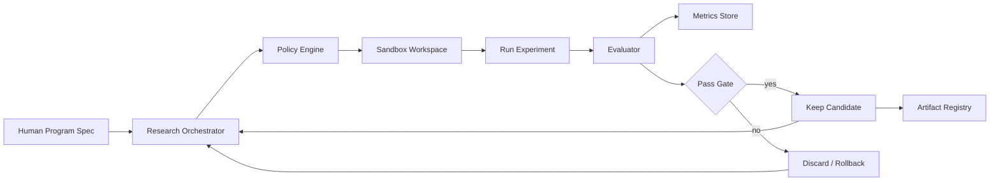

# 第十四章 AutoResearch 与自动研究型 Agent

## 1. 先说结论：AutoResearch 的价值，不在“让 Agent 改代码”，而在“把研究变成可闭环的实验系统”

`karpathy/autoresearch` 是一个很小但很有代表性的项目。

它做的事情并不复杂：

- 给 Agent 一个真实但简化的 LLM 训练任务
- 让 Agent 只修改一个文件 `train.py`
- 每次训练固定运行 5 分钟
- 用同一个指标 `val_bpb` 判断好坏
- 结果变好就保留，没变好就丢弃
- 整个过程持续循环

这个项目最值得学习的地方，不是它用了什么模型结构，也不是它能不能真的超过人类研究员，  
而是它展示了一种非常清楚的 Agent 工作模式：

> 把开放式研究问题，压进一个有边界、有指标、有预算、有回滚的自动实验循环里。

这正是企业级 Agent 很需要的能力。

很多 Agent 项目失败，不是因为模型不会想办法，  
而是因为系统没有给它定义：

- 什么可以改
- 什么不能改
- 怎么判断变好了
- 失败后怎么回退
- 实验结果怎么记录
- 成本和时间预算是多少

AutoResearch 的启发是：

**一个真正能长期工作的研究型 Agent，首先是一个被良好约束的实验系统。**

## 2. AutoResearch 是什么？

根据 `karpathy/autoresearch` 仓库说明，它的目标是让 AI Agent 在一个小型但真实的 LLM 训练环境里自动做实验。

仓库刻意保持很小，核心文件主要是三个：

| 文件 | 作用 | 谁改 |
| --- | --- | --- |
| `prepare.py` | 数据准备、tokenizer、dataloader、评估工具和固定常量 | 不改 |
| `train.py` | GPT 模型、优化器、训练循环、超参数 | Agent 改 |
| `program.md` | 给 Agent 的运行说明和实验规则 | 人改 |

这套设计里，人类不直接像普通研究员一样改 Python 代码，  
而是主要改 `program.md`，也就是“研究组织代码”。

可以把它理解成：

- `train.py` 是 Agent 的实验对象
- `prepare.py` 是不可动的评估基座
- `program.md` 是人类给 Agent 写的研究流程和约束

## 3. 它的核心循环是什么？

AutoResearch 的循环大致可以概括为：

它本质上是一个自动化科研循环：

1. 生成实验假设
2. 修改实验变量
3. 运行固定评估
4. 记录结果
5. 根据指标保留或丢弃
6. 继续下一轮

这和普通 Agent “一次性回答问题”完全不同。

AutoResearch 的 Agent 不是回答者，  
而是一个持续运行的实验执行者。

## 4. 为什么这个设计很强？

### 4.1 可修改面很小

Agent 只改 `train.py`。

这件事非常关键。

如果让 Agent 随便改任何文件，它可能会：

- 改评估逻辑
- 改数据处理
- 加不稳定依赖
- 把结果变好但不可比较
- 让系统越来越难复现

只允许改一个文件，牺牲了一部分自由度，  
但换来了更强的可控性和可审查性。

### 4.2 评估基座不可修改

`prepare.py` 承担数据准备和评估职责，并且被明确设为不可修改。

这相当于企业 Agent 里的：

- 固定评估集
- 固定 judge
- 固定验收标准
- 固定安全策略

没有这个约束，Agent 可能不是把系统做得更好，  
而是把尺子改得更容易通过。

### 4.3 指标单一且明确

AutoResearch 使用 `val_bpb` 作为核心指标，越低越好。

这让 Agent 的决策非常清楚：

- 变好了：保留
- 没变好：丢弃
- 跑崩了：记录 crash

企业 Agent 不一定能只有一个指标，  
但至少需要一个主指标和几个硬约束。

例如：

- 主指标：任务成功率
- 硬约束：关键错误率必须为 0
- 成本约束：单任务成本不能超过预算
- 延迟约束：p95 不能超过 SLA

### 4.4 时间预算固定

每个实验固定训练 5 分钟。

这解决了一个很现实的问题：

如果每次实验训练时间不同，结果就很难比较。  
模型变大可能只是因为算得久，不一定是真正更好。

固定时间预算相当于把比较基准拉平。

企业里也应该有类似控制：

- 单任务最大步骤数
- 单任务最大工具调用次数
- 单任务最大 token
- 单任务最大运行时长
- 单任务最大成本

### 4.5 Git 分支天然就是实验轨迹

AutoResearch 用专门分支做实验，变好就前进，不好就 reset。

这让每次实验都有清楚记录：

- 改了什么
- 为什么改
- 指标多少
- 是否保留
- 失败怎么回退

这和企业 Agent 的 trace、checkpoint、审计日志本质上是同一类东西。

## 5. `program.md` 为什么值得重视？

`program.md` 是这个项目里最有意思的部分之一。

它不是普通说明文档，而是给 Agent 的“运行程序”。

它定义了：

- 初始化流程
- 哪些文件可以读
- 哪些文件可以改
- 哪些事情禁止做
- 如何运行实验
- 如何提取指标
- 如何记录结果
- 什么时候保留或丢弃改动
- 出错时怎么处理
- Agent 是否需要继续自主循环

这其实就是一种轻量级 skill。

从 Agent 工程角度看，`program.md` 的价值在于：

> 人不是告诉 Agent 每一步具体怎么做，而是在写一个研究组织的运行协议。

这比“帮我优化一下训练代码”强得多。

因为它给 Agent 的不是一次性指令，  
而是一套可以重复执行的实验制度。

## 6. AutoResearch 模式可以抽象成什么？

可以把它抽象成 8 个组件。

| 组件 | AutoResearch 里的体现 | 企业 Agent 里的对应物 |
| --- | --- | --- |
| 目标 | 降低 `val_bpb` | 业务成功指标 |
| 可编辑面 | 只改 `train.py` | 工具权限 / 代码写入范围 |
| 不可编辑基座 | `prepare.py` | 评估集 / 权限策略 / 审计规则 |
| 实验预算 | 固定 5 分钟 | 成本、时间、步骤、工具预算 |
| 评估指标 | `val_bpb`、显存、crash | 成功率、关键错误、延迟、成本 |
| 实验轨迹 | git commit、branch | trace、checkpoint、audit log |
| 保留规则 | 指标变好才前进 | 上线准入、灰度、回滚 |
| 人类程序 | `program.md` | skill、runbook、policy、workflow spec |

所以 AutoResearch 不是只适合机器学习训练。

它代表的是一种通用模式：

> 让 Agent 在一个受控实验环境里，持续提出改变、执行验证、记录结果、保留改进。

## 7. 和普通 Agent、RAG、代码 Agent 有什么不同？

| 类型 | 主要目标 | 典型输出 | 是否持续实验 |
| --- | --- | --- | --- |
| 普通聊天 Agent | 回答问题 | 文本答案 | 通常不是 |
| RAG Agent | 基于外部知识回答 | 带引用答案 | 通常不是 |
| 代码 Agent | 修改代码完成任务 | patch / PR | 有时是 |
| AutoResearch 型 Agent | 持续优化系统指标 | 实验序列和更优版本 | 是 |

AutoResearch 型 Agent 的关键区别是：

- 它不是只完成一个任务
- 它会连续做很多次尝试
- 它以指标变化作为反馈
- 它把失败当作正常实验成本
- 它需要日志和回滚才能长期运行

这类 Agent 更接近“自动化研究员”或“自动化优化器”。

## 8. 企业里可以怎么借鉴？

### 8.1 Prompt / RAG 自动优化

把 AutoResearch 模式用于 RAG：

- 可编辑面：prompt、检索 top-k、rerank 配置、上下文拼装策略
- 不可编辑基座：评估集、权限样本、安全样本
- 指标：引用命中率、任务成功率、幻觉率、拒答正确率
- 保留规则：主指标提升且安全指标不退化

### 8.2 Agent 工作流自动优化

把 AutoResearch 模式用于工作流：

- 可编辑面：路由规则、澄清策略、工具调用顺序、确认节点
- 不可编辑基座：工具 schema、权限策略、评估样本
- 指标：任务成功率、平均步骤数、人工接管率、关键错误率

### 8.3 代码修复和性能优化

把 AutoResearch 模式用于工程优化：

- 可编辑面：指定模块
- 不可编辑基座：测试、benchmark、lint、安全扫描
- 指标：测试通过、性能提升、复杂度不升高
- 保留规则：所有测试通过且核心指标改善

### 8.4 数据处理 pipeline 优化

把 AutoResearch 模式用于数据清洗：

- 可编辑面：清洗规则、chunk 策略、字段映射
- 不可编辑基座：金标数据集、线上回放样本
- 指标：解析成功率、检索命中率、数据新鲜度、异常率

## 9. 企业落地时必须加强哪些边界？

AutoResearch README 里建议在本地仓库里运行 Agent，并给它较高自主权。  
这适合个人实验，但企业环境不能直接照搬。

企业落地时要补这些边界：

1. **权限边界**  
   Agent 只能改指定目录或指定配置，不能改评估、权限和审计代码。

2. **执行沙箱**  
   实验要在隔离环境跑，不能直接影响生产数据和生产服务。

3. **成本预算**  
   每轮实验、每小时、每天都要有计算资源和模型调用预算。

4. **安全测试**  
   所有候选改动必须跑安全样本和高风险样本。

5. **人工准入**  
   指标变好不等于自动上线，进入生产前仍要评审。

6. **实验注册表**  
   每个实验都要有 ID、版本、参数、指标、日志和产物。

7. **回滚路径**  
   保留上一稳定版本，支持快速回退。

## 10. 一个企业版 AutoResearch 架构

关键模块：

- `Research Orchestrator`：生成实验想法、调度执行、控制循环
- `Policy Engine`：限制可修改文件、命令、预算和风险动作
- `Sandbox Workspace`：隔离运行环境
- `Evaluator`：固定评估和安全门禁
- `Metrics Store`：记录指标趋势
- `Artifact Registry`：保存通过门禁的版本

这比原始 AutoResearch 多了很多企业控制，  
但核心循环仍然一样：

> 改一点，测一下，记录结果，保留好的，丢掉坏的。

## 11. 常见误区

### 11.1 误区一：以为让 Agent 无限循环就等于自动研究

真正的自动研究不是“无限尝试”，  
而是有评价标准、有预算、有轨迹、有回滚的循环。

### 11.2 误区二：让 Agent 同时改实验对象和评估标准

这会让结果失去可信度。

评估基座必须比实验对象更稳定。

### 11.3 误区三：只记录最好结果，不记录失败

失败记录非常重要。

它能告诉你：

- 哪些方向试过了
- 哪些改动容易 crash
- 哪些提升只是偶然
- 哪些复杂度不值得

### 11.4 误区四：只看主指标，不看复杂度和资源

AutoResearch 的 `program.md` 里有一个很重要的原则：

- 如果提升很小但复杂度明显上升，不一定值得保留。

企业里也一样。

任务成功率提升 1%，但成本翻倍、延迟翻倍、安全风险增加，  
通常不能算真正变好。

### 11.5 误区五：把个人实验模式直接搬到企业生产

个人实验可以激进，企业生产必须可控。

企业版 AutoResearch 必须补：

- 沙箱
- 权限
- 审计
- 成本
- 安全门禁
- 人工准入

## 12. 落地顺序

如果要在企业里做 AutoResearch 型 Agent，建议按下面顺序：

1. 先选一个低风险优化对象，例如 prompt、检索参数或测试环境代码。
2. 固定评估集和不可修改基座。
3. 限定 Agent 可修改范围。
4. 定义主指标和硬约束。
5. 建立实验日志和版本记录。
6. 让 Agent 先跑短循环，人工 review 结果。
7. 再逐步接入调度、沙箱、自动回滚和报告生成。

不要一开始就让它改生产系统、改权限逻辑或自动上线。

## 13. 小结

AutoResearch 最重要的启发可以总结成 5 点：

1. **研究型 Agent 要靠闭环，而不是靠一次性回答。**
2. **可修改面必须小，评估基座必须稳。**
3. **指标、预算、日志和回滚，是自动实验能长期运行的前提。**
4. **`program.md` 这类“人写给 Agent 的运行协议”，本质上是轻量级 skill。**
5. **企业落地不能照搬个人实验模式，必须补安全、沙箱、审计和人工准入。**

所以从 Agent 工程角度看：

> AutoResearch 不是一个“让 Agent 乱试”的项目，  
而是一个把开放式探索压进工程闭环里的很小但很锋利的样板。

## 14. 参考资料

- [karpathy/autoresearch GitHub 仓库](https://github.com/karpathy/autoresearch)
- [autoresearch README](https://raw.githubusercontent.com/karpathy/autoresearch/master/README.md)
- [autoresearch program.md](https://raw.githubusercontent.com/karpathy/autoresearch/master/program.md)

